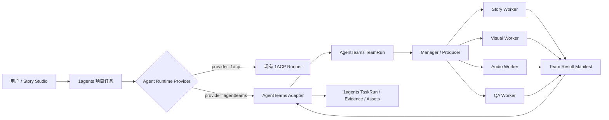

> **不要把 AgentTeams 当成 1ACP 的替代实现逐任务接入，而是把 AgentTeams 整体当成一个可选的 Team Runtime。1agents 向它提交一个团队级任务，AgentTeams 内部自己完成 Manager 拆解、Worker 协作、上下文传递和结果汇总，最后把 TeamRun 结果返回给 1agents。**

这样：

- 不需要改造 1ACP；
- 不需要把 1ACP 包进 AgentTeams；
- 不需要让 1agents 调度每个 AgentTeams Worker；
- 不需要在两个系统间同步完整任务 DAG；
- AgentTeams 的 Manager、Worker、Matrix、TeamHarness 能力得到真实使用；
- 1agents 仍然是用户入口、项目控制面和结果沉淀位置；
- 比赛结束后，AgentTeams 仍然只是可选运行时，不污染默认单机路径。

---

# 一、最简架构应该是这样



1agents 只需要知道：

```text
这是一个 agent 类型任务
它应该由哪个 runtime provider 执行
提交以后对应哪个 external run
当前 external run 是什么状态
最后返回了什么结果、证据和资产
```

它不需要知道 AgentTeams 内部：

- Manager 创建了几个子任务；
- Worker 之间发送了多少条 Matrix 消息；
- Visual Worker 有没有创建临时子 Agent；
- AgentTeams 内部任务房间是怎么组织的；
- Worker 使用 OpenClaw、QwenPaw 还是 Hermes；
- 内部文件如何通过 AgentTeams MinIO 交换。

这些全部由 AgentTeams 自己负责。

---

# 二、不是“把 1ACP 切换成 AgentTeams”，而是“选择 Provider”

概念上要稍微修正一下。

不应该描述为：

> 把 1ACP 切到 AgentTeams。

更准确的是：

> 1ACP 和 AgentTeams 是两种并列的 Agent Runtime Provider。

```text
agent runtime provider
├── 1acp
└── agentteams
```

其中：

- `1acp`：执行一个具体 Agent 会话；
- `agentteams`：执行一个由多个 Agent 组成的 TeamRun。

两者粒度不同，但都可以被 1agents 的 `executor=agent` 使用。

现有三种执行器不需要变化：

```text
executor=agent
executor=function
executor=human
```

只需要在 `executor=agent` 内部增加运行时选择：

```text
executor=agent
  └── runtime_provider
      ├── 1acp
      └── agentteams
```

这样不会增加新的 `executor=team`，也不会破坏现有 agent/function/human 语义。

---

# 三、参数应该放在哪里

我不建议只有一个全局开关，例如：

```yaml
use_agentteams: true
```

因为未来同一个项目里可能同时存在：

- 写代码任务走 1ACP；
- 内容生产任务走 AgentTeams；
- 媒体处理任务走 Function；
- 发布审批走 Human。

推荐采用“项目默认值 + 任务可覆盖”的结构。

## 项目默认配置

```yaml
agent_runtime:
  provider: agentteams
  profile: storybook-production
```

普通项目默认：

```yaml
agent_runtime:
  provider: 1acp
  profile: default
```

## 单个任务覆盖

```json
{
  "executor": "agent",
  "target": {
    "runtimeProvider": "agentteams",
    "runtimeProfile": "storybook-production",
    "runtimeMode": "team"
  }
}
```

或者某个具体代码任务仍然使用：

```json
{
  "executor": "agent",
  "target": {
    "runtimeProvider": "1acp",
    "runtimeProfile": "codex"
  }
}
```

为了避免在核心里出现太多 AgentTeams 专属字段，建议只使用通用字段：

```go
type AgentRuntimeTarget struct {
    Provider string `json:"provider,omitempty"`
    Profile  string `json:"profile,omitempty"`
    Mode     string `json:"mode,omitempty"`
}
```

而不是：

```go
MatrixRoomID
WorkerCRName
KubernetesNamespace
AgentTeamsTeamID
```

这些 Provider 专属数据由 Adapter 自己保存。

---

# 四、比赛版应该采用“粗粒度 TeamRun”

这是进一步缩小改造面的关键。

## 不推荐的细粒度模式

前一版方案是：

```text
1agents 创建 Story Task
1agents 创建 Visual Task
1agents 创建 Audio Task
1agents 创建 QA Task
1agents 分别把这些任务派给 AgentTeams Worker
AgentTeams 再管理 Worker
```

问题是：

- 1agents 在编排；
- AgentTeams Manager 也在编排；
- 两边都有任务；
- 两边都在追踪状态；
- 容易形成双任务系统；
- AgentTeams 容易被评委看成“远程执行容器”，而不是协同框架；
- 修改调度器、任务绑定、状态同步的范围会变大。

## 推荐的粗粒度模式

1agents 只创建一个团队级任务：

```text
任务：制作《猴王出世》幼儿有声绘本内容包
executor: agent
runtime_provider: agentteams
runtime_profile: storybook-production
```

提交给 AgentTeams 后，AgentTeams 内部完成：

```text
Manager 接收目标
  ↓
拆成 Story / Visual / Audio / QA
  ↓
派给不同 Worker
  ↓
上下文传递
  ↓
候选方案选择
  ↓
质量不通过后返工
  ↓
人工确认
  ↓
生成 Team Result
```

1agents 只跟踪这个 TeamRun 的外部生命周期：

```text
pending
  → queued
  → running
  → awaiting_human
  → running
  → completed / failed / cancelled
```

这更符合 AgentTeams 的产品定位，也让比赛中的 AgentTeams 使用更加真实。

---

# 五、1agents 和 AgentTeams 的任务边界

采用粗粒度模式后，可以形成两级任务体系，但它们负责不同层次，不算重复。

## 1agents：业务生产任务

回答的是：

- 用户要交付什么；
- 哪个项目正在生产；
- 是否达到业务验收标准；
- 最终资产和版本是什么；
- 是否允许发布；
- 成本、证据和审计在哪里。

例如：

```text
制作第一章有声绘本
生成儿童节营销素材包
修订悟空角色形象
发布内容包 v1.2
```

## AgentTeams：团队内部工作

回答的是：

- Manager 如何把目标拆给 Worker；
- 哪个 Worker 做文本；
- 哪个 Worker 做图片；
- Worker 之间如何交接；
- 哪个 Worker 阻塞；
- 是否需要临时 Agent；
- 内部协作如何恢复。

例如：

```text
Story Worker：生成第一章幼儿版脚本
Visual Worker：生成悟空角色候选
Audio Worker：生成旁白
QA Worker：验证文图音一致性
```

可以把边界总结成：

```text
1agents Task
  = 对用户承诺的工作单元

AgentTeams Internal Tasks
  = 完成这个承诺所需的团队内部工作
```

这实际上比两边共享同一张任务表更合理。

---

# 六、最小需要修改的内容

虽然方向上是“增加一个参数”，但工程上不能真的只加一个字段。最少还需要五个很薄的能力。

## 1. Agent Runtime 选择参数

在项目配置或 `TaskTargetSpec` 增加：

```text
runtime_provider
runtime_profile
runtime_mode
```

默认行为保持不变：

```text
空值 → 1ACP
```

这样现有项目、现有任务和现有测试不需要迁移。

## 2. Runtime Router

当前 scheduler 遇到 `executor=agent` 时，大致改为：

```go
switch task.Target.RuntimeProvider {
case "", "1acp":
    return oneACPRunner.Execute(task)
case "agentteams":
    return agentTeamsRunner.Execute(task)
default:
    return ErrUnknownRuntimeProvider
}
```

1ACP Runner 本身不需要变化。

只是它前面多了一个 Router。

## 3. 一个很小的 AgentTeams Adapter

比赛版只需要四个核心方法：

```go
type AgentTeamsRuntime interface {
    Submit(ctx context.Context, req TeamRunRequest) (TeamRunHandle, error)
    Status(ctx context.Context, handle TeamRunHandle) (TeamRunStatus, error)
    Cancel(ctx context.Context, handle TeamRunHandle) error
    Result(ctx context.Context, handle TeamRunHandle) (TeamRunResult, error)
}
```

如果 AgentTeams 支持事件或 callback，可再增加：

```go
Watch(ctx context.Context, handle TeamRunHandle) (<-chan TeamRunEvent, error)
```

但仍然建议保留 `Status()` 轮询作为恢复手段，避免 callback 丢失后任务永久卡住。

## 4. External Run 映射

在 1agents 的 TaskRun 或运行元数据里保存：

```json
{
  "provider": "agentteams",
  "externalRunId": "atrun-...",
  "runtimeProfile": "storybook-production",
  "submittedAt": "...",
  "lastReconciledAt": "...",
  "externalStatus": "running",
  "traceRef": "...",
  "roomRef": "..."
}
```

不要把这些塞进 Task 描述或 Labels。

Task 是用户意图，TaskRun 才是一次具体运行。

## 5. 结果导入

AgentTeams 最终返回一个固定结构：

```json
{
  "schemaVersion": "1.0",
  "runId": "atrun-001",
  "status": "completed",
  "summary": "第一章有声绘本内容包制作完成",
  "artifacts": [
    {
      "type": "story-script",
      "uri": "..."
    },
    {
      "type": "illustration",
      "uri": "..."
    },
    {
      "type": "audio",
      "uri": "..."
    },
    {
      "type": "content-bundle",
      "uri": "..."
    }
  ],
  "evidence": [
    {
      "kind": "quality-report",
      "uri": "..."
    },
    {
      "kind": "team-trace",
      "uri": "..."
    }
  ],
  "metrics": {
    "durationMs": 0,
    "agentCount": 5,
    "reworkCount": 1
  }
}
```

1agents 完成：

- 拉取或导入最终资产；
- 计算 hash；
- 保存 TaskRun Evidence；
- 更新 root task；
- 调用 Story Studio 的 completion hook；
- 把内容包绑定到对应 `business_ref`。

这已经足够形成端到端闭环。

---

# 七、AgentTeams 内部如何启动这次 TeamRun

可以为比赛定义一个 `storybook-production` Team Profile：

```yaml
id: storybook-production
version: 0.1.0

team:
  name: storybook-team
  leader: producer

workers:
  - id: producer
    role: team_leader
    runtime: qwenpaw
    skills:
      - production-planning
      - team-coordination

  - id: story-editor
    role: worker
    skills:
      - child-story-adaptation
      - scene-breakdown

  - id: visual-director
    role: worker
    skills:
      - character-bible
      - scene-illustration
      - visual-consistency-review

  - id: audio-producer
    role: worker
    skills:
      - pronunciation-lexicon
      - tts-production

  - id: quality-auditor
    role: worker
    skills:
      - child-safety-review
      - multimodal-quality-gate
```

1agents 提交：

```json
{
  "goal": "制作《猴王出世》4-6 岁儿童有声绘本内容包",
  "profile": "storybook-production",
  "context": {
    "briefRef": "artifact://...",
    "storyBibleRef": "artifact://...",
    "outputContractRef": "schema://content-bundle/1.0"
  },
  "constraints": {
    "maxCostCNY": 20,
    "deadline": "...",
    "humanApprovalRequired": true
  },
  "callback": {
    "url": "...",
    "token": "task-scoped-token"
  }
}
```

AgentTeams 内部如何拆解、怎样安排 Worker、如何通过 Matrix 协作，完全由 AgentTeams Manager 和 TeamHarness 负责。

---

# 八、人类审批也可以先保持在 AgentTeams 内部

为了进一步简化比赛版，人工审批第一阶段不必同时实现两套 UI。

## 比赛实验版

当 AgentTeams 需要用户选择角色图时：

```text
AgentTeams TeamRun
  → awaiting_human
  → Element/Matrix 展示候选
  → 用户选择
  → TeamRun 恢复
```

1agents 只镜像：

```text
task.status = awaiting_human
external_run.room_ref = ...
```

用户可以从 1agents 点击“前往 AgentTeams 房间处理”。

完成后，AgentTeams 返回审批 Evidence：

```json
{
  "kind": "human-selection",
  "actor": "user",
  "selectedArtifact": "candidate-2",
  "timestamp": "..."
}
```

## 中长期

如果以后 AgentTeams 成为正式 Provider，再统一到 1agents Human Task：

```text
AgentTeams 请求审批
  → 1agents 创建 Human Task
  → WebUI/cc-connect 完成审批
  → 1agents 回传 AgentTeams
```

参赛阶段先不做这一层双向审批桥，可以显著缩小修改面。

---

# 九、内部子任务不要同步成 1agents ProjectItem

这也是必须坚持的简化边界。

AgentTeams 内部有：

```text
story task
visual task
audio task
qa task
```

比赛版不要把它们逐个复制成 1agents ProjectItem。

否则马上会出现：

- 谁是权威状态；
- 两边任务 ID 如何映射；
- AgentTeams 重试时是否创建新任务；
- Worker 临时子任务是否同步；
- Matrix 中撤回任务如何映射；
- 任务依赖如何双向同步；
- 断线后以哪边为准；
- AgentTeams 内部任务删除后 1agents 怎么办。

比赛版只需要把内部执行过程同步成只读事件：

```text
TeamRunEvent
├── worker_started
├── internal_task_started
├── artifact_submitted
├── rework_requested
├── awaiting_human
├── worker_failed
└── internal_task_completed
```

这些事件用于：

- Trace；
- 时间线；
- Demo 可视化；
- 调试；
- 证据。

但它们不是 ProjectItem。

如果未来用户明确要求在 1agents 中控制每个 Worker 子任务，再单独设计细粒度同步协议，不要在参赛版提前承担这部分复杂性。

---

# 十、MinIO 也可以完全留在 AgentTeams 内部

按照这个简化方案，1agents 不需要现在实现 MinIO SDK。

AgentTeams 内部可以继续使用自己的 MinIO：

```text
Worker A 产出脚本
Worker B 读取脚本
Worker B 上传插图
Worker C 读取脚本和插图
QA Worker 读取全部候选
```

最终只需要在 `TeamRunResult` 中返回：

- 最终选中资产；
- 内容包；
- 质量报告；
- 执行证据。

1agents 在 TeamRun 完成后把正式结果导入自己的 workspace。

因此边界是：

```text
AgentTeams MinIO
  = TeamRun 内部工作区和交换空间

1agents AssetStore/workspace
  = 最终正式成果和长期资产
```

AgentTeams 的临时资源被卸载或清理，不影响已经完成的项目。

---

# 十一、这样是否满足比赛对 AgentTeams 的要求

满足，而且比逐任务 Provider 更容易讲清楚。

比赛要求 AgentTeams 映射：

| 要求 | 简化方案中的实现 |
|---|---|
| 角色编排 | AgentTeams Team Profile 和 WorkerSpec |
| 任务拆解 | AgentTeams Manager/Producer 内部拆解 TeamRun |
| 上下文传递 | TeamHarness、Matrix、shared files、MCP |
| 协同执行 | AgentTeams Worker 协作 |
| 状态追踪 | TeamStatus、WorkerStatus、TeamRun Events |
| 工具调用 | Worker Skills、MCP、TTS/图片工具 |
| 结果验证 | QA Worker + Human Selection |
| 执行证据 | TeamRun Result、Matrix Trace、质量报告 |
| 异常处理 | Worker 失败、重试、转派 |
| 经验沉淀 | AgentSpec、Skill、Team Profile 版本化 |

评委看到的不是：

> 1agents 使用 AgentTeams 启动了一个 Agent。

而是：

> 1agents 把一个企业生产任务交给 AgentTeams 团队，AgentTeams 的 Manager 和多个 Worker 完成真实协作，最后由 1agents 收口成果、证据和业务状态。

这就是完整的 Agent Infra 分层。

---

# 十二、这套简化架构的长期价值

这种粗粒度 Team Runtime 其实不只是比赛捷径，也是一条合理的长期架构。

未来可以有：

```text
1agents 业务级任务
├── 生成一章有声绘本
├── 完成一个软件版本
├── 处理一个客户投诉
├── 调研一个市场
└── 制作一个营销活动
```

每个业务级任务可以选择：

```text
1ACP
  = 一个 Agent 独立完成

AgentTeams
  = 一个 Agent 团队协作完成

Function
  = 确定性程序完成

Human
  = 人完成
```

这正好形成一个很自然的执行模型：

| 任务特征 | 选择 |
|---|---|
| 单 Agent 可以完成 | 1ACP |
| 需要多个角色协作 | AgentTeams |
| 确定性处理 | Function |
| 主观裁决或高风险动作 | Human |

这比把所有任务都强行拆成平台级细粒度 DAG 更灵活。

中期如果发现需要让 1agents 控制 AgentTeams 内部节点，再增加“细粒度 TeamRuntime 模式”：

```text
runtime_mode=managed-team
```

当前比赛只实现：

```text
runtime_mode=delegated-team
```

其中：

- `delegated-team`：AgentTeams 内部全权拆解；
- `managed-team`：未来由 1agents 控制细粒度任务。

现在不要实现后者。

---

# 十三、最终推荐的最小实现范围

参赛版只做：

1. 在 Agent Task Target 增加 `runtime_provider`；
2. 增加项目默认 runtime provider；
3. 在现有 agent dispatch 前增加 Router；
4. 保持 1ACP Runner 完全不变；
5. 新增一个薄的 AgentTeams Adapter；
6. 支持 `Submit/Status/Cancel/Result`；
7. TaskRun 保存 external run ID；
8. AgentTeams 返回固定 Team Result Manifest；
9. 1agents 导入最终结果和 Evidence；
10. UI 显示 AgentTeams 状态、Team Room 链接和最终产物；
11. AgentTeams 内部负责完整多 Agent 闭环；
12. 不同步内部子任务；
13. 不把 AgentTeams MinIO 接成核心存储；
14. 不做双向审批系统；
15. 不修改 AgentTeams 上游子模块。

可以明确把不做的内容写进设计：

```text
NOT IN SCOPE
- 1ACP 运行在 AgentTeams Worker 内
- 1ACP 到 AgentTeams 的会话迁移
- AgentTeams 内部任务同步为 ProjectItem
- Matrix 与 cc-connect 双向消息同步
- AgentTeams MinIO 成为默认 AssetStore
- Kubernetes 生产部署
- 多租户
- 分布式任务一致性
- AgentTeams 与 1agents 双向细粒度调度
```

---

## 最终判断

你的方向是对的。参赛阶段应该采用：

> **1agents 控制面 + runtime provider 参数 + AgentTeams 整体 Team Runtime。**

而不是：

> 1agents 控制面 + 逐任务 AgentTeams Worker 调度 + 1ACP/AgentTeams 会话兼容 + 双向任务同步。

最简洁的产品语义是：

```text
这个任务由谁完成？

agent + 1acp
agent + agentteams
function
human
```

其中 AgentTeams 路径提交的是一个完整 TeamRun，内部多 Agent 协同全部交给 AgentTeams。1agents 只负责提交、监督、取消、接收结果和沉淀证据。

所以可以说“核心入口确实只是增加一个参数选择”，但为了达到可运行、可恢复、可审计，参数背后还需要一个很薄的 Provider Adapter、External Run 状态映射和 Result Manifest。除此之外，现有 1ACP 路径、Function 路径和 Human 路径都可以保持不变。

这应当成为当前参赛方案的首选技术路线。