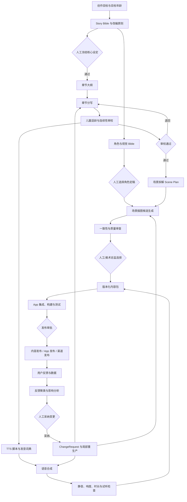
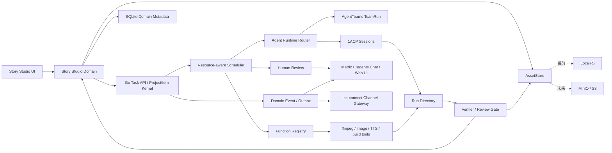

## 结论

> **2026-08-03 决策更新**：本文保留绘本生产、资产血缘和单机到多人的长期分析，但 AgentTeams、Matrix 和 cc-connect 的边界已更新为“聊天优先、工作台留痕”。权威说明见 [Chat-first AgentTeams 交互与渠道架构](../architecture/chat-first-agentteams-interaction.md)。

不考虑比赛后，我仍然建议继续以 1agents 为基础建设，不另起炉灶；但产品方向应从“集成更多 Agent 框架”转向：

> 把 1agents 做成面向一人团队的 AI 原生生产操作系统，核心能力是让多个 AI 职能围绕一个真实项目，持续地产生、验证、选择、版本化和交付成果；未来再把同一套生产模型扩展为多人、多智能体协同。

以西游记有声绘本为例，真正需要解决的不是“同时运行多少个 Agent”，而是：

- 谁负责大纲、改写、审校、插画、TTS、App、发行和营销；
- 上一个环节产出了什么结构化结果；
- 下一个环节究竟依赖哪个版本；
- 哪些工作可以自动执行，哪些必须验证，哪些必须由人选择；
- 悟空角色形象修改后，哪些插图、封面、宣传素材需要重新生成；
- 每项成果由哪个模型、提示词、Skill、工具和任务产生；
- 什么版本已经发布到哪个渠道；
- 用户反馈如何转化为变更任务，而不是直接污染正式内容。

这恰好与 1agents 当前“任务、上下文、执行器、验证、回写”的产品骨架一致。项目 README 对自身的定位已经接近这一方向：[README.md](/Users/scott/Documents/01-开发项目/1agents/1agents_app/README.md:3)。

因此我的总体建议是：

1. **继续在当前项目上做。**
2. **建设一个 Story Studio/绘本工作室领域应用，而不是新建第二套任务平台。**
3. **优先建设资产版本、产物血缘、资源调度、验证回写和反馈闭环。**
4. **AgentTeams 作为实验性 Team Runtime 和参赛运行路径，Matrix 同时承担第一方轻量聊天入口；两者仍不进入普通用户的默认单机启动链路。**
5. **MinIO 当前不作为必需服务，先实现本地 AssetStore；多人阶段再换成 MinIO/S3。**
6. **Go 后端守住任务与业务事实，1ACP 和 AgentTeams 分别作为单 Agent 与 Team Runtime，Matrix 负责第一方聊天，cc-connect 收敛为外部渠道网关。**

---

## 一、重新定义 1agents 的产品目标

我建议把短期和长期定位写得更明确。

### 短期：一人 AI 工作室

目标用户是独立开发者、一人公司、小型内容创作者。运行环境是单人、单 PC，但能够调用本地或云端的多个模型和工具。

用户感知不应该是“我开了八个 Agent 聊天窗口”，而应该是：

> 我创建了一个项目，系统帮我组织出多个职能角色，按依赖关系完成内容制作、审校、资产生成、软件开发和发布，过程中需要我决策的地方会通知我，最后所有成果都有版本和证据。

单 PC 不等于只能串行跑一个 Agent，也不等于要模拟一个 Kubernetes 集群。它需要的是一个轻量但可靠的本地生产调度器。

### 长期：多人、多智能体生产工作室

未来扩展后，一个项目可以包含：

- 多个人类成员；
- 多台机器；
- 多个长期职能 Agent；
- 临时子 Agent；
- 共享资产库；
- 权限、预算和审批；
- 分布式任务执行；
- 共享的发布和反馈闭环。

这里的关键是：**长期架构必须继承短期项目里的任务、资产和版本语义**，而不是到了多人阶段再重建一套数据模型。

所以现在应该稳定的是“生产协议”，不是提前部署所有分布式服务。

---

## 二、为什么适合继续在当前项目上建设

当前 1agents 已经具备几个非常关键的底座。

### 1. Go 后端已经可以成为唯一任务控制面

北向 Task API 已经形成了比较清晰的边界：业务应用负责创建和查询任务，不应该自己嵌入 Agent 或 Runner，见 [api.go](/Users/scott/Documents/01-开发项目/1agents/1agents_app/backend/internal/taskapi/api.go:1)。

任务定义已经具备：

- 标题、描述和验收标准；
- executor；
- assignee；
- function type；
- 依赖；
-优先级；
- milestone；
- workspace；
- `business_ref`。

尤其是 `business_ref`，它可以把通用任务和绘本业务对象关联起来，见 [binding.go](/Users/scott/Documents/01-开发项目/1agents/1agents_app/backend/internal/taskapi/binding.go:7)。

例如：

```text
storybook:project:xiyouji-kids
storybook:chapter:chapter-01
storybook:scene:chapter-01-scene-03
storybook:character:sun-wukong
storybook:asset:cover-v2
storybook:release:ios-1.0.0
```

这样，Go 后端继续管理通用任务状态；Story Studio 只管理故事、角色、场景和资产等领域状态。两边通过 `business_ref` 和完成回写连接，不需要建设第二个任务系统。

### 2. executor 三分法非常适合真实生产流程

当前任务内核已经区分：

- `agent`
- `function`
- `human`

见 [types.go](/Users/scott/Documents/01-开发项目/1agents/1agents_app/backend/internal/meta/types.go:230)。

这比“所有任务都丢给大模型”更适合生产系统。

以绘本为例：

| 工作 | 执行器 | 原因 |
|---|---|---|
| 故事大纲、章节改写 | Agent | 需要创作和判断 |
| 儿童适龄性审校 | Agent + Human | 可以机器初审，但最终标准带有主观性 |
| 角色形象选择 | Human | 是长期一致性的基准决策 |
| 图片缩放、格式转换 | Function | 确定性操作，不需要 LLM |
| TTS 调用 | Function 或 Agent | 固定 API 调用用 Function；需要情绪判断时由 Agent 制订参数 |
| 音频静音检测、响度归一化 | Function | 可重复验证 |
| App 代码开发 | Agent | 需要理解代码上下文 |
| 构建、打包、校验和 | Function | 确定性流程 |
| 正式发布 | Human gate + Function | 高风险外部操作必须审批 |

现有任务状态也已经包含 `blocked`、`pending_review`、`awaiting_human` 等长期运行所需状态，并具备 verifier、evidence、closed-by 等概念，见 [types.go](/Users/scott/Documents/01-开发项目/1agents/1agents_app/backend/internal/meta/types.go:292)。

这已经不是一个简单聊天 Demo 的数据模型了，适合继续强化。

### 3. Runtime、Matrix 与渠道的正确位置

应该固定这几个组件的职责：

| 组件 | 应负责 | 不应负责 |
|---|---|---|
| Go 后端 | 项目、任务、依赖、状态、调度、验证、审计、业务绑定 | 不直接实现每个 Agent 平台协议 |
| 1ACP | 启动和恢复 Codex、Claude、Cursor 等单 Agent Session / Turn | 不成为任务数据库，不嵌入 AgentTeams |
| AgentTeams | 执行粗粒度 TeamRun，管理 Manager、Worker、内部拆解与运行时生命周期 | 不成为第二套业务任务或资产数据库 |
| Matrix / 1agents Chat | 第一方人机聊天、团队协作、轻量预览和人工介入 | 不以聊天记录取代 ProjectItem、Evidence 和正式审批 |
| cc-connect | 外部 IM webhook、身份、卡片、限流和 Command/Event 投影 | 不再作为第一方 Agent 会话与团队协作主入口 |
| Story Studio | 故事、角色、场景、资产、发布、反馈等领域对象 | 不复制通用任务调度 |

Matrix 提供第一方移动聊天和团队可见性；cc-connect 现有窄 notifier 边界仍可把阻塞、失败和待验收投影到用户已有的企业 IM，见 [notify.go](/Users/scott/Documents/01-开发项目/1agents/1agents_app/backend/internal/agent/notify.go:10)。两者都必须通过 1agents 统一 Command API 回写，不各自拥有一套审批状态机。

---

## 三、真正值得纳入项目的核心内容

### 第一优先级：领域应用框架，而不是更多基础设施

当前 App SDK 合同已经明确了一个很好的原则：

> 业务应用使用平台的 Task API、executor 三分法、存储和壳层，但不把 Agent 嵌到业务应用内部。

见 [app-sdk-contract.md](/Users/scott/Documents/01-开发项目/1agents/1agents_app/docs/architecture/app-sdk-contract.md:31)。

虽然这份文档仍带有前瞻性设计属性，但前后端已经存在 App Registry、挂载点和 Roundtable 应用注册的实际骨架，例如：

- [appregistry.go](/Users/scott/Documents/01-开发项目/1agents/1agents_app/backend/internal/appregistry/appregistry.go:41)
- [appViewRegistry.ts](/Users/scott/Documents/01-开发项目/1agents/1agents_app/frontend/src/modules/appViewRegistry.ts:7)
- [MountPointRenderer.tsx](/Users/scott/Documents/01-开发项目/1agents/1agents_app/frontend/src/components/platform/MountPointRenderer.tsx:1)
- [roundtable/index.tsx](/Users/scott/Documents/01-开发项目/1agents/1agents_app/frontend/src/apps/roundtable/index.tsx:17)

因此不应该另建一个独立绘本系统。更合理的是：

```text
1agents Platform
  ├── Task Kernel
  ├── Agent Runtime Router / 1ACP / AgentTeams
  ├── Function Runtime
  ├── Matrix / 1agents Chat / Human Approval
  ├── cc-connect Channel Gateway
  ├── AssetStore
  ├── Application SDK
  └── Story Studio App
```

Story Studio 可以成为第一个真正复杂的领域应用，用它来验证 App SDK 是否足够。如果第二个领域应用出现相同需求，再抽象通用能力。现在不要先设计一个过度通用的“全行业媒体生产平台”。

名称上我倾向于：

- 产品层可以叫 `Story Studio`；
- 内部应用 namespace 先叫 `storybook`；
- 通用能力如 `AssetStore`、`ProductionGraph`、`ReviewGate` 放平台层；
- 故事章节、角色设定、绘本场景等留在应用层。

### 第二优先级：资产库和产物血缘

目前项目最明显的长期缺口不是任务系统，而是“生产资产系统”。

对绘本生产来说，文本、图片、音频、视频、App 内容包都是一等公民，不能只把它们当作任务附件。

建议引入如下领域模型：

```text
StoryProject
├── StoryBible
├── Character
│   └── CharacterVersion
├── Chapter
│   ├── ScriptVersion
│   └── Scene
│       ├── ScenePlanVersion
│       ├── IllustrationVersion
│       └── AudioClipVersion
├── VoiceProfile
├── PronunciationLexicon
├── ContentBundle
├── AppRelease
├── ChannelRelease
├── CampaignAsset
├── Feedback
└── ChangeRequest
```

这里必须把“对象”和“任务”分开：

- `Chapter` 是业务对象；
- “重写第一章”是一个 ProjectItem；
- `IllustrationVersion` 是产物；
- “为第一章第三场生成插图”是一个 ProjectItem；
- `business_ref` 把两者关联起来。

任务回答的是“要做什么、谁来做、是否完成”；领域对象回答的是“现在存在什么、当前正式采用哪个版本”。

每个资产版本至少要记录：

```text
asset_id
version_id
content_hash
mime_type
size
dimensions / duration
derived_from[]
prompt
negative_prompt
model_provider
model_name
model_version
seed
reference_asset_hashes[]
skill_version
tool_version
task_run_id
turn_id
creator_role
license / source / attribution
review_status
accepted_at
superseded_by
```

这样一旦悟空的角色定稿从 v2 改成 v3，系统就可以回答：

- 哪些场景图片依赖悟空 v2；
- 哪些营销海报依赖这些图片；
- 哪些内容包包含旧图；
- 是否需要重新生成全部，还是只重做受影响场景；
- 已发布版本是否需要补丁。

这才是“用户反馈驱动内容调整”的工程基础。

### 第三优先级：本地 AssetStore，暂不强制 MinIO

单人单 PC 模式下，MinIO 并不是最佳默认方案。它会额外带来：

- 常驻服务；
- 端口和进程管理；
- 访问密钥；
- 数据目录和备份；
- 升级兼容；
- 安全更新；
- 启动失败处理；
- 发行包体积与用户认知成本。

但现在就应该建立对象存储边界，例如：

```go
type AssetStore interface {
    Put(...)
    Open(...)
    Stat(...)
    Resolve(...)
    Promote(...)
    Delete(...)
}
```

第一阶段实现 `LocalFSAssetStore`：

```text
workspace/
└── .1agents/
    ├── assets/
    │   ├── blobs/
    │   │   └── sha256/
    │   │       └── ab/cd/abcdef...
    │   └── refs/
    │       ├── characters/
    │       ├── chapters/
    │       └── releases/
    ├── runs/
    │   └── <run_id>/
    └── manifests/
```

技术原则：

- 二进制放文件系统，不进 SQLite；
- SQLite 保存元数据、索引、关系和状态；
- 内容寻址，使用 SHA-256；
- blob 尽量不可变；
- `ref` 指向当前采用版本；
- 任务先写独立 `runs/<run_id>`；
- 验证通过后原子提升为正式资产；
- 写入采用临时文件加原子 rename；
- 对图片生成缩略图，对音频保存时长、波形和响度数据；
- 正式资产与缓存、预览、临时文件分开。

这也符合现有 App SDK 关于“三类存储平面”的设计：元数据放数据库，二进制放 workspace，任务负载只传规范和引用，不传大二进制，见 [app-sdk-contract.md](/Users/scott/Documents/01-开发项目/1agents/1agents_app/docs/architecture/app-sdk-contract.md:282)。

未来进入多人模式，只需增加：

```text
S3AssetStore
  ├── MinIO
  ├── AWS S3
  ├── 阿里云 OSS 的兼容适配
  └── 其他对象存储
```

因此，**现在值得纳入的是 AssetStore 抽象和本地实现，不是把 MinIO 服务本身变成必需依赖。**

### 第四优先级：资源感知的单机调度器

当前调度器使用内存 `WorkspaceLock`，并且一个 workspace 同时只调度一个可运行任务，见 [scheduler.go](/Users/scott/Documents/01-开发项目/1agents/1agents_app/backend/internal/agent/scheduler.go:12) 和 [scheduler.go](/Users/scott/Documents/01-开发项目/1agents/1agents_app/backend/internal/agent/scheduler.go:590)。

这对于“Agent 修改同一个代码仓库”很安全，但对绘本生产会形成严重瓶颈：

- 第一章和第二章文本可以并发；
- 不同场景插图可以排队或有限并发；
- TTS 与文本审校可以并行；
- 图片生成不应和 App 构建争抢同一种资源；
- 只读审校不需要锁住整个 workspace。

需要把“workspace 全局锁”逐步升级成资源租约模型：

```text
workspace:code       exclusive
asset:character:xxx  exclusive
asset:scene:xxx      exclusive
gpu:0                capacity=1
cpu                   capacity=N
memory                weighted
image-provider        rate_limited
tts-provider          rate_limited
app-build             capacity=1
```

单机默认可以采用保守配置：

```text
文本 Agent：最多 2 个
图片生成：最多 1 个
TTS：最多 1 个
App 构建：最多 1 个
只读审校：最多 2 个
```

最重要的写入规则是：

> 并行任务不能直接同时修改正式资产。每个任务只写自己的 run 目录，验证或人工选择后再提升为正式版本。

这个改造对用户实际效率的提升，远大于现在接入 AgentTeams/Kubernetes。

### 第五优先级：结构化交接，而不是 Agent 之间互相聊天

多 Agent 系统很容易陷入“Agent A 发一段话给 Agent B，Agent B 再总结给 Agent C”。这种方式不适合长周期生产，因为状态无法校验、容易丢失，也难以复用。

绘本流程应建立结构化交接物：

```text
StoryBrief
  → StoryBible
  → ChapterOutline
  → ChapterDraft
  → EditorialVerdict
  → ScenePlan
  → IllustrationPromptPack
  → IllustrationCandidates
  → SelectedIllustration
  → TTSManifest
  → AudioMaster
  → ContentBundle
  → ReleaseManifest
```

每种交接物都是：

- 有 schema 的 JSON/YAML；
- 有版本；
- 有来源；
- 有上游资产引用；
- 有验收状态；
- 有对应任务运行记录；
- 大文件只保存 asset ref。

Agent 的聊天记录可以作为证据，但不应成为唯一状态。

---

## 四、AgentTeams 的实验性集成边界

AgentTeams 在参赛和 Story Studio 纵切中作为真实可运行的实验性 Team Runtime，而不再只是供 1agents 吸收概念的参考子模块。它负责粗粒度 TeamRun 内的 Manager 拆解、Worker 委派、Matrix 协作、内部微任务和运行时生命周期；1agents 依然拥有业务级任务、正式资产、Evidence 和发布状态。

AgentTeams 的 TeamHarness 边界明确强调，它提供跨运行时的提示词、Skill 和 MCP 工具契约，并不负责 worker 生命周期和底层设施，见 [teamharness-boundary-and-contracts.md](/Users/scott/Documents/01-开发项目/1agents/1agents_app/modules/AgentTeams/docs/teamharness-boundary-and-contracts.md:6)。

### 现在值得吸收的设计

#### 1. Identity 与 Role 分离

角色不应该只是 prompt 文件名。建议在 1agents 中逐步形成：

```text
RoleProfile
├── role_id
├── responsibilities
├── input_contracts
├── output_contracts
├── skills
├── tool_capabilities
├── model_policy
├── budget_policy
├── review_authority
└── memory_scope
```

例如“美术总监”与“插画执行者”是不同角色：

- 美术总监定义画风、角色锚点和验收标准；
- 插画执行者根据 ScenePlan 和已定稿角色生成候选图；
- 美术总监或人类选择正式版本。

#### 2. 长期职能与临时子 Agent 分离

AgentTeams 的 WorkerFlow 把临时子 Agent 定义为某个 worker 为完成边界明确的工作而临时创建的执行单元，见 [WORKERFLOW.md](/Users/scott/Documents/01-开发项目/1agents/1agents_app/modules/AgentTeams/plugins/workerflow/prompts/team/WORKERFLOW.md:1)。

这很适合当前项目：

- “故事主编”是长期逻辑角色；
- “分别检查第一至第五章人物一致性”的五个检查 Agent 是临时执行单元；
- 临时 Agent 完成后退出；
- 长期角色拥有稳定策略、记忆和责任边界，但不一定是常驻进程。

单机模式下完全没有必要为每个长期角色运行一个容器。

#### 3. Leader、Worker、Human 的责任边界

可吸收 AgentTeams 的团队模型：

- Producer/Leader 拆解和调度；
- Worker 完成局部任务；
- Reviewer/Verifier 验证；
- Human 负责关键裁决。

但是 Producer 不能通过聊天消息私自改变任务状态。最终状态必须由 Go 后端任务内核持久化。

#### 4. 期望状态与实际状态

AgentTeams 的 WorkerSpec 已包含 desired state、access、skills、MCP、resources 等思想，见 [types.go](/Users/scott/Documents/01-开发项目/1agents/1agents_app/modules/AgentTeams/agentteams-controller/api/v1beta1/types.go:174)。

1agents 可轻量吸收：

```text
desired_state: ready / stopped
actual_state: provisioning / ready / busy / blocked / offline
last_heartbeat
current_task
runtime
model
capabilities
resource_profile
```

单机阶段这些状态可以表示 1ACP 会话和本地 Function Worker；未来再映射到远程 AgentTeams worker。

#### 5. 并列 Runtime Provider 边界

采用：

```text
executor=agent
  └── runtime_provider
      ├── 1acp        # 单 Agent Session / Turn
      └── agentteams  # 多 Agent TeamRun
```

参赛首版仅实现粗粒度 `delegated-team`：1agents 提交一个 TeamRun，AgentTeams 在内部完成拆解与协作，最后返回 Result Manifest。不改造 1ACP，不将 AgentTeams 内部子任务双向同步成 ProjectItem。

### 当前不建议纳入默认单机发行链路的内容

- Kubernetes/CRD；
- 要求所有普通用户必须启动 AgentTeams Controller；
- 要求所有普通用户必须启动 Manager/Worker 容器与 Matrix/Tuwunel；
- AgentLoop 全栈；
- Higress；
- AgentTeams 自带的 MinIO 依赖；
- 为单机用户启动一整套分布式服务。

原因不是这些技术没有价值，而是它们解决的是：

- 多机器；
- 多租户；
- worker 隔离；
- 分布式生命周期；
- 服务发现；
- 网络通信；
- 集中对象存储；
- 企业网关。

这些能力可以进入参赛或高级用户显式启用的 AgentTeams Profile，但不能成为 1agents 核心进程的硬依赖。普通用户未启用该 Profile 时，现有 1ACP、Function 和 Human 路径必须独立工作。

### AgentTeams 子模块本身怎么处理

AgentTeams 已进入参赛纵切的实验性路线，应保留子模块，但必须明确标记为 optional / experimental，并与默认构建、启动和数据存储解耦。

当前决策是保留，并明确为实验性可选模块。

要求：

- 不进入默认 `make all`；
- 不进入默认发行包；
- 主应用不能依赖它才能启动；
- 在架构文档中说明集成目的；
- 固定 commit，不跟随上游随意漂移；
- 明确升级周期，例如按季度评估；
- 升级时检查 license、CVE、API diff 和最小集成测试；
- 有一个明确 owner；
- 只通过 provider/adapter 边界访问。

从当前 Makefile 情况看，AgentTeams 没有进入默认构建链路，这一点应继续保持。参赛纵切和高级用户 Profile 必须有独立的安装、启动、停止和卸载路径。

---

## 五、绘本场景应该如何映射为多 Agent 生产闭环

### 建议的逻辑角色

不需要一次创建九个常驻进程，但可以定义以下职能角色：

1. **制片人/项目经理**

   - 理解项目目标；
   - 创建生产计划；
   - 维护依赖和里程碑；
   - 汇总阻塞；
   - 请求人类裁决。

2. **故事架构师**

   - 整理原著素材；
   - 制订适龄改编原则；
   - 生成 Story Bible；
   - 设计章节和人物弧线。

3. **章节作者**

   - 按 Story Bible 重写章节；
   - 生成对白、旁白和场景描述；
   - 可按章节临时并发。

4. **儿童内容编辑/连续性审校**

   - 检查年龄适配；
   - 检查恐怖、暴力、复杂表达；
   - 检查人物、法宝、地名和前后情节一致性；
   - 输出结构化审校意见，而不是直接覆盖原文。

5. **美术总监**

   - 制定视觉 Bible；
   - 生成角色锚点；
   - 定义构图、色彩、服饰和禁用元素；
   - 审核场景一致性。

6. **插画执行者**

   - 根据 ScenePlan 和角色锚点生成候选；
   - 保存生成参数和来源；
   - 根据审查结果局部重做。

7. **音频导演/TTS 执行者**

   - 管理声音角色；
   - 管理发音词典；
   - 切分对白和旁白；
   - 合成、检查、混音和响度标准化。

8. **App 工程师**

   - 消费版本化内容包；
   - 开发播放、字幕、下载、书架等功能；
   - 执行构建和测试。

9. **发行与营销角色**

   - 制作渠道素材；
   - 生成商店文案；
   - 管理发布版本；
   - 生成营销内容，但正式发送和发布需人工审批。

10. **反馈分析角色**

   - 聚合评论、反馈和数据；
   - 去重和分类；
   - 形成 ChangeProposal；
   - 分析影响范围；
   - 经人采纳后创建变更任务。

角色很多，但在单机中它们只是“逻辑身份和执行策略”。只有任务到达可运行状态时，才启动相应会话。

### 建议的完整流程



这里有三个非常重要的人工冻结点：

- Story Bible 和改编原则；
- 角色形象、视觉风格和声音选择；
- 正式发布。

如果这些基准没有冻结，后续章节、图片和音频会不断漂移，Agent 数量越多反而越混乱。

---

## 六、内容生产和 App 研发应该解耦

不要把每章文本、图片和音频直接硬编码进 App 源码。

建议定义版本化的 `content-bundle.json`：

```json
{
  "bundleVersion": "2026.07.1",
  "projectId": "xiyouji-kids",
  "locale": "zh-CN",
  "minimumAppVersion": "1.0.0",
  "storyBibleVersion": "3",
  "chapters": [
    {
      "id": "chapter-01",
      "scriptVersion": "5",
      "coverAsset": "asset://sha256/...",
      "scenes": [
        {
          "id": "chapter-01-scene-01",
          "illustration": "asset://sha256/...",
          "audio": "asset://sha256/...",
          "subtitle": "asset://sha256/..."
        }
      ]
    }
  ],
  "checksums": {
    "asset://sha256/...": "..."
  }
}
```

这带来几个长期好处：

- 修正文案或音频时不一定重新发布原生 App；
- App 代码发布与内容发布可以拥有不同版本；
- 可以做灰度内容包；
- 可以回滚到上一内容版本；
- 可以为不同年龄、语言或渠道生成不同 bundle；
- 所有 bundle 都能追溯到对应任务和资产版本。

因此发行模型应该至少区分：

```text
App Binary Release
Content Bundle Release
Channel Release
Marketing Campaign Release
```

不能全部混成一个“发布任务”。

---

## 七、反馈调整不能直接覆盖内容

用户反馈闭环应该是：

```text
Raw Feedback
  → 去重与聚类
  → Feedback Cluster
  → Change Proposal
  → 影响分析
  → Human Adopt/Reject
  → Change Request
  → ProjectItems
  → 新资产版本
  → 验证
  → 新内容包
```

例如反馈：“第一章悟空的形象和第三章不一致。”

系统应执行：

1. 找到两个场景采用的 `CharacterVersion`；
2. 判断是不是角色版本不同，还是生成偏差；
3. 找出所有引用旧角色版本的插图；
4. 生成影响列表；
5. 由人决定统一到哪个版本；
6. 只为受影响的场景创建重生成任务；
7. 新图通过验证后，生成新内容包；
8. 保留旧版本和变更证据。

不要让“反馈 Agent”直接编辑正式图片或正式章节。反馈分析和正式变更必须通过 ChangeRequest 隔离。

---

## 八、Feature Catalog 应该怎么用

当前 Feature Catalog 的职责是记录产品/解决方案功能蓝图和交付进度，见 [prd.md](/Users/scott/Documents/01-开发项目/1agents/1agents_app/docs/features/feature-catalog/prd.md:13)。

它适合管理：

```text
Story Studio
├── 故事 Bible 管理
├── 章节工作流
├── 角色版本管理
├── 插画生产
├── TTS 生产
├── 内容包构建
├── App 发布
└── 反馈闭环
```

也就是回答：“Story Studio 这个产品已经具备哪些功能、哪些还在建设。”

它不适合存放：

- 第一章正文；
- 悟空角色图；
- TTS 音频；
- 场景版本；
- 用户反馈实例。

后者应该进入 Story Studio 自己的领域表和 AssetStore。

不要把“产品功能目录”和“内容生产资产目录”混成一个模型。

---

## 九、安全和审计是单机阶段也必须处理的

当前 unattended Agent Runner 存在使用 `approve-all` 的路径，见 [runner.go](/Users/scott/Documents/01-开发项目/1agents/1agents_app/backend/internal/agent/runner.go:109)。

对于个人本地开发，这有时能提高效率；但一旦加入：

- 删除资产；
- 上传应用商店；
- 发布营销内容；
- 调用付费图片/TTS API；
- 对外发送消息；
- 处理渠道账号；

统一 `approve-all` 就不合适了。

建议改为任务作用域策略：

```text
创作 Agent
  read: project references
  write: own run directory
  network: selected model provider
  publish: denied

媒体 Function
  read: declared input assets
  write: own output directory
  execute: allowlisted binary
  network: denied by default

App 工程 Agent
  read/write: code workspace
  secrets: none by default
  publish: denied

发行任务
  prepare: automated
  publish: requires human approval
  credentials: task-scoped
```

Secrets 应放系统 Keychain 或加密凭据存储，不要进入：

- prompt；
- task description；
- Story Studio 数据表；
- 项目文件；
- Agent 长期记忆。

审计记录至少要包括：

- actor 是 human、agent 还是 function；
- 使用哪个 runtime、model、skill、tool；
- 输入资产版本；
- 输出资产版本；
- 外部调用；
- 成本；
- 审批人；
- 发布时间；
- 回滚关系。

---

## 十、单机到多人阶段的合理技术演进

### 阶段 A：单机闭环

推荐技术：

- SQLite：权威元数据；
- LocalFSAssetStore：二进制资产；
- Go 后端：任务和生产图；
- 1ACP：本地 Agent 会话；
- AgentTeams Profile：参赛或高级用户显式启用的 Team Runtime；
- Element / Matrix：AgentTeams Profile 的第一方聊天与团队协作入口；
- Function Registry：确定性媒体任务；
- cc-connect：外部 IM 通知和渠道投影；
- 编译期 App Registry：Story Studio；
- 进程内事件分发，重要事件加 DB outbox；
- 本地资源租约；
- 本地 run directory；
- 内容寻址和资产 manifest。

默认单机 Profile 不需要：

- PostgreSQL；
- MinIO；
- RocketMQ；
- Nacos；
- Higress；
- Kubernetes；
- AgentTeams Controller、Matrix 和 Manager/Worker 容器。

上述 AgentTeams 组件只在用户选择 AgentTeams Profile 时启动。

### 阶段 B：单人专业生产

补充：

- 断点恢复；
- 资源配额；
- 云端图片和 TTS provider；
- 成本预算；
- 批量任务；
- 资产对比和人工选择 UI；
- 质量评估集；
- 内容包构建；
- App 和渠道发布流水线；
- 反馈影响图。

这是 Story Studio 真正达到可用产品的阶段。

### 阶段 C：小团队协作

当出现多用户、共享项目和多机器需求时，再引入：

- PostgreSQL；
- S3/MinIO；
- 用户、组织和 RBAC；
- 分布式资源租约；
- 共享资产引用；
- 审批流；
- 评论和指派；
- 多人并发冲突控制；
- 审计查询；
- 团队预算；
- 共享 provider credentials。

这时 MinIO 才有明确价值。

### 阶段 D：将实验性 AgentTeams 升格为分布式运行后端

当实验性 AgentTeams Profile 稳定，并存在以下真实需求时，再升格为正式支持的分布式 Provider：

- 多台机器组成 worker pool；
- 不同 worker 使用不同镜像或依赖；
- 需要隔离不可信工具；
- Agent 需要长期运行和心跳；
- 需要动态扩缩容；
- 需要跨节点调度；
- 需要远程团队环境；
- 需要企业网络和工具网关。

此时可将实验 Profile 升格为：

```text
runtime_provider=agentteams
runtime_mode=distributed-team
```

并按需要引入：

- AgentTeams Controller；
- Kubernetes；
- Matrix 或其他协作传输；
- Higress 或企业 MCP 网关；
- MQ；
- MinIO。

这些组件应该是可替换后端，不应改变 Story Studio 的章节、角色、场景、资产和任务语义。

---

## 十一、建议现在稳定的六个边界

不建议现在抽象所有数据库 Repository，但以下边界很值得稳定：

### 1. TaskAPI

已经存在，继续作为所有业务应用的统一任务入口。

### 2. Agent Runtime Router

当前保留 1ACP 本地单 Agent 会话，并以实验性 AgentTeams Provider 执行粗粒度 TeamRun。两者共用 `executor=agent`，通过 `runtime_provider` 选择。

### 3. AssetStore

当前 LocalFS；未来 S3/MinIO。

### 4. ResourceLeaseManager

当前单机资源锁；未来分布式 lease。

### 5. ToolGateway / Capability Resolver

当前为任务注入本地 MCP 和工具权限；未来可以接 Higress 或企业网关。

### 6. EventSink / Outbox

当前事件同时驱动工作台、Matrix / 1agents Chat 和 cc-connect 外部渠道投影；未来可接 MQ、WebSocket 和外部审计系统。

整体关系如下：



---

## 十二、建议的实施优先级

### P0：先让生产资产闭环成立

1. Story Studio 领域模型；
2. StoryProject 项目模板；
3. LocalFSAssetStore；
4. 资产版本和血缘；
5. `business_ref` 绑定与完成回写；
6. Story Bible、Chapter、Scene、Character、Asset 的基础 UI；
7. 结构化任务结果 schema；
8. 绘本生产 DAG 模板；
9. 人工选择正式版本。

这是最核心的一层。没有它，多 Agent 只是多窗口调用模型。

### P1：提高单机生产效率和可靠性

1. 资源感知调度；
2. 每次运行独立目录；
3. 断点恢复；
4. 角色 Profile 和 Skill 包；
5. Function 类型媒体任务；
6. 图片候选对比和选择；
7. TTS 试听、替换和重新合成；
8. 质量验证与证据；
9. 成本统计；
10. 风险分级审批。

### P2：打通实际交付

1. 内容包；
2. App 消费内容包；
3. App 构建与测试；
4. 内容发布与 App 发布分离；
5. 渠道 Release Manifest；
6. 营销素材生产；
7. 反馈聚类；
8. 影响分析；
9. ChangeRequest；
10. 局部重新生产。

### P3：再做团队化和分布式

1. 用户、组织、RBAC；
2. PostgreSQL；
3. MinIO/S3；
4. 多机 worker；
5. 分布式 lease；
6. AgentTeamsRuntime；
7. 企业 Tool Gateway；
8. 消息总线；
9. 多人审核和协作。

---

## 最终取舍表

| 内容 | 现在是否纳入 | 建议方式 |
|---|---:|---|
| Story Studio 领域应用 | 是 | 建在当前 App SDK 和 Task API 上 |
| 任务、依赖、验证、证据 | 是 | 继续强化 Go 后端作为唯一控制面 |
| 1ACP | 是 | 默认单 Agent Runtime，不持有业务任务真相 |
| AgentTeams | 实验性纳入 | 参赛/高级 Profile 的粗粒度 Team Runtime，不进入默认启动链 |
| Matrix / 1agents Chat | 是 | 第一方聊天、团队协作和人工介入，不作权威事实库 |
| cc-connect | 是 | 外部 Channel Gateway，保留平台适配、卡片、身份和通知投影 |
| MinIO | 暂否 | 先实现 LocalFSAssetStore，未来 S3 backend |
| Higress | 暂否 | 先做任务级 MCP 能力注入和凭据边界 |
| Kubernetes | 否 | 等真实多机隔离和动态调度需求 |
| RocketMQ/NATS | 暂否 | 先用 DB outbox 和进程内事件 |
| Feature Catalog | 是，但用途不同 | 管理产品功能蓝图，不管理绘本内容资产 |
| 资产血缘与版本 | 必须 | 应成为下一阶段核心 |
| 资源感知调度 | 必须 | 比接入分布式 AgentTeams 更优先 |
| 内容包 | 必须 | 解耦内容生产和 App 发版 |
| 反馈影响分析 | 必须 | 支持局部重生产和版本回滚 |

一句话概括最终技术路线：

> 以 1agents Go 任务内核为控制面，以 1ACP 和实验性 AgentTeams 分别承担单 Agent 与 Team Runtime，以 Matrix / 1agents Chat 作为第一方交互驾驶舱，以工作台保存任务、资产、Evidence 和发布事实，以 cc-connect 承担外部 IM 渠道网关；Story Studio、LocalFSAssetStore 和产物血缘则建立可追溯的内容生产闭环。

这条路线既不会为了未来过早背上分布式基础设施成本，也不会把系统锁死在单机 Demo 阶段。最关键的是，它将长期竞争力放在了真正难以替代的部分：**持久化生产图、版本化成果、结构化交接、验证证据、反馈影响和人机协同决策。**

聊天卡片、工作台抽屉、结构化 Action、Matrix 状态投影与 cc-connect 渠道化的实施边界，以 [Chat-first AgentTeams 交互与渠道架构](../architecture/chat-first-agentteams-interaction.md) 为准。
