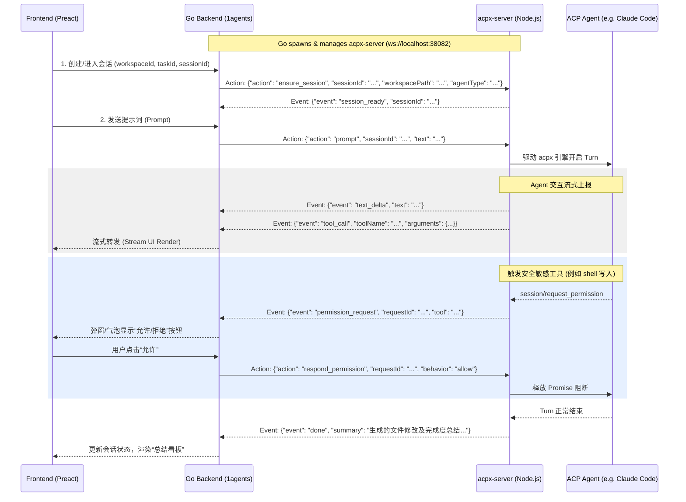
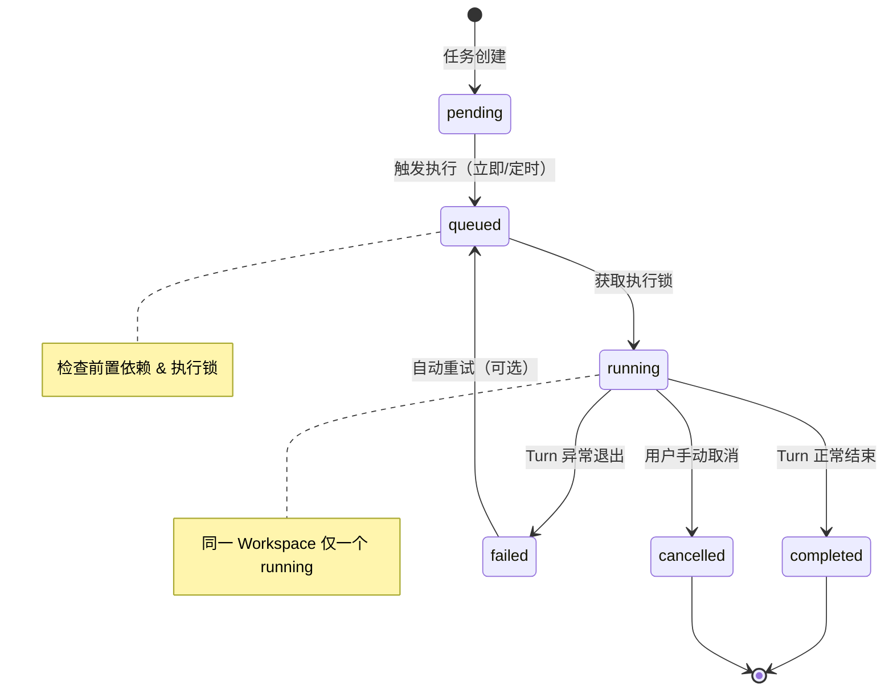
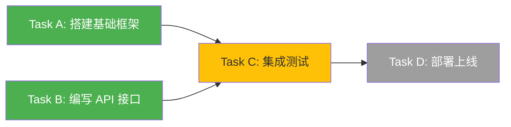

# AI Collaborative Workbench Design Document

## 1. Introduction & Product Vision

The **AI Collaborative Workbench** transforms `1agents` from a simple remote shell panel into a structured, collaborative AI development console. Instead of unstructured, ephemeral PTY chats, the system introduces a clear hierarchy:

$$\text{Project (Workspace)} \longrightarrow \text{Tasks} \longrightarrow \text{Sessions (Agent Contexts)}$$

*   **Project**: Represents a local codebase workspace. It maintains default settings (such as the default agent to use and channel configurations).
*   **Task**: A specific engineering goal (e.g., "Implement user authentication", "Align navigation layout"). A project contains multiple tasks.
*   **Session**: An active or completed execution context. To achieve a single Task, the user or orchestrator AI may launch multiple sequential sessions. As the project evolves, the user can review past session summaries and launch new sessions that inherit previous context to adjust the results dynamically.

---

## 2. Architecture & Communication Flow

The system runs a backend-managed local microservice (`acpx-server`) written in Node.js, leveraging the `acpx/runtime` SDK. The Go backend acts as the orchestrator and routes client messages.



---

## 3. Data Models & Storage Strategy

### 3.1 Zero-Redundancy Storage Principle (Claude Code Native Integration)

To keep the workspace clean and avoid duplicate storage databases, we adopt a **lightweight hybrid storage model**:

1.  **Chat Logs / History (Agent Native)**: We do NOT duplicate conversation logs in our Go database. Instead, the ACP agent (taking Claude Code as the primary example) manages its own session records on the local host.
    *   **Project Session Folder**: Located at `~/.claude/projects/<slugified-path>/`. The `<slugified-path>` is generated by replacing directory separators (`/`) and non-ASCII or special characters with hyphens `-` (e.g., `/Users/scott/Documents/01-开发项目/Web应用/1agents` becomes `-Users-scott-Documents-01------Web---1agents`).
    *   **Session Log File**: `<session-id>.jsonl` stored in the project folder. Each line is a JSON object representing a specific interaction or state change event.
    *   **Active Daemon Registry**: Located at `~/.claude/sessions/<pid>.json`, tracking active CLI daemon PIDs, status, and session IDs.
2.  **Summary & Metadata (Local Project Scope)**: The metadata of Tasks and Session summaries are stored locally in the workspace folder under `.1agents/tasks.json`. This makes the project's task history fully portable.

### 3.2 Claude Code Session Data Format (`.jsonl`)

The `<session-id>.jsonl` file records a stream of structured events. The key event types are:

*   **Session Config/Mode Event**:
    ```json
    {"type":"mode", "mode":"normal", "sessionId":"62cc86ed-73d6-4735-9e77-da116b991ef7"}
    ```
*   **User Prompt Event**:
    ```json
    {
      "type": "user",
      "message": { "role": "user", "content": "请帮我重构 app.tsx" },
      "uuid": "79a95138-7091-4992-8741-3f1b73c43ee8",
      "timestamp": "2026-06-10T00:54:29.827Z",
      "cwd": "/Users/scott/Documents/01-开发项目/Web应用/1agents",
      "sessionId": "62cc86ed-73d6-4735-9e77-da116b991ef7",
      "gitBranch": "main"
    }
    ```
*   **System Tool/Command Execution Result**:
    ```json
    {
      "type": "system",
      "subtype": "local_command",
      "content": "<local-command-stdout>Build completed successfully.</local-command-stdout>",
      "timestamp": "2026-06-10T00:54:35.838Z",
      "uuid": "433596db-ce79-4d93-9d13-3563c0fa2b41",
      "sessionId": "62cc86ed-73d6-4735-9e77-da116b991ef7"
    }
    ```
*   **Assistant Response Event**:
    ```json
    {
      "type": "assistant",
      "uuid": "22f45941-45fd-4a8a-879f-23a922cfb741",
      "timestamp": "2026-06-10T00:54:41.960Z",
      "message": {
        "role": "assistant",
        "content": [{ "type": "text", "text": "文件重构已完成！" }]
      },
      "sessionId": "62cc86ed-73d6-4735-9e77-da116b991ef7"
    }
    ```

### 3.3 History Loading & Replay Mechanism

When the user enters a past session, the Go backend initiates `ensure_session` or `loadSession` through the WebSocket client to `acpx-server`.
*   The ACP client calls the `session/load` JSON-RPC method with the target `sessionId`.
*   The Claude Code ACP server reads the native `<session-id>.jsonl` file and replays all past events to the client via `session/update` notifications.
*   The `acpx-server` captures this replay stream, formats it into standard message list payloads, and sends it back to the Go backend for rendering in the Web UI.

### 3.4 Metadata Schema (`.1agents/tasks.json`)

```json
{
  "tasks": [
    {
      "id": "task_uuid_12345",
      "title": "修复主页搜索框对齐问题",
      "status": "completed", // "pending" | "running" | "completed" | "cancelled"
      "createdAt": "2026-06-10T00:50:00Z",
      "updatedAt": "2026-06-10T01:15:00Z",
      "summary": "已将搜索框内边距调整为 12px，并修复了移动端溢出问题。",
      "sessions": [
        {
          "id": "session_uuid_abcde",
          "kind": "chat",
          "name": "智能体排查与修复",
          "agentType": "claudecode",
          "status": "idle",
          "summary": "定位了 CSS 冲突类名并完成了初步修改。",
          "createdAt": "2026-06-10T00:51:00Z"
        },
        {
          "id": "session_uuid_fghij",
          "kind": "chat",
          "name": "样式复核与微调",
          "agentType": "claudecode",
          "status": "idle",
          "summary": "进行了移动端适配测试，确认排版正常并生成了最终总结。",
          "createdAt": "2026-06-10T01:10:00Z"
        }
      ]
    }
  ]
}
```

---

## 4. Context Chaining & Dynamic Task Adjustments

When starting a new session under a task to continue or adjust previous work:

1.  **Aggregate Prior Summaries**: The Go backend reads `.1agents/tasks.json` and fetches all prior completed sessions for the target task.
2.  **Formulate Context Prompt**: It constructs a system-level context injection string:
    ```markdown
    [Task Context History]
    The user is working on the task: "${task.title}".
    Previous sessions have already achieved the following:
    - Session 1 (${session[0].agentType}): ${session[0].summary}
    - Session 2 (${session[1].agentType}): ${session[1].summary}
    Please continue the task from here, focusing on any requested adjustments.
    ```
3.  **Inject and Start**: The prompt is injected as the initial instruction when the Node bridge starts the new ACP agent run, ensuring the agent doesn't repeat already-completed steps.

---

## 5. Microservice Protocol (WebSocket API)

The `acpx-server` service exposes a WebSocket API at `ws://localhost:38082`.

### 5.1 Actions (Go -> Node)

#### `ensure_session`
Initializes the ACP client and starts the agent process in keep-alive mode.
```json
{
  "action": "ensure_session",
  "sessionId": "session_uuid_abcde",
  "workspacePath": "/Users/scott/Documents/project1",
  "agentType": "claudecode",
  "systemContext": "[Task Context History] ..."
}
```

#### `prompt`
Sends a user message to drive the agent turn.
```json
{
  "action": "prompt",
  "sessionId": "session_uuid_abcde",
  "text": "请帮我修改一下对齐方式为居中"
}
```

#### `respond_permission`
Responds to a pending permission request.
```json
{
  "action": "respond_permission",
  "sessionId": "session_uuid_abcde",
  "requestId": "req_9988",
  "behavior": "allow" // "allow" | "deny"
}
```

#### `get_history`
Retrieves structural messages for past session rendering.
```json
{
  "action": "get_history",
  "sessionId": "session_uuid_abcde"
}
```

#### `cancel`
Interrupts the currently running turn.
```json
{
  "action": "cancel",
  "sessionId": "session_uuid_abcde"
}
```

#### `close_session`
Kills the agent process and deletes runtime session resources.
```json
{
  "action": "close_session",
  "sessionId": "session_uuid_abcde"
}
```

### 5.2 Events (Node -> Go)

#### `session_ready`
```json
{
  "event": "session_ready",
  "sessionId": "session_uuid_abcde"
}
```

#### `text_delta`
流式输出字符（包含思考过程和正常回复）。
```json
{
  "event": "text_delta",
  "sessionId": "session_uuid_abcde",
  "text": "正在排查样式...",
  "type": "thinking" // "thinking" | "output"
}
```

#### `tool_call`
```json
{
  "event": "tool_call",
  "sessionId": "session_uuid_abcde",
  "toolName": "run_command",
  "arguments": { "command": "npm run build" }
}
```

#### `permission_request`
```json
{
  "event": "permission_request",
  "sessionId": "session_uuid_abcde",
  "requestId": "req_9988",
  "toolName": "run_command",
  "arguments": { "command": "git reset --hard" }
}
```

#### `done`
当智能体完成这轮会话的交互时触发。
```json
{
  "event": "done",
  "sessionId": "session_uuid_abcde",
  "summary": "智能体自动生成的修改内容和任务总结..."
}
```

#### `history_response`
```json
{
  "event": "history_response",
  "sessionId": "session_uuid_abcde",
  "messages": [
    { "role": "user", "text": "Start task" },
    { "role": "agent", "text": "Understood. Modifying CSS..." }
  ]
}
```

#### `error`
```json
{
  "event": "error",
  "sessionId": "session_uuid_abcde",
  "message": "Failed to launch agent process: claude executable not found."
}
```

---

## 6. Implementation Checklist

1.  **Microservice Implementation (`modules/1acp`)**:
    *   Initialize Node.js project (install `ws` and import `@agentclientprotocol/sdk` / `acpx`).
    *   Create `bridge-server.js` implementing WebSocket actions and keep-alive processes.
2.  **Go Backend Client (`backend/internal/agent`)**:
    *   Write `acpx_client.go` to handle connections to `acpx-server`.
    *   Create metadata manager to read/write `.1agents/tasks.json` in local workspaces.
    *   Hook up `server.go` to pull/launch `acpx-server` as a managed daemon process on startup.
3.  **Frontend Chat Console (`html/src`)**:
    *   Modify `ChatPanel.tsx` to communicate via backend WebSocket endpoints.
    *   Render stream thinking segments and inline permission widgets directly in chat bubbles.
    *   Update `TaskList.tsx` in the drawer to show tasks, session cards, and their respective summaries.

---

## 7. Defensive Engineering — 工程防御性设计

### 7.1 智能体孤儿进程防护（Orphaned Subprocess Prevention）

**风险**：Keep-Alive 模式下，Node.js 桥接服务管理多个 `claude` 守护进程。若 Go 后端被 OOM、`kill -9`、或用户强制关闭终端，Node 服务和底层 Agent 进程将变为"孤儿进程"常驻后台，持续消耗系统资源。

**防护机制**（双保险）：

1.  **Stdin 生命周期绑定（Stdin Bind）**：Node.js 桥接服务在启动时监听 `process.stdin` 的 `close` / `end` 事件。当 Go 父进程挂掉时，stdin 管道自动断开，Node 服务必须**立即执行全量清理**：
    ```javascript
    // bridge-server.js — 孤儿进程防护
    process.stdin.resume();
    process.stdin.on('end', () => {
      console.error('[acpx-server] Parent process gone, cleaning up...');
      killAllManagedAgents(); // SIGKILL all child claude processes
      process.exit(1);
    });
    ```

2.  **Go 后端优雅退出清理**：使用 `os/signal` 捕获 `SIGINT`/`SIGTERM`，在退出前向 Node 微服务发送 `close_all_sessions` 指令，等待确认后再终止进程：
    ```go
    // server.go — 退出清理
    sigCh := make(chan os.Signal, 1)
    signal.Notify(sigCh, syscall.SIGINT, syscall.SIGTERM)
    go func() {
        <-sigCh
        acpxClient.CloseAllSessions(ctx)  // 通知 Node 服务清理
        acpxProcess.Kill()                // 终止 Node 进程
        os.Exit(0)
    }()
    ```

### 7.2 工作区路径一致性保证（Path Normalization）

**风险**：Claude Code 的本地存储路径基于绝对路径的 Slug 命名（如 `-Users-scott-Documents-01------Web---1agents`）。若用户重命名项目文件夹、通过符号链接（Symlink）从不同路径访问、或使用 `~/` 简写，将导致路径哈希不一致，会话历史匹配失败。

**解决方案**：在所有路径传递的入口处（Go 后端 & Node 桥接），统一调用路径归一化函数：

*   **Node 端**：调用 `fs.realpathSync(workspacePath)` 解析出最终物理绝对路径。
*   **Go 端**：调用 `filepath.EvalSymlinks(workspacePath)` + `filepath.Abs()` 双重保证。
*   **原则**：所有存储、查询、传递的路径，必须经过归一化处理，杜绝软链接/相对路径引起的一切不一致。

### 7.3 权限询问超时兜底（Permission Pending Timeout）

**风险**：Agent 执行敏感操作时触发权限审计（如 `rm -rf`、`git reset --hard`），若用户关闭网页或走开，该 Turn 将无限期挂起（Awaiting Promise），导致 WebSocket 连接和子进程长期占用。

**解决方案**：在 Node 桥接中对每一个 `permission_request` 引入超时兜底逻辑：

```javascript
// bridge-server.js — 权限超时机制
const PERMISSION_TIMEOUT_MS = 5 * 60 * 1000; // 5 分钟

function handlePermissionRequest(requestId, toolName, args) {
  const timer = setTimeout(() => {
    respondPermission(requestId, 'deny');
    notifyBackend({
      event: 'permission_timeout',
      requestId,
      message: `Permission request for "${toolName}" auto-denied after 5min timeout.`
    });
  }, PERMISSION_TIMEOUT_MS);

  pendingPermissions.set(requestId, { timer, toolName, args });
}

// 当用户响应时，清除计时器
function onPermissionResponse(requestId, behavior) {
  const pending = pendingPermissions.get(requestId);
  if (pending) {
    clearTimeout(pending.timer);
    pendingPermissions.delete(requestId);
  }
  respondPermission(requestId, behavior);
}
```

### 7.4 Node.js 依赖隔离策略（Yarn 3 Isolation）

**风险**：主项目前端 (`html/`) 使用 Yarn 3 PnP-disabled 模式，而 `modules/1acp` 作为独立子模块引入 Node.js 服务。若共享全局包管理器或包缓存，可能导致 `make frontend` 和 `make 1acp` 编译互相干扰。

**解决方案**：

*   `modules/1acp` 保持**独立的 `package.json`**，仅依赖轻量原生库（如 `ws`），不引入复杂构建工具链。
*   在主项目 `Makefile` 中精确定义其构建方式：
    ```makefile
    .PHONY: 1acp
    1acp:
    	cd modules/1acp && npm install --production && echo "acpx-server ready"
    ```
*   **不复用** `html/` 的 Yarn 3 配置，避免 `nodeLinker`、`.yarnrc.yml` 等配置交叉污染。

---

## 8. Concurrency Control & Task Scheduling — 并发控制与任务调度

### 8.1 核心设计理念

任务执行引入**时间维度**和**依赖维度**的双重编排能力：

$$\text{Task Scheduling} = f(\text{ExecutionTime}, \text{Dependencies}, \text{ConcurrencyLock})$$

### 8.2 短期方案：会话状态锁（Session Queue Lock）

在同一项目（Workspace）内，同一时间只允许一个 ACP 智能体处于 `running` 状态。其余会话在 `queued`（排队等待）状态。

**状态流转**：



**执行锁实现**：

```go
// backend/internal/agent/scheduler.go
type WorkspaceLock struct {
    mu       sync.Mutex
    running  map[string]string  // workspacePath -> runningSessionId
}

func (wl *WorkspaceLock) TryAcquire(workspace, sessionId string) bool {
    wl.mu.Lock()
    defer wl.mu.Unlock()
    if _, occupied := wl.running[workspace]; occupied {
        return false  // 当前 workspace 已有会话在执行
    }
    wl.running[workspace] = sessionId
    return true
}

func (wl *WorkspaceLock) Release(workspace string) {
    wl.mu.Lock()
    defer wl.mu.Unlock()
    delete(wl.running, workspace)
}
```

### 8.3 任务执行时间编排（Execution Scheduling）

每个任务支持两种执行模式：

| 模式 | 字段 | 说明 |
|------|------|------|
| **立即执行** | `"scheduleType": "immediate"` | 任务创建后立即进入 `queued` 状态，等待获取执行锁 |
| **定时执行** | `"scheduleType": "scheduled"`, `"scheduledAt": "ISO8601"` | 任务在指定时间到达后才进入 `queued` 状态 |

**调度器轮询逻辑**：

```go
// backend/internal/agent/scheduler.go
func (s *Scheduler) tick() {
    now := time.Now()
    for _, task := range s.getPendingTasks() {
        // 1. 检查定时条件
        if task.ScheduleType == "scheduled" && task.ScheduledAt.After(now) {
            continue  // 时间未到，跳过
        }

        // 2. 检查前置依赖
        if !s.allDependenciesMet(task) {
            continue  // 前置任务未完成，顺延
        }

        // 3. 尝试获取执行锁
        if s.workspaceLock.TryAcquire(task.WorkspacePath, task.ID) {
            task.Status = "running"
            go s.executeTask(task)
        }
        // 获取锁失败则保持 queued，等待下一轮
    }
}
```

### 8.4 任务前置依赖管理（Task Dependencies / DAG）

任务之间可以声明**前置依赖关系**，形成有向无环图（DAG）。调度器在执行前检查所有前置任务是否已完成：



**依赖检查逻辑**：

```go
func (s *Scheduler) allDependenciesMet(task *Task) bool {
    for _, depId := range task.DependsOn {
        dep := s.getTask(depId)
        if dep == nil || dep.Status != "completed" {
            return false  // 前置任务未完成，当前任务顺延
        }
    }
    return true
}
```

**顺延规则**：
*   定时任务到达执行时间后，若前置依赖未完成，任务保持 `pending` 状态，不进入 `queued`。
*   每次调度器 tick 时重新检查，直到所有前置依赖标记为 `completed`。
*   若前置任务标记为 `failed` 或 `cancelled`，依赖它的后续任务自动标记为 `blocked`，需人工介入。

### 8.5 升级后的 Metadata Schema（`.1agents/tasks.json`）

```json
{
  "tasks": [
    {
      "id": "task_uuid_001",
      "title": "搭建基础框架",
      "status": "completed",
      "scheduleType": "immediate",
      "scheduledAt": null,
      "dependsOn": [],
      "createdAt": "2026-06-10T00:50:00Z",
      "updatedAt": "2026-06-10T01:15:00Z",
      "startedAt": "2026-06-10T00:50:05Z",
      "completedAt": "2026-06-10T01:14:30Z",
      "summary": "已完成项目基础框架搭建，包含路由、状态管理和基础组件。",
      "sessions": [
        {
          "id": "session_uuid_abcde",
          "kind": "chat",
          "name": "框架初始化",
          "agentType": "claudecode",
          "status": "idle",
          "summary": "创建了项目脚手架和核心路由结构。",
          "createdAt": "2026-06-10T00:51:00Z"
        }
      ]
    },
    {
      "id": "task_uuid_002",
      "title": "编写 API 接口",
      "status": "completed",
      "scheduleType": "immediate",
      "scheduledAt": null,
      "dependsOn": [],
      "createdAt": "2026-06-10T01:00:00Z",
      "updatedAt": "2026-06-10T01:30:00Z",
      "startedAt": "2026-06-10T01:00:03Z",
      "completedAt": "2026-06-10T01:29:50Z",
      "summary": "已完成所有 RESTful API 端点的实现和基础校验。",
      "sessions": []
    },
    {
      "id": "task_uuid_003",
      "title": "集成测试",
      "status": "queued",
      "scheduleType": "scheduled",
      "scheduledAt": "2026-06-10T02:00:00Z",
      "dependsOn": ["task_uuid_001", "task_uuid_002"],
      "createdAt": "2026-06-10T01:00:00Z",
      "updatedAt": "2026-06-10T01:30:00Z",
      "startedAt": null,
      "completedAt": null,
      "summary": null,
      "sessions": []
    }
  ]
}
```

**Schema 新增字段说明**：

| 字段 | 类型 | 说明 |
|------|------|------|
| `scheduleType` | `"immediate" \| "scheduled"` | 执行模式：立即执行或定时执行 |
| `scheduledAt` | `ISO8601 \| null` | 定时执行的目标时间，`immediate` 模式下为 `null` |
| `dependsOn` | `string[]` | 前置依赖的 Task ID 列表，空数组表示无依赖 |
| `startedAt` | `ISO8601 \| null` | 任务实际开始执行的时间 |
| `completedAt` | `ISO8601 \| null` | 任务完成时间 |
| `status` | `enum` | 扩展为: `pending` → `queued` → `running` → `completed` / `failed` / `cancelled` / `blocked` |

### 8.6 长期路线：Git Worktree 多智能体并行（Roadmap）

> [!IMPORTANT]
> 这是远期规划，不在当前版本实现。短期方案使用 §8.2 的会话状态锁保证同一时间单个智能体执行。

**目标**：通过 Git Worktree 机制为每个并发智能体会话创建独立的工作目录，实现真正的多智能体同步并行开发。

**设计思路**：

```
project/                     # 主工作区 (main branch)
├── .git/                    # 共享的 Git 仓库
├── .git/worktrees/
│   ├── agent-session-001/   # Worktree: 智能体 A 独立工作区
│   └── agent-session-002/   # Worktree: 智能体 B 独立工作区
```

*   **会话创建时**：`git worktree add .git/worktrees/<session-id> -b agent/<session-id>` 创建独立分支和工作目录。
*   **会话执行时**：每个智能体在自己的 worktree 中自由修改代码，互不干扰。
*   **会话完成时**：通过 `git merge` 或 `git rebase` 将变更合并回主分支，并清理 worktree。
*   **冲突处理**：若合并产生冲突，标记任务为 `conflict`，通知用户或启动新的智能体会话进行冲突解决。

**前提条件**：
1.  ACP Agent（如 Claude Code）需要支持在非项目根目录的 worktree 路径下正常工作。
2.  需要设计 worktree 生命周期管理（自动清理过期/废弃的 worktree）。
3.  需要评估多个 Agent 同时读写同一个 `.git` 目录时的锁竞争问题（Git 内部使用文件锁）。
