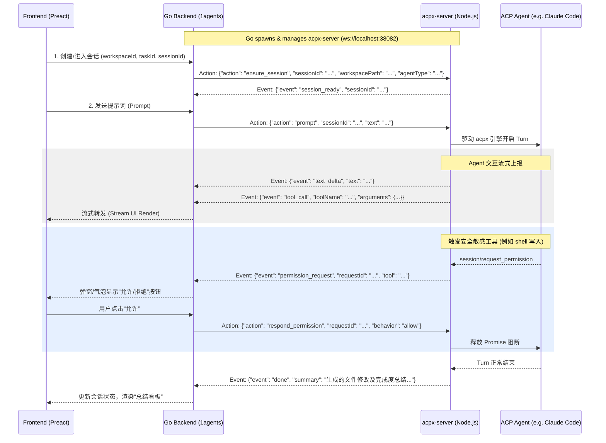

# AI Collaborative Workbench Design Document

## 1. Introduction & Product Vision

The **AI Collaborative Workbench** transforms `1agents` from a simple remote shell panel into a structured, collaborative AI development console. Instead of unstructured, ephemeral PTY chats, the system introduces a clear hierarchy:

$$\text{Project (Workspace)} \longrightarrow \text{Tasks} \longrightarrow \text{Sessions (Agent Contexts)}$$

*   **Project**: Represents a local codebase workspace. It maintains default settings (such as the default agent to use and channel configurations).
*   **Task**: A specific engineering goal (e.g., "Implement user authentication", "Align navigation layout"). A project contains multiple tasks.
*   **Session**: An active or completed execution context. To achieve a single Task, the user or orchestrator AI may launch multiple sequential sessions. As the project evolves, the user can review past session summaries and launch new sessions that inherit previous context to adjust the results dynamically.

---

## 2. Architecture & Communication Flow

The system runs a backend-managed local microservice (`acpx-server`) written in Node.js, leveraging the `acpx/runtime` SDK. The Go backend acts as the orchestrator and routes client messages.



---

## 3. Data Models & Storage Strategy

### 3.1 Zero-Redundancy Storage Principle (Claude Code Native Integration)

To keep the workspace clean and avoid duplicate storage databases, we adopt a **lightweight hybrid storage model**:

1.  **Chat Logs / History (Agent Native)**: We do NOT duplicate conversation logs in our Go database. Instead, the ACP agent (taking Claude Code as the primary example) manages its own session records on the local host.
    *   **Project Session Folder**: Located at `~/.claude/projects/<slugified-path>/`. The `<slugified-path>` is generated by replacing directory separators (`/`) and non-ASCII or special characters with hyphens `-` (e.g., `/Users/scott/Documents/01-开发项目/Web应用/1agents` becomes `-Users-scott-Documents-01------Web---1agents`).
    *   **Session Log File**: `<session-id>.jsonl` stored in the project folder. Each line is a JSON object representing a specific interaction or state change event.
    *   **Active Daemon Registry**: Located at `~/.claude/sessions/<pid>.json`, tracking active CLI daemon PIDs, status, and session IDs.
2.  **Summary & Metadata (Local Project Scope)**: The metadata of Tasks and Session summaries are stored locally in the workspace folder under `.1agents/tasks.json`. This makes the project's task history fully portable.

### 3.2 Claude Code Session Data Format (`.jsonl`)

The `<session-id>.jsonl` file records a stream of structured events. The key event types are:

*   **Session Config/Mode Event**:
    ```json
    {"type":"mode", "mode":"normal", "sessionId":"62cc86ed-73d6-4735-9e77-da116b991ef7"}
    ```
*   **User Prompt Event**:
    ```json
    {
      "type": "user",
      "message": { "role": "user", "content": "请帮我重构 app.tsx" },
      "uuid": "79a95138-7091-4992-8741-3f1b73c43ee8",
      "timestamp": "2026-06-10T00:54:29.827Z",
      "cwd": "/Users/scott/Documents/01-开发项目/Web应用/1agents",
      "sessionId": "62cc86ed-73d6-4735-9e77-da116b991ef7",
      "gitBranch": "main"
    }
    ```
*   **System Tool/Command Execution Result**:
    ```json
    {
      "type": "system",
      "subtype": "local_command",
      "content": "<local-command-stdout>Build completed successfully.</local-command-stdout>",
      "timestamp": "2026-06-10T00:54:35.838Z",
      "uuid": "433596db-ce79-4d93-9d13-3563c0fa2b41",
      "sessionId": "62cc86ed-73d6-4735-9e77-da116b991ef7"
    }
    ```
*   **Assistant Response Event**:
    ```json
    {
      "type": "assistant",
      "uuid": "22f45941-45fd-4a8a-879f-23a922cfb741",
      "timestamp": "2026-06-10T00:54:41.960Z",
      "message": {
        "role": "assistant",
        "content": [{ "type": "text", "text": "文件重构已完成！" }]
      },
      "sessionId": "62cc86ed-73d6-4735-9e77-da116b991ef7"
    }
    ```

### 3.3 History Loading & Replay Mechanism

When the user enters a past session, the Go backend initiates `ensure_session` or `loadSession` through the WebSocket client to `acpx-server`.
*   The ACP client calls the `session/load` JSON-RPC method with the target `sessionId`.
*   The Claude Code ACP server reads the native `<session-id>.jsonl` file and replays all past events to the client via `session/update` notifications.
*   The `acpx-server` captures this replay stream, formats it into standard message list payloads, and sends it back to the Go backend for rendering in the Web UI.

### 3.4 Metadata Schema (`.1agents/tasks.json`)

```json
{
  "tasks": [
    {
      "id": "task_uuid_12345",
      "title": "修复主页搜索框对齐问题",
      "status": "completed", // "pending" | "running" | "completed" | "cancelled"
      "createdAt": "2026-06-10T00:50:00Z",
      "updatedAt": "2026-06-10T01:15:00Z",
      "summary": "已将搜索框内边距调整为 12px，并修复了移动端溢出问题。",
      "sessions": [
        {
          "id": "session_uuid_abcde",
          "kind": "chat",
          "name": "智能体排查与修复",
          "agentType": "claudecode",
          "status": "idle",
          "summary": "定位了 CSS 冲突类名并完成了初步修改。",
          "createdAt": "2026-06-10T00:51:00Z"
        },
        {
          "id": "session_uuid_fghij",
          "kind": "chat",
          "name": "样式复核与微调",
          "agentType": "claudecode",
          "status": "idle",
          "summary": "进行了移动端适配测试，确认排版正常并生成了最终总结。",
          "createdAt": "2026-06-10T01:10:00Z"
        }
      ]
    }
  ]
}
```

---

## 4. Context Chaining & Dynamic Task Adjustments

When starting a new session under a task to continue or adjust previous work:

1.  **Aggregate Prior Summaries**: The Go backend reads `.1agents/tasks.json` and fetches all prior completed sessions for the target task.
2.  **Formulate Context Prompt**: It constructs a system-level context injection string:
    ```markdown
    [Task Context History]
    The user is working on the task: "${task.title}".
    Previous sessions have already achieved the following:
    - Session 1 (${session[0].agentType}): ${session[0].summary}
    - Session 2 (${session[1].agentType}): ${session[1].summary}
    Please continue the task from here, focusing on any requested adjustments.
    ```
3.  **Inject and Start**: The prompt is injected as the initial instruction when the Node bridge starts the new ACP agent run, ensuring the agent doesn't repeat already-completed steps.

---

## 5. Microservice Protocol (WebSocket API)

The `acpx-server` service exposes a WebSocket API at `ws://localhost:38082`.

### 5.1 Actions (Go -> Node)

#### `ensure_session`
Initializes the ACP client and starts the agent process in keep-alive mode.
```json
{
  "action": "ensure_session",
  "sessionId": "session_uuid_abcde",
  "workspacePath": "/Users/scott/Documents/project1",
  "agentType": "claudecode",
  "systemContext": "[Task Context History] ..."
}
```

#### `prompt`
Sends a user message to drive the agent turn.
```json
{
  "action": "prompt",
  "sessionId": "session_uuid_abcde",
  "text": "请帮我修改一下对齐方式为居中"
}
```

#### `respond_permission`
Responds to a pending permission request.
```json
{
  "action": "respond_permission",
  "sessionId": "session_uuid_abcde",
  "requestId": "req_9988",
  "behavior": "allow" // "allow" | "deny"
}
```

#### `get_history`
Retrieves structural messages for past session rendering.
```json
{
  "action": "get_history",
  "sessionId": "session_uuid_abcde"
}
```

#### `cancel`
Interrupts the currently running turn.
```json
{
  "action": "cancel",
  "sessionId": "session_uuid_abcde"
}
```

#### `close_session`
Kills the agent process and deletes runtime session resources.
```json
{
  "action": "close_session",
  "sessionId": "session_uuid_abcde"
}
```

### 5.2 Events (Node -> Go)

#### `session_ready`
```json
{
  "event": "session_ready",
  "sessionId": "session_uuid_abcde"
}
```

#### `text_delta`
流式输出字符（包含思考过程和正常回复）。
```json
{
  "event": "text_delta",
  "sessionId": "session_uuid_abcde",
  "text": "正在排查样式...",
  "type": "thinking" // "thinking" | "output"
}
```

#### `tool_call`
```json
{
  "event": "tool_call",
  "sessionId": "session_uuid_abcde",
  "toolName": "run_command",
  "arguments": { "command": "npm run build" }
}
```

#### `permission_request`
```json
{
  "event": "permission_request",
  "sessionId": "session_uuid_abcde",
  "requestId": "req_9988",
  "toolName": "run_command",
  "arguments": { "command": "git reset --hard" }
}
```

#### `done`
当智能体完成这轮会话的交互时触发。
```json
{
  "event": "done",
  "sessionId": "session_uuid_abcde",
  "summary": "智能体自动生成的修改内容和任务总结..."
}
```

#### `history_response`
```json
{
  "event": "history_response",
  "sessionId": "session_uuid_abcde",
  "messages": [
    { "role": "user", "text": "Start task" },
    { "role": "agent", "text": "Understood. Modifying CSS..." }
  ]
}
```

#### `error`
```json
{
  "event": "error",
  "sessionId": "session_uuid_abcde",
  "message": "Failed to launch agent process: claude executable not found."
}
```

---

## 6. Implementation Checklist

1.  **Microservice Implementation (`modules/1acp`)**:
    *   Initialize Node.js project (install `ws` and import `@agentclientprotocol/sdk` / `acpx`).
    *   Create `bridge-server.js` implementing WebSocket actions and keep-alive processes.
2.  **Go Backend Client (`backend/internal/agent`)**:
    *   Write `acpx_client.go` to handle connections to `acpx-server`.
    *   Create metadata manager to read/write `.1agents/tasks.json` in local workspaces.
    *   Hook up `server.go` to pull/launch `acpx-server` as a managed daemon process on startup.
3.  **Frontend Chat Console (`html/src`)**:
    *   Modify `ChatPanel.tsx` to communicate via backend WebSocket endpoints.
    *   Render stream thinking segments and inline permission widgets directly in chat bubbles.
    *   Update `TaskList.tsx` in the drawer to show tasks, session cards, and their respective summaries.
