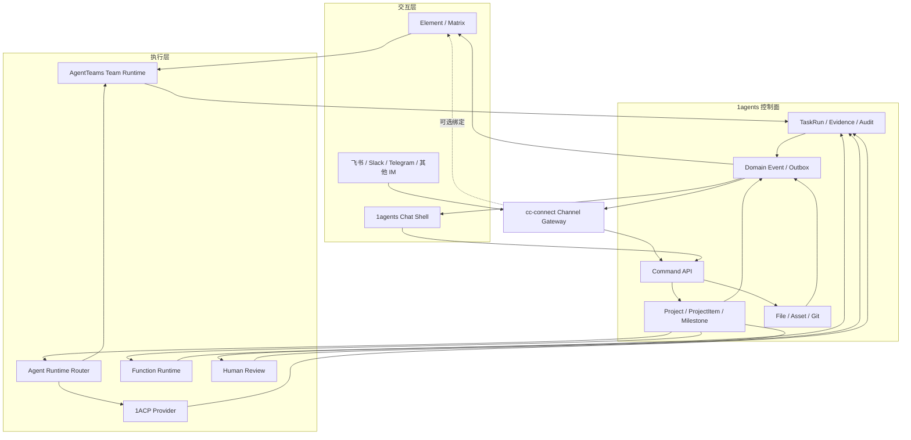

# Chat-first AgentTeams 交互与渠道架构

> Status: Accepted direction, implementation pending
>
> Decision date: 2026-08-03
>
> Scope: AgentTeams / Matrix 聊天入口、1agents 工作台、1ACP 与 cc-connect 的长期边界

## 1. 决策摘要

1agents 采用“聊天优先、工作台留痕”的双表面产品形态：

- **Matrix / 聊天是日常工作的驾驶舱**：提出目标、补充上下文、看摘要、处理异常、选择候选产物和执行审批。
- **1agents 工作台是结构化事实与审计账本**：保存 Project、ProjectItem、Milestone、TaskRun、Evidence、Artifact、Git 和发布状态。
- **AgentTeams 是可选 Team Runtime**：管理 Manager、Leader、Worker、Human、Matrix 房间、团队内部任务和运行时生命周期。
- **1ACP 是并列的单 Agent Runtime Provider**：保持现有 Session / Turn 执行路径，不嵌入 AgentTeams，也不为 AgentTeams 做会话迁移。
- **cc-connect 收敛为外部 Channel Gateway**：保留飞书、Slack、Telegram、钉钉、企业微信等平台适配，不再作为第一方 Agent 会话与团队协作主入口。

一句话定界：

> **聊天负责交互，工作台负责事实，Runtime 负责执行，cc-connect 负责外部渠道。**

## 2. 为什么转向聊天优先

一人团队的高频行为不是长时间查看管理仪表盘，而是持续地向 AI 员工提出目标、补充条件、处理异常和做关键选择。Matrix 的房间、私聊、未读、消息历史、移动端和人工介入模式比“先打开工作台，再找一个按钮创建任务”更接近用户已有的工作习惯。

但聊天时间线无法回答下列问题：

- 整个项目还有哪些里程碑未完成？
- 哪些任务依赖某个角色或资产版本？
- 谁在什么时间批准了发布？
- 哪个 Skill、模型和工具生成了当前产物？
- 任务失败、重试和返工后，哪个结果是正式版本？

因此产品不是“用聊天替换工作台”，而是让两者消费同一套事实和命令。

## 3. 总体架构



## 4. 双表面交互模型

### 4.1 聊天表面：行动与及时介入

聊天适合：

- 提出目标和修改意图；
- 补充项目上下文；
- 查看当前阶段和异常摘要；
- 选择候选文本、图像、音频或方案；
- 批准、打回、取消或重试；
- 观察 Manager 与 Worker 的协作过程；
- 通过深链接打开详细对象。

### 4.2 工作台表面：全局状态与审计

工作台适合：

- 任务蓝图、看板和批量任务；
- 功能清单、里程碑和发布计划；
- 文件、Git Diff、资产版本和依赖关系；
- 成本、Trace、Evidence 和审计查询；
- 团队、Agent Identity、Skill 和 Runtime 配置；
- 长周期阻塞、回滚和发布历史。

### 4.3 四级渐进展开

| 层级 | 展示形态 | 适用内容 |
|------|----------|----------|
| L0 消息摘要 | Matrix / Chat 普通消息 | 状态、结论、异常和下一步 |
| L1 内联卡片 | 结构化摘要、缩略图、按钮 | 任务、审批、候选、进度 |
| L2 抽屉视图 | 1agents 右侧面板或弹层 | 文件预览、Diff、任务详情、音频试听 |
| L3 完整工作台 | 独立项目页 | 蓝图、里程碑、Git、资产、Trace、批量操作 |

## 5. 事实、命令与消息的边界

下列事实不得仅保存在 Matrix 或聊天记录中：

- 任务状态和依赖；
- 正式资产与当前版本；
- 人工审批和高风险操作结果；
- 发布、回滚和取消事实；
- 验收结果和执行证据。

用户可以用自然语言发起命令，但审批、发布、删除、回滚、重试和候选选择必须转换为结构化 Action：

```json
{
  "action": "approve_release",
  "projectId": "xiyouji",
  "taskId": "release-001",
  "expectedVersion": 7,
  "actorId": "user-001",
  "expiresAt": "2026-08-03T12:00:00Z",
  "nonce": "example-nonce"
}
```

后端必须校验 actor 权限、当前状态、期望版本、nonce、过期时间和幂等性，再写入 1agents 事实并生成审计记录。

## 6. 状态同步流

### 6.1 用户命令

```text
用户在 Matrix、1agents Chat 或外部 IM 发起命令
  → Matrix Ingress / cc-connect Channel Gateway
  → AgentTeams Manager 解释意图（需要时）
  → 调用 1agents Command API
  → 1agents 校验并写入权威状态
  → 生成 Domain Event
```

### 6.2 事实投影

```text
1agents Domain Event / Outbox
  → 更新工作台视图
  → 发送或编辑 Matrix 消息
  → 经 cc-connect 投影到外部 IM
  → 写入 Trace / Audit
```

每个跨系统事件应携带：

```text
origin
origin_event_id
correlation_id
causation_id
project_id
task_id
actor_id
```

用于防止重复消息、投影回环和过期操作。

## 7. AgentTeams 与 1ACP 的运行时边界

`executor=agent` 内部通过 Runtime Provider 选择执行路径：

```text
executor=agent
  └── runtime_provider
      ├── 1acp        单 Agent Session / Turn
      └── agentteams  多 Agent TeamRun
```

项目可定义默认 Provider，任务可选择性覆盖。AgentTeams 路径在参赛和初期产品中使用粗粒度 `delegated-team` 模式：

- 1agents 提交一个业务级 TeamRun；
- AgentTeams Manager 在内部拆解和委派微任务；
- 内部子任务不双向复制为 1agents ProjectItem；
- 1agents 仅保存 External Run 绑定、关键事件、最终结果和 Evidence。

1ACP 路径保持现有实现，不需要迁移到 AgentTeams Worker 内。

## 8. Matrix 与 cc-connect 的竞合边界

### 8.1 Matrix 替代的能力

AgentTeams / Matrix 可逐步替代 cc-connect 的：

- 第一方人机聊天入口；
- Manager 与 Worker 团队内部通信；
- 第一方移动端访问；
- Agent 协作历史和人工介入窗口；
- 项目内部状态通知。

### 8.2 cc-connect 继续负责的能力

cc-connect 保留：

- 飞书、Slack、Telegram、Discord、钉钉、企业微信等 Platform Adapter；
- webhook、签名验证、平台卡片、限流、i18n 和租户身份；
- 外部业务消息输入；
- 1agents Event 向已有企业渠道的投影。

长期依赖方向从：

```text
Platform ↔ cc-connect Engine ↔ Agent
```

收敛为：

```text
External Platform ↔ cc-connect Channel Gateway ↔ 1agents Command/Event API
```

cc-connect 不再直接拥有正式 Agent 任务的会话生命周期。

### 8.3 外部渠道与 Matrix 的绑定

不得将全部外部消息无条件双向复制到 Matrix。可选绑定必须明确：

```json
{
  "projectId": "xiyouji",
  "sourcePlatform": "feishu",
  "sourceConversationId": "example-conversation",
  "matrixRoomId": "example-room",
  "direction": "bidirectional",
  "allowedEventTypes": ["user_command", "task_status", "human_review"],
  "exposeInternalAgentMessages": false,
  "allowedActions": ["view", "approve", "reject"]
}
```

默认不向外部渠道投影 Worker 内部讨论、调试信息和秘密上下文。

## 9. 聊天内嵌策略

第一阶段不 Fork Element，也不假设所有 Matrix 客户端都支持自定义 iframe。

### 9.1 参赛阶段

- 使用原生 Element / Matrix 作为聊天入口；
- 消息中使用 Markdown、缩略图、结构化摘要和 1agents 深链接；
- 用双窗口或分屏演示 Matrix 协作与 1agents 工作台自动回写；
- 不实现 Element Widget、完整自定义 Matrix Client 或 cc-connect 大规模重构。

### 9.2 产品化阶段

1agents 内建 Chat Shell，直接消费 Matrix Timeline，并通过原生组件复用工作台能力。App SDK 可增加：

```text
chat-card
chat-drawer
entity-preview
```

第一方 Task、File、Git、Feature 和 Asset 视图优先原生渲染；只有第三方或不可信网页使用受控 iframe。外部 Matrix 客户端无法渲染定制组件时，降级为文本摘要、图片和深链接。

## 10. 权威所有者

| 概念 | 权威所有者 |
|------|--------------|
| Project、ProjectItem、Milestone | 1agents Go 后端 |
| 业务任务状态 | 1agents Go 后端 |
| 正式资产版本 | 1agents AssetStore / workspace |
| TaskRun、Evidence、人工决策 | 1agents |
| AgentTeams Team / Worker 生命周期 | AgentTeams Controller |
| AgentTeams 内部微任务 | AgentTeams TeamHarness |
| Matrix 房间和消息历史 | Matrix homeserver |
| 1ACP Session / Turn Journal | 1ACP |
| 外部 IM webhook 与回复位置 | cc-connect |
| Skill / App 版本与安装回执 | 1agents / HarnessKit |

一个概念只允许一个权威所有者。其他系统只保存引用或可重建投影。

## 11. 分阶段实施

### Phase 1：参赛纵切

- Element / Matrix 负责聊天与 AgentTeams 团队协作；
- 1agents 新增粗粒度 AgentTeams Runtime Provider；
- TeamRun 状态、最终 Result Manifest 和 Evidence 写回 1agents；
- Matrix 消息使用深链接打开任务、文件、资产和预览；
- 展示一次返工、一次人工选择和一次最终验收；
- cc-connect 保持现状，本阶段不做双向 Matrix 桥接。

### Phase 2：Chat-first 1agents

- 内建 Matrix Timeline 与 Chat Shell；
- 实现 Task Card、Asset Candidate Card 和 Review Card；
- 实现 File Preview / Git Diff / Task Detail Drawer；
- App SDK 增加聊天表面挂载点；
- 为移动端和外部 Matrix 客户端提供降级表达。

### Phase 3：cc-connect 渠道化

- 将外部平台输入统一转为 1agents Command；
- 将 1agents Event 投影为平台卡片或消息；
- 新增 ConversationBinding、身份映射、幂等和回环防护；
- 逐步弱化 cc-connect 直连 Agent Session 的正式任务路径。

### Phase 4：多人多智能体

- 组织、团队、SSO 与 RBAC；
- 多项目 Matrix 房间和外部合作方权限；
- 消息留存、审计导出和数据隔离；
- 多设备、远程 Worker 与分布式 Runtime。

## 12. 非目标

当前不做：

- 不用 Matrix 消息取代 ProjectItem、TaskRun 或 Evidence；
- 不将 AgentTeams 内部子任务双向复制为 1agents ProjectItem；
- 不将 1ACP 迁移到 AgentTeams Worker；
- 不在参赛阶段 Fork Element 或实现完整 Matrix Widget；
- 不立即删除 cc-connect 的 Agent Adapter，先保留兼容路径；
- 不无条件桥接全部 Matrix 和外部 IM 消息；
- 不让任何 Runtime 直接写入 1agents 数据库。

## 13. 验收标准

### 参赛纵切

1. 用户可以在 Matrix 中向 AgentTeams Manager 提交一个团队任务。
2. 1agents 可以显示关联 TeamRun 的运行、等待人工、完成或失败状态。
3. Matrix 消息可以打开对应的 1agents 任务、文件或资产。
4. AgentTeams 完成后，Result Manifest 和 Evidence 被导入 1agents。
5. 工作台状态变化能投影为 Matrix 通知，而且不会形成消息回环。
6. 卸载或停止 AgentTeams 不会删除 1agents 中的项目、正式资产和审计记录。

### 产品化纵切

1. 同一 Task / File / Asset 组件可以在工作台页、聊天卡片和右侧抽屉中复用。
2. 外部 Matrix 客户端不支持定制组件时，仍可通过文本、图片和深链接完成关键操作。
3. 所有审批、发布、删除、回滚和重试操作都有结构化 Action 和审计记录。
4. cc-connect 外部渠道和 Matrix 绑定具有权限、幂等、去重和回环保护。

## 14. 相关文档

- [AgentTeams 参赛技术方案](../GOAI/技术方案v1.md)
- [AgentTeams 与绘本生产长期方案](../GOAI/技术方案（长期）-v1.md)
- [AgentTeams 历史集成讨论](../discussions/agentTeams-集成方案讨论.md)
- [App SDK 契约](./app-sdk-contract.md)
- [cc-connect 现有多渠道架构](./remote_agents和cc-connect的技术架构设计.md)
