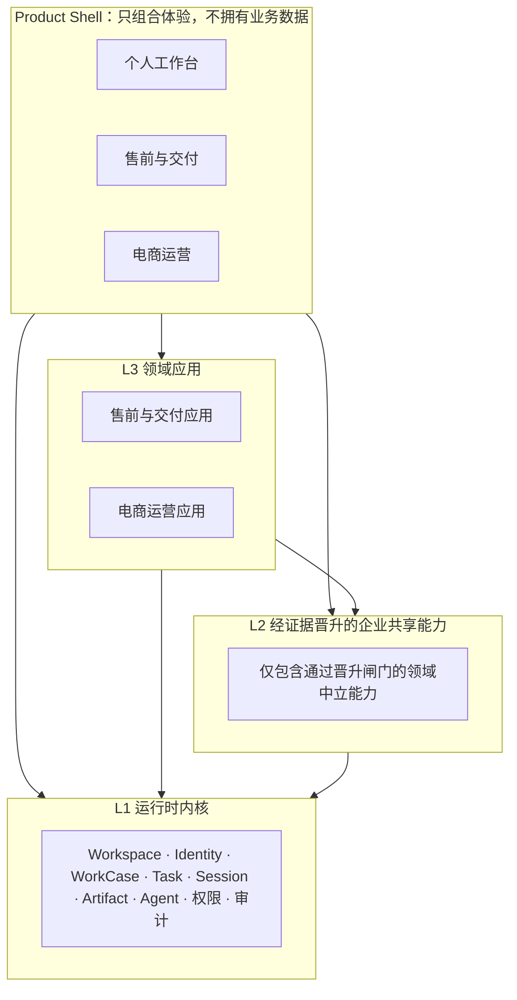
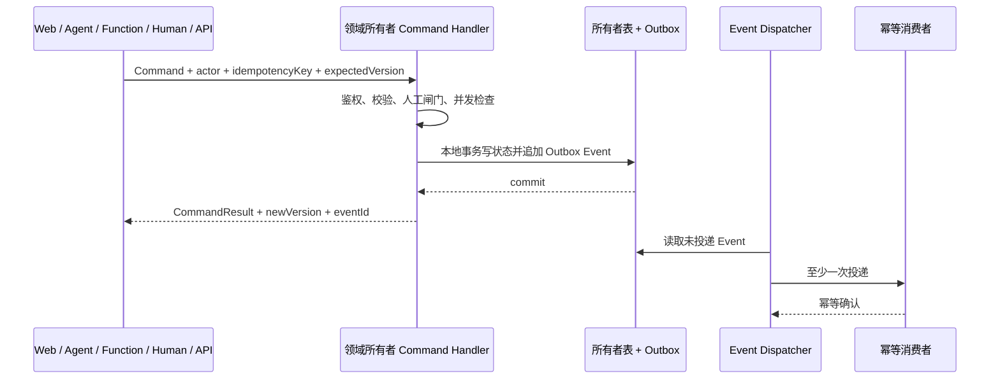

# 企业工作底座 v1.0.0：架构、术语与升级闸门

> **状态：目标架构已冻结，尚未整体实现。** 本文定义 `1.0.0` 大迭代的边界、术语、D1–D7 架构决策和 C0/C1/C2 验收闸门。任何“当前已实现”的判断以代码和现有权威文档为准，不能从本文的目标设计反推已经交付。
>
> **追溯：** 顶层需求为项目看板 `#319`「v1.0.0：建设通用企业工作底座与三产品壳」；本文交付任务为 `#320`「冻结 v1.0.0 企业底座架构、术语与升级闸门」。版本路线以[产品里程碑路线图](../product/roadmap.md)为准，现行基础架构见[agentsOS 架构设计](./agentsOS-架构设计.md)，既有实体名以[名称定义表](../product/名称定义表.md)为准。

---

## 1. 一句话目标

v1.0.0 把 1Agents 从以项目、ProjectItem 和 Agent 会话为中心的个人 AI 工作台，升级为可承载多个企业业务领域的 AI 原生工作底座：业务事实留在领域应用，长期业务事项由 WorkCase 协调，可执行工作由 Task 承载，所有跨边界交互通过版本化 Command、Query 和 Outbox Event 完成，并由三个 Product Shell 组合成不同用户体验。

发布不是“把 CRM 和电商字段塞进现有任务表”。发布成立的条件是：售前与交付跑通一个真实闭环，电商产品上新在不增加内核领域字段的情况下跑通第二个闭环，二者共享同一套运行、权限和审计事实。

---

## 2. 当前能力与 v1.0.0 目标

### 2.1 当前已实现基线

下表只列已有代码或已验收功能，不包含本次目标设计。

| 当前能力 | 已实现事实 | v1.0.0 如何处理 |
|---|---|---|
| 项目与工作项 | `Workspace`（产品称“项目”）、`ProjectItem`、依赖、状态、计划、严格 SemVer 里程碑已经存在；仅 `ProjectItem(type=task)` 可调度 | 保留并兼容；v1.0.0 的 Task 首先沿用 `ProjectItem(type=task)`，不复制第二套任务系统 |
| 功能蓝图 | 模块/功能点树、`source` 需求、`delivery` 任务、目标里程碑、覆盖率、历史版本和导出已经存在 | 继续作为功能范围与追溯索引；不承载领域业务状态，也不新增第二套排期事实 |
| 执行与审计 | `Session`、`AgentTurn`、`TaskRun`、`ProjectEvent`，以及 agent/function/human 三类执行通道已经存在 | 作为运行时内核基线；补齐 WorkCase 关联和统一跨域契约 |
| 工作环境 | Chat、终端、文件、项目目录、Inbox、日程、Agent 与远程访问入口已经存在 | 收敛为“个人工作台” Product Shell 的原生能力，不重做一个缩水版工作台 |
| 应用基础设施 | 编译期 App Registry、Manifest 查询/启停、前端视图注册，以及 `project-tab` / `l1-page` / `lens` 挂载点已经存在 | 演进为带 `provides` / `requires` 的 Capability Contract 和 Shell 声明；仍从进程内注册起步 |
| 领域存储基础 | 同一 `meta.db` 可创建带应用前缀的领域表，领域产物可写入 Workspace 下的 `.artifacts/<app-id>/` | 新表实行明确所有权和跨域访问门禁；不强制重命名已有内核表 |

现有 `ProjectEvent` 是项目变更的不可变审计事实，现有 App Manifest 主要描述挂载点、任务类型和领域表。它们分别是 Outbox Event 和 Capability Contract 的演进基础，但**不等于**完整的跨域 Outbox 或版本化能力契约已经实现。

### 2.2 v1.0.0 新增目标

以下能力目前是目标，只有通过对应阶段闸门后才能标记为已实现。

| 目标能力 | v1.0.0 完成定义 |
|---|---|
| 三层边界 | 运行时内核、经证据晋升的企业共享能力、领域应用具有单向依赖和唯一数据所有者 |
| WorkCase | 提供位于 Domain Object 与 Task 之间的长期业务事项，聚合目标、参与者、阶段、任务、会话、产物、事件和人工决策 |
| Command / Query / Event | 状态修改只走 Command，跨域权威读取只走 Query，已发生事实通过与领域事务原子提交的 Outbox Event 通知 |
| Capability Contract | Manifest 声明版本、`provides`、`requires`、类型化接口、权限与迁移约束；C0 先实现最小进程内契约和启动校验 |
| 能力晋升 | 领域能力只有满足双领域真实使用、真实跨域流程、唯一权威所有者和稳定中立契约后才能进入共享层 |
| 同库分域 | 保持一个数据库实例；内核、共享能力、售前和电商各自拥有表，只能由所有者写入 |
| 三个 Product Shell | 个人工作台、售前与交付、电商运营共享事实，分别提供导航、首页、术语和流程视角，不复制数据 |
| 双领域验证 | 先跑通售前与交付，再用电商产品上新薄切片证明内核没有售前特化 |

---

## 3. D1：三层架构与 Product Shell

Product Shell 是用户体验组合层，不是第四个数据层。目标架构的三个数据与能力层如下。



### 3.1 L1：运行时内核

运行时内核只保存跨业务都成立、缺失后任何领域都无法安全运行的事实：

- Workspace、Identity、权限与审计；
- WorkCase、Task、依赖、调度、执行、核验和人工闸门；
- Session、AgentTurn、TaskRun、Artifact 引用与 Agent/Function/Human 执行通道；
- Command、Query、Event 的注册、鉴权、幂等、并发和投递基础设施；
- Capability Contract 与 Product Shell 的最小注册能力。

内核不得出现 `opportunity_stage`、`customer_budget`、`sku`、`listing_status` 等领域字段，也不得了解某个售前或电商流程的具体阶段。

### 3.2 L2：经证据晋升的企业共享能力

共享层不是“看起来以后可能复用”的工具箱。它只接纳已经由至少两个独立领域证明需要共享的能力。共享层拥有自己的中立模型、版本化契约、权限和迁移策略，并且不能依赖任一领域应用实现。

在晋升前，客户、商品、内容等概念都保留在各自领域。名称相似不构成共享证据。

### 3.3 L3：领域应用

领域应用拥有业务语言、业务状态机、业务表和领域页面。例如：

- 售前与交付拥有 Opportunity、Evidence、QualificationAssessment、EngagementEvent、RequirementSnapshot、SolutionVersion、DeliveryBinding；
- 电商运营拥有 ProductCandidate、Product、SKU、ShootBrief、MediaAsset、Listing、PublishRecord。

领域应用可以依赖内核和已晋升共享能力，但不能直接依赖其他领域应用的代码、表或内部类型。需要另一领域做事时发 Command；需要其当前权威状态时发 Query；需要获知已经发生的事实时订阅 Event。

### 3.4 边界规则

| 规则 | 必须满足 | 禁止 |
|---|---|---|
| 依赖方向 | `领域应用 → 共享能力 → 运行时内核`，领域应用也可直接使用内核契约 | 内核反向依赖领域；应用依赖应用实现 |
| 数据所有权 | 每个权威事实只有一个所有者和一个写入口 | 多个模块直接更新同一权威表 |
| Shell | 声明导航、首页、术语、挂载点和默认视图 | 在 Shell 内复制 Workspace、WorkCase、Task、权限或领域业务表 |
| 跨域交互 | 使用版本化 Query、Command、Event | 跨域 SQL、共享内部 Store、跨域事务写表 |
| 人工责任 | 高风险和最终业务决定由显式 Human Command 形成审计事实 | Agent 或 Event consumer 静默覆盖人工决定 |

---

## 4. D2：Domain Object、WorkCase 与 Task

### 4.1 三类对象的职责

| 对象 | 回答的问题 | 生命周期 | 所有者 |
|---|---|---|---|
| **Domain Object** | “业务上这是什么、现在处于什么状态？” | 由领域状态机决定，通常长期存在 | 对应领域应用 |
| **WorkCase** | “围绕哪些业务对象，要达成什么目标，当前协作推进到哪里？” | 跨越多个阶段、任务、会话和人工决定 | 运行时内核；业务阶段键由 CaseDefinition 解释 |
| **Task** | “下一件可执行、可交接、可核验的工作是什么？” | 短于 WorkCase，完成或取消后保留审计 | 运行时内核 |

```text
Domain Object（业务事实）
  └── DomainRef ──► WorkCase（长期业务事项）
                       ├── Task A ──► Session / AgentTurn / TaskRun
                       ├── Task B ──► Session / AgentTurn / TaskRun
                       ├── Artifact / Evidence 引用
                       ├── Command / Event 时间线
                       └── Human Decision
```

### 4.2 Domain Object

Domain Object 保存领域权威事实。它不能被 WorkCase 或 Task 的通用字段替代。例如 Opportunity 的资格状态属于售前域，Listing 的发布状态属于电商域。内核只通过稳定 `DomainRef` 引用它：

```text
DomainRef = { domain, objectType, objectId, contractVersion }
```

跨域消费者不能根据 `DomainRef` 拼表查询；它必须调用该领域公开的 Query。

### 4.3 WorkCase

WorkCase 是新增的一等协调对象，不是 ProjectItem 的新 `type`，也不是把整个领域对象序列化进任务描述。它至少表达：

- 稳定身份、所属 Workspace、CaseDefinition 和当前协调状态；
- 目标、参与者、负责人、阶段键、SLA/期望时间；
- 一个主 DomainRef 和零到多个相关 DomainRef；
- Task、Session、Artifact、Event 与 Decision 的关联；
- 创建者、当前责任人、版本、创建/更新时间和关闭原因。

约束：

1. WorkCase 可以没有立即可执行的 Task，例如等待客户回复；Task 完成也不自动关闭 WorkCase。
2. 领域对象状态变化不会隐式改写 WorkCase；需要由显式 Command 根据 CaseDefinition 推进。
3. WorkCase 不保存客户预算、SKU 属性等领域字段。
4. 关键人工决定必须绑定 actor、理由、证据和所依据的版本，Agent 只能提出建议或发起待审批 Command。
5. 三个 Product Shell 读取同一个 WorkCase ID，不创建“个人版 Case”或“领域版 Case”。

### 4.4 Task

Task 是可执行工作的通用对象，继续遵守“目标清晰、可独立交接、可核验”的约束。v1.0.0 的兼容策略是：

- 以现有 `ProjectItem(type=task)` 承载 Task 事实；
- 以关系表或等价稳定关联连接 `work_case_id`，不复制 ProjectItem；
- requirement、bug、discussion 仍是 ProjectItem 的非执行类型，不冒充 WorkCase 或 Domain Object；
- Task 的完成只代表一件工作完成，不代表 Domain Object 或 WorkCase 自动进入终态；
- Task 的调度、Session、TaskRun、Evidence、Verifier 和人工验收继续复用现有能力。

---

## 5. D3：Command、Query 与 Outbox Event

### 5.1 语义边界

| 契约 | 语义 | 返回/结果 | 一致性要求 |
|---|---|---|---|
| **Command** | 请求所有者改变状态；可以成功、拒绝或冲突 | 明确结果、当前版本、产生的 Event ID | 鉴权、幂等键、`expectedVersion`、actor、correlation/causation 和审计 |
| **Query** | 读取所有者当前权威状态；不能产生业务副作用 | 类型化只读结果和契约版本 | 由所有者实现；跨域调用不得绕过权限或直接查表 |
| **Outbox Event** | 通知“某事实已经发生”，使用过去时 | 版本化不可变事实；消费者自行幂等处理 | 与领域状态修改在同一本地事务提交；至少一次投递，不承诺全局顺序 |

Command 不是 Event：`ApproveSolution` 是请求，`SolutionApproved` 是成功后产生的事实。Event 也不是跨域写指令：消费者不能把收到 `SolutionApproved` 当成可以直接更新售前表的权限。

### 5.2 写入与通知流程



### 5.3 契约最小字段

Command、Query 和 Event 的具体 payload 由所有者定义，但公共信封至少包含：

| 公共字段 | Command | Query | Event |
|---|:---:|:---:|:---:|
| `contract` + `schemaVersion` | ✓ | ✓ | ✓ |
| `workspaceId` / tenant scope | ✓ | ✓ | ✓ |
| `actor` 与权限上下文 | ✓ | ✓ | ✓ |
| `correlationId` | ✓ | ✓ | ✓ |
| `causationId` | 可选 | 可选 | ✓ |
| `idempotencyKey` | ✓ | - | Event ID 即幂等键 |
| `expectedVersion` | 修改并发对象时必需 | - | 记录结果版本 |
| `occurredAt` | - | - | ✓ |

C0 只要求进程内类型化处理、稳定信封、注册与测试，不要求引入网络消息中间件。外部 API、Web、Agent、Function、Human 和 IM 最终都必须进入同一个 Command Handler，不能各写一套状态推进逻辑。

---

## 6. D4/D5：能力晋升与 Capability Contract

### 6.1 能力晋升闸门

领域概念默认私有。只有同时满足以下条件，才可以从 L3 晋升到 L2：

1. **至少两个独立领域真实使用**，不是两个页面或同一领域的两个流程；
2. **至少一个真实跨域流程已经跑通**，可以指出生产级调用者和用户结果；
3. **能够指定唯一权威所有者**，并明确谁写、谁读、谁迁移；
4. **存在稳定的领域中立 API**，名称和 payload 不含某个领域的私有术语；
5. **版本、权限和迁移契约完整**，有契约测试及失败策略。

```text
领域私有能力
  └─ 双领域真实使用？ ─否─► 留在领域
          │是
          └─ 真实跨域流程？ ─否─► 留在领域
                    │是
                    └─ 唯一所有者 + 中立 API + 版本/权限/迁移？
                              ├─ 否 ─► 整理契约，仍留在领域
                              └─ 是 ─► 晋升为企业共享能力
```

WorkCase、Task、Session、Artifact、Identity、权限和审计是 v1.0.0 运行底座的预先确认内核事实，不走领域能力晋升流程。客户、联系人、内容资产分类等是否共享，必须等待 C2 的双领域证据。

### 6.2 Capability Contract 最终形态

Capability Contract 是 App Manifest 的版本化演进，至少声明：

- `id`、`version`、所有者和数据命名空间；
- `provides.queries`、`provides.commands`、`provides.events`；
- `requires` 的 capability ID 与兼容版本范围；
- 权限、迁移、启动校验和失败策略；
- 向哪些 Product Shell 贡献哪些声明式页面或挂载点。

依赖以 capability 为单位，而不是导入另一个应用的 Store 或 handler。应用可以要求 `workcase.commands@1`，不能要求“售前模块内部的 Go package”。

### 6.3 渐进实现

| 阶段 | 必须实现 | 明确延后 |
|---|---|---|
| C0 | 命名空间与所有权、禁止跨域写表、进程内接口注册、基础 `provides`/`requires`、契约版本、启动校验、契约测试 | 动态安装、完整 SemVer 求解、依赖迁移图、远程服务发现、插件市场 |
| C1 | 售前应用以契约消费内核能力；外部入口归一到 Command | 不因“售前会用”就把私有概念晋升为共享能力 |
| C2 | 电商应用独立消费内核契约；收集双领域证据并执行晋升评审 | 未过晋升闸门的候选能力继续留在各领域 |

---

## 7. D6：同一数据库实例内分域

v1.0.0 继续使用同一数据库实例，以降低部署、备份和本地事务复杂度；“同库”不等于“所有模块都能读写所有表”。

### 7.1 所有权规则

| 分区 | 典型所有者 | 写入规则 |
|---|---|---|
| 既有内核表 | runtime kernel | 由现有 Store/Command Handler 写入；C0 建立所有权清单，不要求为了前缀迁移重命名全部旧表 |
| 新内核表 | runtime kernel | 使用明确内核命名空间，只有内核服务写入 |
| 共享能力表 | 对应 capability owner | 只有共享能力自己的 Command Handler 写入 |
| 售前表 | presales application | 只有售前应用写入；其他模块通过 Query/Command/Event 交互 |
| 电商表 | commerce application | 只有电商应用写入；不得读取或更新售前内部表 |
| Outbox | 产生事实的所有者 | 与所有者状态事务原子追加；dispatcher 只改变投递元数据 |

SQLite 没有真正的 schema namespace，因此 C0 必须用模块边界、表名前缀、所有权注册表、代码扫描/测试和受控事务 API 共同执行规则。新领域表沿用 `<domain>_...` 前缀；已有核心表通过所有权清单纳管，不为了形式一致做高风险全表改名。

### 7.2 一致性选择

- 单领域修改使用本地事务；
- 跨领域修改使用 Command，不做跨表写入；
- 跨领域当前状态使用 Query，不把 Event 投影冒充权威真相；
- 事实通知使用 Outbox Event，允许至少一次投递，消费者必须幂等；
- 不使用分布式事务，也不以“先写 A 表、再尽力写 B 表”模拟事务；
- 未来拆服务时沿用现有所有权和契约边界，而不是重新发现边界。

---

## 8. D7：三个 Product Shell

Product Shell 只定义产品入口、导航、首页、术语、默认视图和应用组合。它不拥有 Domain Object，也不复制 Workspace、WorkCase、Task、Session、Artifact、Agent、权限或审计事实。

| Product Shell | 面向用户的主任务 | v1.0.0 内容 | 数据来源 |
|---|---|---|---|
| **个人工作台** | 跨领域管理自己的工作、会话、文件、Agent、待审批和异常 | 保留现有项目、任务、终端、文件、Inbox、日程和 Agent；增强跨 WorkCase 的多任务、多会话与待办聚合 | 运行时内核 Query + 有权限的领域摘要 Query |
| **售前与交付** | 从线索证据推进到方案、建设和验收 | 商机池、研判、作战室、方案版本、建设清单、交付绑定与验收追溯 | 售前领域 + 运行时内核 |
| **电商运营** | 推进商品上新内容生产和发布 | 选品、人工立项、拍摄 Brief、素材、Listing、人工发布与证据 | 电商领域 + 运行时内核 |

同一租户/Workspace 内可以切换 Shell。领域应用通过声明式挂载点向适用 Shell 贡献页面；Shell Registry 决定显示组合，不改变应用所有权。用户在个人工作台打开某个售前 WorkCase，与在售前壳打开的是同一个 ID 和同一组权限事实。

---

## 9. 两个领域阶段

### 9.1 售前与交付：第一个完整闭环

售前阶段按以下业务链验收，而不是按页面数量验收：

```text
线索与原始 Evidence
  → Opportunity 规范化
  → 调研任务与 QualificationAssessment
  → Human：继续调研 / 确认跟进 / 暂不跟进
  → EngagementEvent 与已确认的当前共识
  → RequirementSnapshot
  → SolutionVersion v1 / v2 / ...
  → Human：批准方案与建设基线
  → DeliveryBinding + 建设 WorkCase / Tasks
  → Feature Catalog source/delivery 追溯
  → TaskRun / Artifact / Verification / Human Acceptance
```

阶段约束：

- Evidence 原文、结构化事实、AI 研判和人工决定分层保存；未知值保持未知；
- QualificationAssessment 和 SolutionVersion 版本化，不能覆盖历史；
- 沟通内容先产生候选事实、目标、约束、决定和开放问题，人工确认后才进入当前共识；
- “确认跟进”“批准方案”“批准建设/验收”是不同 Human Command；
- 未通过建设闸门时不能创建可执行建设任务；有权限的例外必须记录理由和证据；
- DeliveryBinding 连接领域对象与现有 Project/Feature/Task/验收事实，不把 Opportunity 直接变成 ProjectItem。

### 9.2 电商运营：第二领域薄切片

电商阶段只验证“产品上新”闭环：

```text
ProductCandidate 调研
  → Human：立项
  → Product / SKU
  → ProductLaunch WorkCase
  → ShootBrief
  → MediaAsset 生产与核验
  → Listing 草稿
  → Human：批准上架
  → PublishRecord / Artifact / Event 证据
```

验收关键不是电商功能丰富，而是：

1. 电商域不向内核增加 `sku`、`price`、`listing_status` 等字段；
2. ProductLaunch WorkCase、Task、Session、Artifact、权限和审计复用同一底座；
3. 电商应用不依赖售前应用实现；
4. 与售前出现相似需求时先记录证据，再按晋升闸门决定是否形成共享能力。

---

## 10. C0 / C1 / C2 里程碑与不做范围

`C0`、`C1`、`C2` 是 v1.0.0 内部交付阶段，不是新的 SemVer 版本，也不是能力等级。功能点的目标里程碑仍统一为 `1.0.0`。

| 阶段 | 交付范围 | 阶段退出条件 | 本阶段明确不做 |
|---|---|---|---|
| **C0：企业底座契约与兼容基线** | WorkCase/DomainRef；Command/Query/Outbox Event；Capability Contract 最小注册；同库所有权；Product Shell Registry；个人工作台兼容 | 契约和端到端测试证明：所有者写入、Command 幂等/并发、Query 只读、Outbox 原子提交、关键人工决策不可被 Agent 覆盖；现有个人工作台主流程无回归 | 不做完整 RBAC/多租户、微服务拆分、分布式事务、网络消息总线、动态安装、完整 SemVer 依赖求解、通用工作流编辑器 |
| **C1：售前与交付闭环** | 线索证据、调研资格、人工跟进、沟通共识、需求快照、方案版本、建设清单、DeliveryBinding 和验收追溯 | 至少一个真实商机从 Evidence 跑到 Human Acceptance；任一关键状态和方案版本可追溯到 actor、Command、证据和任务 | 不做完整 CRM 联系人/销售漏斗、报价、合同、回款、营销自动化、自动对外发送、无人工批准的自动跟进或开工 |
| **C2：电商上新与泛化验证** | 选品调研、人工立项、ProductLaunch WorkCase、ShootBrief、MediaAsset、Listing、人工上架和双领域晋升评审 | 产品上新无需修改内核领域字段即可完成；三个 Shell 共享运行与权限事实；每个晋升/不晋升决定有双领域证据 | 不做投流、订单、库存、支付、物流、售后、完整 PIM/DAM/ERP；不为“未来也许复用”提前晋升共享能力 |

“完整 RBAC/多租户”延后不等于 v1.0.0 可以无权限运行。C0 仍必须统一现有身份、installation owner、Workspace scope、Agent 授权和人工审批事实，并让三个 Shell 使用同一鉴权结果；延后的是组织级角色设计、租户管理控制面和细粒度企业授权矩阵。

### 10.1 v1.0.0 全局非目标

- 任意对象/字段设计器和低代码业务建模平台；
- 可拖拽任意流程的通用 BPM/工作流引擎；
- 独立数据库起步、微服务拆分或分布式事务；
- 运行时热安装第三方代码、应用市场和第三方代码沙箱；
- 一次性重写 ProjectItem、Feature Catalog、Session、TaskRun 或 ProjectEvent；
- 让 Agent 静默代替业务负责人完成跟进、方案、建设、上架或最终验收决定；
- 完整 CRM、ERP 或电商交易履约套件。

---

## 11. 已确认架构决策 D1–D7

| 决策 | 已确认选择 | 直接后果 |
|---|---|---|
| **D1** | 采用三层架构：运行时内核、经证据晋升的企业共享能力、领域应用 | 内核保持领域中立；共享层不是预制大杂烩；依赖只能向下 |
| **D2** | 新增 WorkCase，位于 Domain Object 与 Task 之间 | 领域对象不塞进 ProjectItem；Task 完成不等于长期业务事项完成 |
| **D3** | 状态修改走 Command，跨域权威读取走 Query，事实通知走 Outbox Event | Web/Agent/Function/Human/IM 不得直接推进状态；Event 不承担命令语义 |
| **D4** | 企业共享能力采用基于证据的晋升机制 | 必须满足双领域、真实跨域流程、唯一所有者、中立 API、版本/权限/迁移契约 |
| **D5** | 采用 Manifest 声明的版本化 Capability Contract，并按验证阶段渐进实现 | C0 先做最小进程内注册和启动校验；动态安装、完整求解和市场延后 |
| **D6** | 同一数据库实例内实行领域表所有权 | 单领域本地事务；跨域禁止写表；Query/Command/Outbox 保留未来拆服务边界 |
| **D7** | 三套一等 Product Shell：个人工作台、售前与交付、电商运营 | Shell 只组合体验；三者共享 Workspace、Identity、WorkCase、Task、Session、Artifact、Agent、权限和审计 |

这些决策是 v1.0.0 的冻结边界。若后续证据要求反转，必须新建 ADR/决策记录，说明被替代的 D 编号、迁移影响和新的验收门，不能在实现中静默偏离。

---

## 12. 功能蓝图、里程碑、任务与文档命名

### 12.1 权威名称

| 对象 | 权威名称/值 |
|---|---|
| SemVer 里程碑持久化值 | `1.0.0`（无 `v` 前缀） |
| 产品文案 | `v1.0.0 企业工作底座` |
| 设计文档 | `docs/architecture/enterprise-foundation-v1.0.0.md` |
| 路线图 | `docs/product/roadmap.md` |
| 顶层需求 | `#319 v1.0.0：建设通用企业工作底座与三产品壳` |
| 架构交付任务 | `#320 冻结 v1.0.0 企业底座架构、术语与升级闸门` |
| 功能蓝图架构功能点 | `AI-native 组织平台架构与多应用框架` |

### 12.2 功能蓝图追溯

当前功能蓝图已将 `#319` 作为以下 21 个 `1.0.0` 功能点的 `source`，并将 `#320` 作为“AI-native 组织平台架构与多应用框架”的 `delivery`：

- 架构总纲：AI-native 组织平台架构与多应用框架；
- 底座：WorkCase 长期业务事项；Command 状态变更、幂等与并发控制；DomainRef 与权威 Query；Outbox Event 与因果审计；Capability Contract 与进程内注册；领域所有权与应用依赖门禁；
- Product Shell：Product Shell Registry 与产品配置；个人工作台 Product Shell；跨壳多任务、多会话与待办聚合；
- 售前与交付：售前与交付 Product Shell；线索证据与商机规范化；调研、资格评估与人工跟进决策；沟通纪要与需求快照；方案版本与基线审批；建设清单、交付绑定与验收；
- 电商运营：电商运营 Product Shell；选品调研与人工立项；ProductLaunch WorkCase 与商品域；拍摄 Brief、素材生产与商品上架；双领域泛化验证与共享能力晋升。

文档中的 C0/C1/C2 只对这些 `1.0.0` 功能点分批验收，不创建 `C0`、`C1`、`C2` 三个伪版本。甘特图继续由 delivery Task 的计划日期和依赖派生，功能蓝图不维护第二套日期。

---

## 13. 发布闸门

v1.0.0 只有同时满足以下条件才能发布：

1. C0、C1、C2 的退出条件全部通过，并保留自动测试或人工验收证据；
2. 三个 Product Shell 读取同一 Workspace、WorkCase、Task、Session、Artifact、Identity/权限和审计事实；
3. 应用不依赖其他应用实现，跨域无直接写表，所有权测试能阻止违规；
4. Command、Query、Event 契约有版本、权限、幂等/并发和兼容性测试；
5. 售前真实样例从线索证据走到建设验收，关键人工决策均可审计；
6. 电商产品上新薄切片不需要向内核增加领域字段；
7. 能力晋升逐项提供证据；不满足条件的候选能力保留在领域层；
8. 功能蓝图的 `source`、`delivery`、目标 `1.0.0`、任务状态和验收证据可以双向追溯；
9. 本文、[产品路线图](../product/roadmap.md)、[文档索引](../README.md)和现行术语没有冲突；
10. 现有个人工作台、项目、任务、会话、终端、文件和 Agent 主流程完成回归。

---

## 14. 取舍与演进原则

- **选择同库分域，不选择立即拆服务。** 当前部署简单、事务可靠；代价是所有权主要靠代码边界和测试执行。契约稳定后再拆服务，避免先支付分布式系统成本。
- **选择新增 WorkCase，不扩大 ProjectItem。** 多一个核心对象换来清晰生命周期；代价是需要迁移关联和新的查询投影，但避免任务表变成通用业务对象表。
- **选择证据晋升，不选择预制共享模型。** 初期可能存在少量相似结构；代价可控，换来更低的错误抽象和内核膨胀风险。
- **选择 Product Shell，不复制产品。** Shell 需要更强的路由、权限和挂载契约；换来跨壳一致事实与更低维护成本。
- **选择人工关键闸门。** 自动化速度会在跟进、方案、建设、上架和验收处有意停下；换来责任清晰、可追溯和 Agent 不越权。

---

## 15. 相关文档

- [产品里程碑路线图](../product/roadmap.md)：v1.0.0 的产品阶段、发布闸门与历史路线关系。
- [agentsOS 架构设计](./agentsOS-架构设计.md)：当前工作 Graph、任务内核、项目外壳和 App Registry 基线。
- [名称定义表](../product/名称定义表.md)：Workspace、ProjectItem、Session、AgentTurn、executor/assignee 等现行实体名。
- [功能蓝图 PRD](../features/feature-catalog/prd.md)：模块、功能点、source/delivery、SemVer 里程碑和派生进度。
- [Agent Turn PRD](../features/turn-model/prd.md)：Session、AgentTurn、TaskRun、ProjectEvent 与审计边界。
- [外部应用 SDK 契约草案](./app-sdk-contract.md)：现有 App SDK 方向；后续应按本文 Capability Contract 和 Product Shell 边界收敛。
