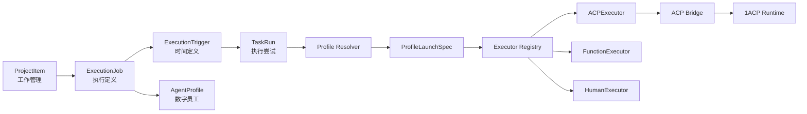

# ExecutionJob × AgentProfile × Schedule × ACP 最终架构设计

> Status: FINAL DESIGN
>
> Date: 2026-08-11
>
> Scope: `grok-build` Profile 纵向闭环、ExecutionJob 内核、Schedule 解耦、任务看板接入、1ACP 瞬时启动参数与凭证通道
>
> 术语权威：[名称定义表](../product/名称定义表.md)。本文沿用 `ProjectItem`、`executor=agent|function|human`、北向 `taskapi` 与内核/应用边界，不创建与 ProjectItem 竞争的第二套工作管理实体。

---

## 1. 结论

本次调整确定四个独立但相连的核心对象：

```text
ProjectItem       = 为什么做、业务上是什么工作
ExecutionJob      = 执行什么、由谁执行、采用什么执行策略
ExecutionTrigger  = 什么时候产生一次执行
TaskRun           = 某个 Job 的一次实际执行尝试
AgentProfile      = 可调度数字员工的稳定身份与配置
```

`AgentProfile` 定义为：

```text
AgentProfile
= Desktop Runtime
+ Provider
+ Model
+ Runtime Options
```

例如：

```text
deepseek-build
├── runtime: grok-build
├── provider: deepseek-api
├── model: deepseek-v4-flash
└── options: {...}
```

最终依赖方向：

```text
ProjectItem / 业务应用
        │
        ▼
North Task API / Execution Service
        │
        ▼
ExecutionJob + ExecutionTrigger
        │
        ▼
Scheduler
        │
        ▼
Executor interface
   ├── ACPExecutor ──► ACP Bridge ──► 1ACP Runtime
   ├── FunctionExecutor
   └── HumanExecutor
```

关键决策：

1. Schedule 逻辑独立于 1ACP，首版作为 Go 后端中的 `execution` 内核包，不放入 1ACP，不拆独立服务。
2. 1ACP 只负责 ACP Runtime、Session、Turn、权限、取消和流式事件，不知道 ProjectItem、依赖、重试与定时规则。
3. `default_profile` 与显式选择的 Profile 只影响 Job 创建时的归属解析；Job 落库后统一保存确定的 `profile_id`。
4. Job 固定 Profile 身份，Run 固定实际使用的 Profile revision。运行中和同一 occurrence 的重试不得升级 revision。
5. 循环任务不再复制 ProjectItem；一个 Job 通过 Trigger 产生多次 Run。
6. 首版新增 `kernel_execution_jobs`、`kernel_execution_triggers`，扩展现有 `task_runs`，不并行建设第二套 Run 表。
7. API Key 仍归 Provider/凭证层所有，不进入 Profile、Job、Run、Turn、Session 持久化与日志。
8. Claude/Codex 继续使用现有桌面配置绑定和 legacy AgentType，一个兼容周期内不强制迁移 Profile。

---

## 2. 背景与当前问题

当前 `ProjectItem` 同时承载了四类职责：

```text
工作管理：标题、描述、需求来源、优先级、里程碑、父子关系
执行定义：executor、assignee、target、验收标准、timeout、retry
调度定义：scheduleType、scheduledAt、plannedStart、recurrence
运行投影：queued、running、failed、completed、result、costTokens
```

当前 Scheduler 也同时负责：

- 时间到期判断；
- 依赖与子任务门禁；
- 缺少验收标准、缺少需求归口等 ProjectItem 业务规则；
- 优先级与 Workspace 并发锁；
- 重试；
- 循环任务复制；
- requirement/bug 自动关闭；
- verifier 调度；
- ACP、function、human 三类执行器分流。

这会造成三个直接问题：

1. Schedule 无法作为纯执行内核复用，因为它知道过多看板业务规则。
2. ACP TaskRunner 被 Scheduler 直接依赖，Profile、Provider、模型和凭证难以作为每次执行的独立输入。
3. 循环任务通过复制 ProjectItem 表示每次执行，工作定义与运行历史混在一起。

现有代码已经提供三条可复用迁移缝：

- `backend/internal/provider` 已有 `AgentProfile`、`ResolvedProfileSnapshot` 和 `ProfileLaunchSpec`；
- `backend/internal/taskapi` 已是应用唯一允许调用的北向任务 API；
- `task_runs` 已是执行审计主干，可渐进扩展为 Job Run，而不另建平行历史系统。

---

## 3. 目标与非目标

### 3.1 目标

- 让任务看板、领域应用和未来自动化入口通过统一 Execution API 执行工作。
- 让一个 Agent Job 可以使用项目默认 Profile、系统默认 Profile或任务显式 Profile。
- 让每次 Run 可解释：由哪个 Profile、哪个 revision、哪个 Runtime、Provider、Model 执行。
- 让 Run 启动期间使用的凭证只存在于内存。
- 让 Schedule 与 ACP、function、human 执行器正交。
- 让立即执行、一次性定时和循环执行最终走同一 Run 生命周期。
- 为后续按数字员工、Provider、Model 和计费账号统计成本保留稳定维度。
- 保持 Claude/Codex 和既有任务兼容，采用渐进迁移而不是大爆炸重写。

### 3.2 非目标

- 不把 Schedule 拆成独立网络服务。
- 不引入分布式队列、Redis、Kafka 或外部工作流引擎。
- 不允许用户自定义任意 Runtime argv 或环境变量模板。
- 不在本阶段全面迁移 Claude/Codex 到 AgentProfile。
- 不实现基于成本、内容或能力的自动 Profile 路由。
- 不实现 LLM 自动选择数字员工。
- 不实现 Provider 账单、配额、预算和负载均衡 UI。
- 不改变 cc-connect 的 Agent 启动体系。
- 不删除现有桌面配置 apply/rollback 能力。
- 不在第一批 PR 中删除 `assignee`、legacy `AgentType`、`TaskTarget` 或 `TaskRun` 兼容字段。

---

## 4. 领域边界

### 4.1 对象关系



### 4.2 四个正交维度

| 维度 | 回答的问题 | 权威对象 |
|---|---|---|
| Work | 为什么存在、用户要完成什么 | `ProjectItem` |
| Job | 执行什么、交给谁、超时与重试策略是什么 | `ExecutionJob` |
| Trigger | 什么时候产生一次执行 | `ExecutionTrigger` |
| Run | 这次实际发生了什么 | `TaskRun` |

### 4.3 Flow、Schedule 与 ACP 的区别

```text
Schedule = 什么时候启动一次 Run
Flow     = Run 启动后按什么步骤执行
ACP      = Flow 或 Run 中的 Agent 步骤如何与 Agent 通信
```

因此：

- Schedule 不属于 1ACP；
- 1ACP Flows 不等于 Schedule；
- Task Board 不直接接 ACP 和 Schedule 两套协议，而是只接 Execution API；
- ACP 只是 `executor=agent` 的一种南向实现。

---

## 5. AgentProfile 设计

### 5.1 RuntimeDefinition

RuntimeDefinition 由代码维护，不允许用户注入命令：

```go
type RuntimeDefinition struct {
    ID                        string
    Label                     string
    SupportedEndpointFamilies []EndpointFamily
    Options                   []AgentOptionDefinition
}
```

首版只注册：

```text
runtime_id = grok-build
supported_endpoint_families = [openai]
```

Runtime Adapter 负责把已验证的 Profile 转换成 `ProfileLaunchSpec`。

### 5.2 Provider Endpoint

Provider Endpoint 以协议族而不是桌面 Agent 名称建模：

```text
family   = openai | anthropic
protocol = openai_responses | openai_chat | anthropic_messages | ...
```

`family` 表示兼容族，`protocol` 表示实际 wire dialect。

schema v3 迁移：

```text
agent_id=codex  → family=openai
agent_id=claude → family=anthropic
```

### 5.3 AgentProfile

```go
type AgentProfile struct {
    ID         string
    Name       string
    RuntimeID  string
    ProviderID string
    ModelID    string
    Options    map[string]json.RawMessage
    Revision   int
    Status     string // active | disabled | archived
    System     bool
    CreatedAt  int64
    UpdatedAt  int64
}
```

约束：

- 只有 `active` Profile 可以分配给新 Job；
- `disabled` 表示配置未完成或当前不可运行；
- `archived` 表示保留历史但不允许新引用；
- Profile 编辑成功后 revision 加一；
- Profile 不保存任意 argv；
- Profile 不保存任意环境变量模板；
- Profile 不直接保存 API Key；
- Runtime、Provider Endpoint、Model 和 Options 必须通过代码维护的 schema 校验。

### 5.4 ResolvedProfileSnapshot

每次 Run 启动时生成无密钥快照：

```go
type ResolvedProfileSnapshot struct {
    ProfileID       string
    ProfileName     string
    ProfileRevision int
    RuntimeID       string
    ProviderID      string
    ProviderName    string
    ModelID         string
    EndpointFamily  EndpointFamily
    Protocol        string
    PublicBaseURL   string
    ModelsEndpoint  string
    Options         map[string]json.RawMessage
    ResolvedAt      int64
}
```

`PublicBaseURL` 和 `ModelsEndpoint` 进入快照前必须：

- 移除 URL userinfo；
- 移除 query；
- 移除 fragment；
- 拒绝明显把 token 放在 path/query 中的配置；
- 不记录自定义秘密 Header。

### 5.5 ProfileLaunchSpec

```go
type ProfileLaunchSpec struct {
    Snapshot     ResolvedProfileSnapshot
    Argv         []string
    Model        string
    Env          map[string]string // 非敏感，可持久化
    TransientEnv map[string]string // 仅内存
    Credentials  map[string]string // 仅内存
}
```

Grok Adapter 首版生成：

```text
argv:
  grok agent --model <model_id> stdio

Env:
  GROK_XAI_API_BASE_URL
  GROK_MODELS_BASE_URL
  GROK_MODELS_LIST_URL
  GROK_DEFAULT_MODEL

TransientEnv / Credentials:
  XAI_API_KEY
  xai.api_key
```

用户只能选择 Profile，不能编辑这些映射。

---

## 6. Profile 分配语义

### 6.1 分配优先级

```text
Task.target.profile_id
        ↓ 未设置
Project.default_profile_id
        ↓ 未设置
ProviderData.default_profile_id
        ↓ 未设置或不可用
拒绝创建新的 Profile Agent Job
```

需要新增：

```text
ProviderData.default_profile_id
Project.default_profile_id
TaskTargetSpec.profile_id
```

### 6.2 默认与显式选择归一

`default_profile` 和用户显式选择的 Profile 不是两种 Executor：

```go
type ProfileBindingSource string

const (
    ProfileBindingExplicit       ProfileBindingSource = "explicit"
    ProfileBindingProjectDefault ProfileBindingSource = "project_default"
    ProfileBindingSystemDefault  ProfileBindingSource = "system_default"
    ProfileBindingLegacy         ProfileBindingSource = "legacy"
)
```

Job 创建完成后统一保存：

```text
profile_id
profile_source
```

`profile_source` 只用于解释“为什么分配给这个数字员工”，执行路径只看 `profile_id`。

### 6.3 默认值变化

- 项目默认 Profile 改变，只影响之后创建的 Job；
- 系统默认 Profile 改变，只影响之后创建且没有项目默认的 Job；
- 已有 Job 不得因为默认值变化而静默换人；
- 用户要给已有 Job 换 Profile，必须显式更新 Job，Job revision 加一并留下审计事件。

### 6.4 Profile revision 策略

```text
Job：固定 profile_id，不固定永久 revision
新 occurrence：解析该 Profile 当前最新 revision
运行中的 Run：固定已解析 revision
同 occurrence 重试：复用第一次解析的快照
下一次 recurrence：重新解析最新 revision
```

这保证：

- Profile 可以升级；
- 运行中的任务不会中途换模型、Endpoint 或凭证；
- 重试结果仍具有可比性；
- 新的独立执行自动使用最新数字员工配置。

---

## 7. ExecutionJob 模型

### 7.1 首版边界

首版一个可执行 `ProjectItem` 对应一个 `ExecutionJob`：

```text
ItemType=task + 已采纳 + 可执行 → 0..1 ExecutionJob
requirement / bug / discussion  → 无 ExecutionJob
```

`work_item_id` 首版必填。无 ProjectItem 的纯后台 Job、Webhook Job 和跨项目 Job 后续再扩展。

### 7.2 数据结构

```go
type ExecutionJob struct {
    ID          string
    ProjectID   string
    WorkItemID  string
    BusinessRef string

    ExecutorKind string // agent | function | human

    // executor=agent
    ProfileID       string
    ProfileSource   ProfileBindingSource
    LegacyAgentType string

    // executor=function
    FunctionType string

    Cwd          string
    Capabilities []string

    Status   string // active | paused | blocked | completed | archived
    Revision int

    TimeoutMinutes int
    MaxAttempts    int

    BlockedCode   string
    BlockedReason string

    CreatedAt time.Time
    UpdatedAt time.Time
}
```

### 7.3 Job 不保存什么

Job 不保存：

- API Key；
- Authorization Header；
- 用户自定义 argv；
- 用户自定义进程环境模板；
- ACP session ID；
- 当前 Run 的 running/completed 状态；
- token 与成本累计；
- Agent 输出正文。

### 7.4 Job revision

以下变化使 Job revision 加一：

- 更换 Profile；
- 更换 ExecutorKind；
- 更换 function type；
- 更换 CWD 或 Capabilities；
- 修改 timeout、retry、overlap 等执行策略。

仅编辑 ProjectItem 的标题、描述、里程碑等业务字段，不直接修改 Job revision。Run 启动时生成 `ResolvedJobSnapshot`，固化实际使用的指令、验收标准与 Job revision。

### 7.5 Legacy Agent target

在 Claude/Codex Profile 化完成前，agent target 是 tagged union：

```text
profile target:
  profile_id = deepseek-build

legacy target:
  legacy_agent_type = codex | claudecode
```

禁止同时设置两者。

---

## 8. ExecutionTrigger 模型

### 8.1 Trigger 类型

```go
type ExecutionTrigger struct {
    ID    string
    JobID string

    Kind string // at | recurrence
    Spec json.RawMessage

    Timezone      string
    MisfirePolicy string // skip | run_once
    OverlapPolicy string // forbid | allow

    Status    string // armed | paused | exhausted
    NextRunAt *time.Time

    CreatedAt time.Time
    UpdatedAt time.Time
}
```

### 8.2 立即执行

立即执行不创建伪 Trigger：

```text
RunNow(job_id, client_request_id)
→ 创建 occurrence
→ Claim
→ 创建 TaskRun
→ Dispatch
```

### 8.3 一次性定时

```text
Trigger.kind = at
Trigger.spec = { at: RFC3339 timestamp }
```

触发成功后 Trigger 进入 `exhausted`。

### 8.4 循环任务

```text
Trigger.kind = recurrence
Trigger.spec = 当前 Recurrence 规范形
```

新设计不再复制 ProjectItem：

```text
一个 ProjectItem
└── 一个 ExecutionJob
    └── 一个 recurrence Trigger
        ├── Run occurrence 1
        ├── Run occurrence 2
        └── Run occurrence N
```

### 8.5 Misfire 与 Overlap

首版必须显式支持：

| 策略 | 值 | 行为 |
|---|---|---|
| Misfire | `skip` | 服务恢复后跳过错过的 occurrence，计算下一次 |
| Misfire | `run_once` | 无论错过多少次，只补一次，然后计算下一次 |
| Overlap | `forbid` | 前一次未结束时不启动新的 occurrence，默认 |
| Overlap | `allow` | 允许同一 Job 并行执行，首版仅对明确开启的 function Job 使用 |

Agent Job 默认 `overlap=forbid`。

---

## 9. TaskRun 演进

### 9.1 为什么扩展现有 task_runs

现有 `task_runs` 已保存：

- Project、Task、Session 关联；
- execution/verification 类型；
- attempt；
- Evidence、Verdict、ClosedBy；
- 错误与时间；
- 完成审计事件。

首版在其上增加 Job/Trigger/Profile 维度，避免两套运行记录发生双写和一致性问题。

### 9.2 新增字段

```text
job_id
trigger_id
occurrence_key
scheduled_for
job_revision
resolved_job_snapshot_json
resolved_profile_snapshot_json
usage_json
client_request_id
```

迁移期这些字段允许为空，以兼容历史 TaskRun。

### 9.3 occurrence 与 attempt

```text
occurrence = 一次手动调用或一次定时触发
attempt    = 该 occurrence 的一次执行尝试
```

Key 规则：

```text
手动：manual:<client_request_id>
定时：<trigger_id>:<scheduled_for_utc>
```

数据库唯一约束：

```text
(job_id, occurrence_key, kind, attempt)
```

Scheduler 的 Claim 与 attempt 分配必须在同一事务内完成，不能继续使用“先 COUNT 再 INSERT”的非原子路径。

### 9.4 重试与 Profile

- 第一次 attempt 解析 Profile 并保存快照；
- 后续 execution retry 复制该 occurrence 的 Profile 快照；
- verifier Run 关联同一个 occurrence；
- 下一次 recurrence 创建新 occurrence，并重新解析 Profile；
- Profile 更新不得改变已经存在的 occurrence。

### 9.5 Usage

```json
{
  "input_tokens": 0,
  "output_tokens": 0,
  "cached_read_tokens": 0,
  "cached_write_tokens": 0,
  "thought_tokens": 0,
  "total_tokens": 0,
  "reported_cost": null,
  "currency": null
}
```

未知值保持未知，不以 0 冒充 Provider 未返回的数据。上例的 0 仅表示字段形状，实际落库应使用可空字段。

---

## 10. 状态所有权

### 10.1 ProjectItem

ProjectItem 权威状态：

```text
issueState = open | closed
```

迁移期保留旧 `status` 字段，但逐步改为 Job/Run 的兼容投影，前端不得再直接把它改成 `running`。

### 10.2 Job

```text
active    可产生新 Run
paused    用户暂停，不产生新 Run
blocked   配置或依赖暂时不可满足
completed 一次性 Job 完成，或 recurrence 已耗尽
archived  历史保留，不再执行
```

常见 blocker：

```text
PROFILE_NOT_FOUND
PROFILE_DISABLED
PROFILE_ARCHIVED
PROVIDER_ARCHIVED
MODEL_UNAVAILABLE
CREDENTIAL_UNAVAILABLE
RUNTIME_UNAVAILABLE
DEPENDENCY_UNMET
AUTHORING_NOT_READY
```

### 10.3 Trigger

```text
armed | paused | exhausted
```

### 10.4 Run

目标状态：

```text
queued
claimed
running
awaiting_human
completed
failed
cancelled
skipped
```

既有 TaskRun 创建即 `running` 的行为可以在迁移第一阶段保留；Scheduler Claim 原子化后再开放 `queued/claimed`。

### 10.5 看板投影

看板最终分别展示：

```text
工作状态：ProjectItem.issueState
调度状态：ExecutionJob.status + Trigger.status
运行状态：latest TaskRun.status
时间信息：last_run_at + next_run_at
```

不要再用一个 `ProjectItem.status` 同时表达全部含义。

---

## 11. Execution API

### 11.1 内部服务接口

```go
type Service interface {
    CreateJob(ctx context.Context, input CreateJobInput) (ExecutionJob, error)
    UpdateJob(ctx context.Context, id string, patch UpdateJobInput) (ExecutionJob, error)
    GetJob(ctx context.Context, id string) (ExecutionJob, error)
    RunNow(ctx context.Context, id, clientRequestID string) (TaskRun, error)
    UpsertTrigger(ctx context.Context, id string, trigger TriggerSpec) (ExecutionTrigger, error)
    PauseJob(ctx context.Context, id string) error
    ResumeJob(ctx context.Context, id string) error
    ArchiveJob(ctx context.Context, id string) error
    CancelRun(ctx context.Context, runID string) error
}
```

### 11.2 HTTP API

```text
POST   /api/execution-jobs
GET    /api/execution-jobs/{id}
PUT    /api/execution-jobs/{id}
POST   /api/execution-jobs/{id}/run
POST   /api/execution-jobs/{id}/pause
POST   /api/execution-jobs/{id}/resume
POST   /api/execution-jobs/{id}/archive

PUT    /api/execution-jobs/{id}/trigger
DELETE /api/execution-jobs/{id}/trigger

GET    /api/execution-jobs/{id}/runs
GET    /api/execution-runs/{id}
POST   /api/execution-runs/{id}/cancel
```

HTTP API 是前端入口；领域应用仍优先使用 `taskapi`，不直接 import `execution` 实现包。

### 11.3 taskapi 兼容门面

`DispatchTask` 新行为：

```text
DispatchTask
├── 创建 ProjectItem
├── 解析 Profile assignment
├── 创建 ExecutionJob
├── 配置 Trigger，或调用 RunNow
└── 在同一事务内提交
```

硬规则：

- 应用只依赖 `taskapi`；
- 应用不能 import Scheduler、Executor 或 ACP 实现；
- `taskapi` 是 North API；
- `execution` 是内核内部实现；
- 完成事件通过现有 Completion Hook / Event 契约写回应用域。

---

## 12. Executor 接口

```go
type Executor interface {
    Execute(ctx context.Context, request RunRequest) (<-chan RunEvent, error)
    Cancel(ctx context.Context, runID string) error
}
```

注册表：

```text
agent    → ACPExecutor
function → FunctionExecutor
human    → HumanExecutor
```

### 12.1 ACPExecutor

负责：

- 调用 Profile Resolver；
- 构造 ProfileLaunchSpec；
- 建立 ACP Bridge 连接；
- ensure session；
- 启动 prompt；
- 把 ACP 事件归一为 RunEvent；
- 收集 Turn、usage、最终结果；
- 取消当前执行。

不负责：

- 任务是否到期；
- 依赖是否满足；
- Job retry；
- ProjectItem 自动关闭；
- recurrence 计算。

### 12.2 FunctionExecutor

继续使用注册表中的确定性 handler，但通过统一 RunRequest/RunEvent 生命周期执行。

### 12.3 HumanExecutor

创建 `awaiting_human` Run，由用户动作完成或取消。Human Job 不占用 ACP 或 function Worker，但依赖它的下游 Job 继续保持 blocked。

---

## 13. Scheduler 设计

### 13.1 包与部署

建议目录：

```text
backend/internal/execution/
├── model.go
├── service.go
├── repository.go
├── scheduler.go
├── recurrence.go
├── lease.go
├── events.go
└── executor.go

backend/internal/executors/
├── acp/
├── function/
└── human/
```

首版：

- 与 Go 后端同进程；
- 使用现有 SQLite；
- 保持五秒 tick；
- 不新增外部基础设施；
- 使用数据库 Claim 和现有 Workspace 并发策略；
- Scheduler 只依赖 Repository 与 Executor interface。

### 13.2 每次 Tick

```text
1. 查询 next_run_at <= now 的 armed Trigger
2. 应用 misfire / overlap 策略
3. 在事务内创建 occurrence 或确认 occurrence 已存在
4. 原子 Claim Job/occurrence
5. 创建 TaskRun attempt
6. 解析或复用 Profile snapshot
7. 调 Executor Registry
8. 消费 RunEvent，完成 TaskRun
9. 计算 Trigger.next_run_at
10. 更新兼容的 ProjectItem 投影与 Event
```

### 13.3 从 Scheduler 移出的规则

以下规则属于 WorkItem/PM policy，不属于通用 Schedule：

- requirement、bug、discussion 不可执行；
- AI suggestion 未采纳不可执行；
- 缺验收标准进入 not-ready；
- 缺需求/缺陷归口进入 not-ready；
- 全部子任务完成后自动关闭父项；
- requirement/bug 子任务全部终态后关闭议题。

这些规则由 WorkItem policy 计算 Job 是否可激活，Scheduler 只消费 `active` 或 `blocked` 结果。

---

## 14. 1ACP 与 ACP Bridge 契约

### 14.1 ensure_session 新输入

Go → ACP Bridge：

```text
session_id
runtime_id
profile_id
profile_revision
launch_fingerprint
argv
model
non_secret_env
transient_env
credentials
workspace_path
resume_session_id
permission_mode
mcp_servers
```

1ACP public runtime 增加规范形：

```ts
type AcpRuntimeEnsureInput = {
  sessionKey: string;
  agent: string;
  mode: "persistent" | "oneshot";
  resumeSessionId?: string;
  cwd?: string;
  sessionOptions?: SessionAgentOptions;
  launch?: {
    argv: string[];
    model?: string;
    env?: Record<string, string>;
    transientEnv?: Record<string, string>;
    credentials?: Record<string, string>;
  };
};
```

### 14.2 持久化规则

| 字段 | 可写 acpx-state | 说明 |
|---|---|---|
| runtime/profile/revision | 是 | 非敏感审计信息 |
| argv | 是 | 只来自代码维护 Runtime Adapter |
| model | 是 | 非敏感 |
| env | 是 | 经过白名单校验的非敏感变量 |
| transientEnv | 否 | 仅当前进程内存 |
| credentials | 否 | 仅当前进程内存 |

当前 `sessionOptions.env` 会进入 Session 持久化，因此 `XAI_API_KEY` 绝不能放入其中。

### 14.3 每次 ensure 重新注入

- Go 是 Profile、Provider 和凭证唯一业务来源；
- Bridge 不读取 `~/.1agents/providers.json`；
- 1ACP 不读取 `~/.1agents/providers.json`；
- 每次 ensure/reconnect 都由 Go 重新解析并注入瞬时凭证；
- 1ACP reconnect 需要凭证但 Go 不可达时，明确返回 `CREDENTIAL_REINJECTION_REQUIRED`，不得从磁盘恢复旧 Key。

### 14.4 Launch fingerprint

```text
launch_fingerprint = hash(
  runtime_id,
  profile_id,
  profile_revision,
  argv,
  model,
  non-secret env
)
```

不包含 API Key。

fingerprint 用于判断现有 Runtime 是否可复用。fingerprint 不同必须关闭旧 Runtime，再尝试恢复 ACP session。

### 14.5 Prewarm 隔离

现有 Grok prewarm 不能只按 `agentType + cwd` 缓存。Profile 化后必须按以下 key 隔离：

```text
(runtime_id, profile_id, profile_revision, launch_fingerprint, cwd)
```

在隔离逻辑完成前，自定义 Profile 禁止命中旧 prewarm 池。绝不能让两个 Profile 共用预热 Handle 或凭证上下文。

---

## 15. Session 与 revision 语义

### 15.1 Headless Job

- 每个新 occurrence 解析当前 Profile revision；
- Run 启动后固定快照；
- 同 occurrence 重试复用快照；
- Profile 编辑不影响运行中的 Run；
- 下一次 recurrence 使用最新 revision。

### 15.2 Chat Session

新增：

```text
ChatSession.profile_id
ChatSession.profile_revision
ChatSession.launch_fingerprint
```

页面重新连接时：

```text
当前 Profile revision == Session revision
    → 复用 Runtime

当前 Profile revision != Session revision
    → 关闭旧 Runtime
    → 使用新 LaunchSpec 尝试 resume 原 ACP session
    → resume 成功：发送 profile_upgraded(resumed=true)
    → resume 失败：创建新 ACP session
                 发送 profile_upgraded(resumed=false)
```

同一 ChatSession 可以跨 revision，但每个 Turn 必须保存实际使用的 revision。

### 15.3 Turn 与 TaskRun

新增：

```text
AgentTurn.resolved_profile_snapshot
TaskRun.resolved_profile_snapshot
```

两者均不含凭证。TaskRun 是成本和执行审计入口，Turn 是实际对话/请求证据。

---

## 16. 存储设计与架构门禁

### 16.1 新表

根据内核表命名规则，新表使用 `kernel_` 前缀：

```text
kernel_execution_jobs
kernel_execution_triggers
```

它们必须登记到 `domainownership` 的 kernel ledger，并通过 `make archgate`。

### 16.2 既有表扩展

```text
projects:
  default_profile_id

project_items.task_target JSON:
  profile_id

task_runs:
  job_id
  trigger_id
  occurrence_key
  scheduled_for
  job_revision
  resolved_job_snapshot_json
  resolved_profile_snapshot_json
  usage_json
  client_request_id

chat_sessions:
  profile_id
  profile_revision
  launch_fingerprint

agent_turns:
  resolved_profile_snapshot_json
```

### 16.3 所有权

| 数据 | 所有者 |
|---|---|
| Provider/Profile 文件 | `provider` 域 |
| Job/Trigger/Run | kernel execution 域 |
| ProjectItem | kernel work item / task 域 |
| ChatSession/Turn | kernel session/turn 域 |
| 应用业务对象 | 各应用自己的命名空间 |

应用不得直接写 Job/Trigger/Run 表，只能通过 `taskapi`/Execution 契约。

---

## 17. 迁移与兼容

### 17.1 Provider schema v3 → v4

- 迁移前生成一次性 `.v3.bak`；
- `agent_id=codex` 转 `family=openai`；
- `agent_id=claude` 转 `family=anthropic`；
- 原子写入 schema v4；
- 自动创建系统 Profile `deepseek-build`；
- Provider 或 Model 无法唯一确定时创建 disabled Profile；
- Provider/Profile 被引用后只归档，不级联硬删除。

### 17.2 现有 ProjectItem → ExecutionJob

可重复、幂等地回填：

```text
ItemType != task                         → 不创建 Job
source=agent-suggested 且未采纳          → 不创建 active Job
executor=human / assignee=user          → Human Job
executor=function                       → Function Job
assignee=deepseek-build                  → Profile Job(profile_id=deepseek-build)
target.profile_id 已存在                 → Profile Job(explicit)
assignee=codex/claudecode                → Legacy Agent Job
其他 agent 且可解析默认 Profile          → Profile Job(default source)
其他不可解析项                           → blocked Job，保留原因
```

约束：

```text
UNIQUE(project_id, work_item_id)
```

### 17.3 Schedule 字段迁移

```text
scheduleType=scheduled + scheduledAt
    → at Trigger

recurrence != nil
    → recurrence Trigger

immediate
    → active Job，无持久 Trigger
```

迁移期间继续写旧字段作为兼容投影；新 Scheduler 切换完成后停止把旧字段当权威来源。

### 17.4 旧 TaskRun

- 历史 `task_runs.job_id` 允许为空；
- 不强制回填无法可靠推断的 Profile；
- legacy `agent_type` 继续展示；
- 新 Run 必须有 JobID；
- Profile Job 的新 Run 必须有 ResolvedProfileSnapshot。

### 17.5 兼容周期

一个版本周期内：

- 旧 `assignee=deepseek-build` 读取时映射到系统 Profile；
- 新 Profile Agent Job 只写 `profile_id`；
- 1ACP 内置 alias 保留作 CLI fallback；
- Claude/Codex 使用 legacy target；
- API 同时返回旧 AgentType 投影和新 Profile 字段；
- 前端优先使用 Profile 字段。

---

## 18. 成本与数字员工

### 18.1 Profile 是内部成本中心

Profile 可以聚合：

```text
执行次数
成功率
平均耗时
输入/输出/缓存/思考 token
Provider 返回成本
模型分布
完成的 ProjectItem
```

Run 至少保存以下非敏感维度：

```text
profile_id
profile_revision
runtime_id
provider_id
model_id
endpoint_family
protocol
job_id
project_id
work_item_id
```

### 18.2 Profile 不等于 API Key

Profile 是数字员工身份，API Key 是计费凭证。两者可以一对一使用，但不应在数据模型中合并。

首版允许多个 Profile 共用一个 Provider/凭证，因此：

- 按 Profile 统计是 1agents 内部成本归属；
- 与 Provider 外部账单对账需要额外的计费账号维度；
- API Key 轮换不能改变历史 Run 的数字员工归属。

后续可引入：

```text
CredentialAccount
├── id
├── provider_id
├── billing_account_ref
├── revision
└── secret material
```

Run 只保存 `credential_account_id/revision`，仍不保存密钥。

### 18.3 Usage 采集

- 以 Turn/request 增量为准，不能直接累加 Session cumulative 值；
- Provider 未返回 cost 时保持 null；
- 本地估算成本必须标记 `source=estimated`；
- Provider 原生返回成本标记 `source=reported`；
- function/human Run 的 token 为空，不自动写 0；
- retry、verification 分 Run/attempt 记录，汇总时再聚合到 occurrence/Job/Profile。

---

## 19. 安全要求

### 19.1 凭证禁止面

原始凭证字节不得出现在：

```text
acpx-state
providers API 响应
Profile API 响应
ExecutionJob
TaskRun
AgentTurn
ChatSession
ProjectEvent
RunEvent
日志
错误消息
launch_fingerprint
测试快照
```

### 19.2 允许面

凭证只允许存在于：

```text
providers.json 的受限凭证字段
Go Profile Resolver 当前调用栈内存
Go → 本机 ACP Bridge 的当前 ensure 消息内存
1ACP 当前 Runtime/Client 内存
Agent 子进程的瞬时环境或 ACP authenticate 调用
```

### 19.3 日志规则

- 不记录完整 ensure payload；
- 不记录 env/credentials map；
- URL 日志使用脱敏后的 PublicBaseURL；
- Provider 错误不得原样回显 Authorization；
- panic/debug dump 必须经过密钥过滤；
- 泄漏测试扫描文件内容和捕获日志的原始 API Key 字节。

---

## 20. 失败与边缘语义

### 20.1 Profile 在 Job 创建后失效

Provider/Profile 被归档、模型 unavailable 或凭证被清除时：

- 不删除 Job；
- 不删除历史 Run；
- Job 进入 `blocked`；
- 保存结构化 blocker；
- Trigger 不重复制造失败 Run；
- 配置恢复后重新校验并恢复 `active`；
- 用户手动 RunNow 返回可读错误和 blocker code。

### 20.2 Profile 在 Run 期间被编辑

- 当前 Run 不变；
- 当前 occurrence 的 retry 不变；
- 新 occurrence 使用最新 revision；
- Chat 只在重连时受控升级。

### 20.3 凭证轮换

- 已启动进程继续使用内存中的旧凭证，直到当前 Run 结束；
- 新 Run 重新从 Go 注入新凭证；
- 不尝试把新凭证热写入运行中 Agent；
- 历史 Snapshot 不包含旧凭证。

### 20.4 服务重启

- Scheduler 根据 Trigger.next_run_at 和 misfire policy 恢复；
- claimed/running Run 需要超时恢复策略，不能永久卡住；
- ACP reconnect 必须重新向 Go 请求瞬时凭证；
- 无法确认旧 Agent 进程状态时，Run 标记为可诊断失败或进入恢复流程，不静默重复执行。

### 20.5 并发

- 默认每 Workspace 同时一个 Agent Run，保持当前安全行为；
- 同 Job 默认 `overlap=forbid`；
- 两个不同 Profile 并行时，argv、model、env、credentials、prewarm Handle 必须隔离；
- Claim 必须依赖数据库唯一约束与事务，不能只依赖进程内 map。

---

## 21. 开发计划

### PR 0：完成 Provider/Profile 基础能力

交付：

- Provider schema v4；
- Endpoint family；
- AgentProfile CRUD/revision/archive/restore；
- RuntimeDefinition；
- Grok Profile Resolver；
- ResolvedProfileSnapshot；
- ProfileLaunchSpec；
- Provider/Profile API 脱敏；
- v3 备份与迁移。

闸门：

- Profile CRUD/revision 测试；
- migration 测试；
- LaunchSpec 测试；
- 缺失 Provider/Model/Credential 测试；
- 凭证泄漏扫描。

### PR 1：Profile assignment 与兼容字段

交付：

- `ProviderData.default_profile_id`；
- `Project.default_profile_id`；
- `TaskTargetSpec.profile_id`；
- `ResolveProfileAssignment` 纯函数；
- explicit/project/system/legacy 来源；
- deepseek-build legacy 映射；
- Claude/Codex legacy target。

闸门：

- 三层优先级矩阵；
- default 修改不影响已有 assignment；
- disabled/archived Profile 拒绝；
- legacy 读取兼容。

### PR 2：ExecutionJob 持久化与 API

交付：

- `backend/internal/execution` model/repository/service；
- `kernel_execution_jobs`；
- `kernel_execution_triggers`；
- `task_runs` 扩展列；
- Job/Trigger HTTP API；
- `taskapi.DispatchTask` 原子创建 WorkItem + Job；
- 幂等 backfill。

这一阶段不切换 Scheduler 行为，先建立稳定数据与契约。

### PR 3：Profile-aware ACP 纵向闭环

交付：

```text
ExecutionJob
→ ResolveProfile
→ ProfileLaunchSpec
→ ACPExecutor
→ ACP Bridge
→ 1ACP ensure_session
→ grok-build
→ TaskRun completion
```

同时完成：

- 1ACP per-session argv；
- non-secret env；
- transient env；
- auth credentials；
- launch fingerprint；
- 删除 1ACP 直接读取 providers.json 的 DeepSeek 特例；
- 自定义 Profile 暂不命中旧 prewarm 池；
- 两 Profile 并发隔离测试。

### PR 4：Executor 接口与 Scheduler 解耦

交付：

- Executor interface/registry；
- ACPExecutor；
- FunctionExecutor；
- HumanExecutor；
- Scheduler 改为读取 ExecutionJob；
- 数据库 Claim；
- Workspace 并发策略迁移；
- ProjectItem policy 从 Scheduler 移出。

保留旧 TaskRunner facade，供兼容调用逐步迁移。

### PR 5：Trigger 与 recurrence 迁移

交付：

- at/recurrence Trigger；
- misfire/overlap；
- occurrence key；
- retry 复用 snapshot；
- recurrence 不再复制 ProjectItem；
- last_run/next_run 投影；
- 旧 schedule 字段兼容写。

此 PR 改变用户可见行为，独立发布与回归。

### PR 6：Session、Turn 与 revision

交付：

- ChatSession profile/revision/fingerprint；
- TaskRun/Turn Snapshot；
- reconnect revision 检查；
- Runtime 关闭与 ACP resume；
- `profile_upgraded` 事件；
- resume 失败后创建新 ACP session；
- prewarm 多 Profile 隔离。

### PR 7：前端迁移与成本基础

交付：

- Profile 管理区；
- 项目默认 Profile；
- Task 显式 Profile；
- 动态数字员工选择器；
- Job/Trigger/Run 分层状态；
- blocked reason；
- last/next run；
- usage 字段采集；
- Profile/Provider/Model 维度查询；
- legacy AgentType 一个版本周期的 UI 兼容。

不在本 PR 实现账单、预算和计费账号 UI。

---

## 22. 测试计划

### 22.1 Provider/Profile

- schema v3 → v4 endpoint 迁移；
- 一次性 v3 备份；
- 系统 Profile 自动创建；
- Profile CRUD、revision、archive/restore；
- Provider/Profile 引用校验；
- 缺失/归档 Provider；
- 无兼容 endpoint；
- Model unavailable；
- Credential unavailable；
- Grok LaunchSpec argv/URL/model/env/credential 映射。

### 22.2 ExecutionJob

- ProjectItem 与 Job 原子创建；
- 非 task Item 不创建 Job；
- explicit/project/system Profile 优先级；
- legacy deepseek-build 解析；
- Claude/Codex legacy target；
- Job revision；
- pause/resume/archive；
- Profile 失效后 Job blocked；
- backfill 幂等；
- UNIQUE(project_id, work_item_id)。

### 22.3 Scheduler/Trigger

- RunNow 幂等；
- at Trigger；
- recurrence 计算；
- timezone/DST；
- misfire skip/run_once；
- overlap forbid/allow；
- 服务重启恢复；
- 原子 Claim；
- 同 occurrence retry；
- 下一 occurrence 使用最新 Profile revision；
- recurrence 不复制 ProjectItem。

### 22.4 ACP 与 Session

- 两个 Profile 并行时 argv/model/credential 不串线；
- 同 revision reconnect 复用；
- revision 变化触发受控升级；
- resume 成功；
- resume 失败后新建 Session；
- profile_upgraded 事件；
- prewarm key 隔离；
- 运行中 Profile 更新不热切换；
- cancel；
- fake ACP server hermetic E2E；
- 本机 opt-in DeepSeek E2E。

### 22.5 泄漏测试

使用随机高熵 API Key，执行完整 Go → Bridge → 1ACP → fake Agent 流程后扫描：

```text
临时 providers API 响应
acpx-state
meta.db 中 TaskRun/Turn/Session/Event
捕获日志
错误响应
前端测试快照
```

原始 Key 字节必须零命中。

### 22.6 前端

- Profile 表单；
- Runtime → Provider family → Model 依赖选择；
- disabled/archived/unavailable 状态；
- 项目默认与任务覆盖；
- Job blocked reason；
- Run history；
- recurrence last/next run；
- SSR/node:test；
- production build。

### 22.7 验证命令

```bash
cd backend
go test ./internal/provider ./internal/agent ./internal/meta ./internal/server
go test ./...

cd ../modules/1acp
pnpm test

cd ../../frontend
yarn check
yarn build

cd ..
make archgate
```

Profile 相关前端 `node:test` 和 fake ACP E2E 作为对应 PR 的必跑项加入 CI。

---

## 23. 上线与回滚

### 23.1 Feature gates

建议使用内部 gate：

```text
execution_jobs_write      双写 Job/Trigger，旧 Scheduler 继续运行
profile_acp_launch        deepseek-build 使用 Profile LaunchSpec
execution_scheduler_read  新 Scheduler 读取 Job
recurrence_runs           recurrence 产生 Run，不复制 ProjectItem
profile_dynamic_ui        前端动态 Profile 列表
```

### 23.2 切换顺序

```text
先写新数据
→ 观察与对账
→ Profile ACP 纵向切换
→ Scheduler 读新 Job
→ recurrence 行为切换
→ 前端切 Profile/Job 状态
→ 停止旧字段作为权威输入
→ 一个版本周期后清理兼容
```

### 23.3 回滚原则

- Provider v3 备份可恢复；
- Job/Trigger 新表不删除旧字段；
- Scheduler 切换可退回旧读路径；
- recurrence 切换前不删除旧 recurrence 数据；
- Profile launch 失败可按 Job 的 legacy target 回滚，但不得把凭证写回旧持久化 env；
- 任何回滚都不能删除已生成的 TaskRun、Turn 与审计证据。

---

## 24. 最终验收标准

全部满足后，ExecutionJob 第一阶段完成：

- 新 Grok Agent Job 只能通过 AgentProfile 执行；
- 显式、项目默认、系统默认 Profile 最终走同一执行链；
- Job 固定 `profile_id`，Run 固定实际 revision；
- Profile 修改不影响运行中的 Run 与同 occurrence 重试；
- 下一次独立执行使用最新 Profile revision；
- Scheduler 不感知 Provider、API Key 或 ACP 协议细节；
- ACPExecutor 不感知任务看板业务状态；
- Task Board 和应用只通过 North API 调用执行能力；
- 循环执行产生 Run，不复制 ProjectItem；
- Function/Human 与 ACP 共用 Job/Trigger/Run 生命周期；
- Claude/Codex 旧任务行为保持不变；
- 两个 Profile 并行执行时 argv、model、credential、Session、prewarm 不串线；
- Profile/Provider/Model/Job/ProjectItem 已成为成本查询维度；
- Provider 未返回 usage/cost 时保持未知；
- 所有持久化、API、事件和日志都不含凭证；
- `go test ./...`、1ACP 测试、前端检查/构建、fake ACP E2E、泄漏测试和 `make archgate` 全部通过。

---

## 25. 后续演进

以下能力建立在本设计之上，但不属于当前交付：

- Claude/Codex Profile 化；
- Profile capability、技能、人格和权限策略，形成更完整数字员工定义；
- CredentialAccount 与外部账单对账；
- Profile 成本、预算、成功率和 SLO；
- 多凭证负载均衡；
- 自动 Profile 路由；
- 无 ProjectItem 的纯后台 Job；
- Event/Webhook Trigger；
- 多节点 Scheduler、数据库 lease/fencing token；
- Schedule 独立服务化；
- Job 内部多步骤 Flow 与可视化追踪。

这些演进不得改变本文的核心边界：

```text
Profile 决定谁来做
Job 决定做什么
Trigger 决定什么时候做
Run 记录这次做得怎样
Executor 决定通过哪条执行通道完成
```
