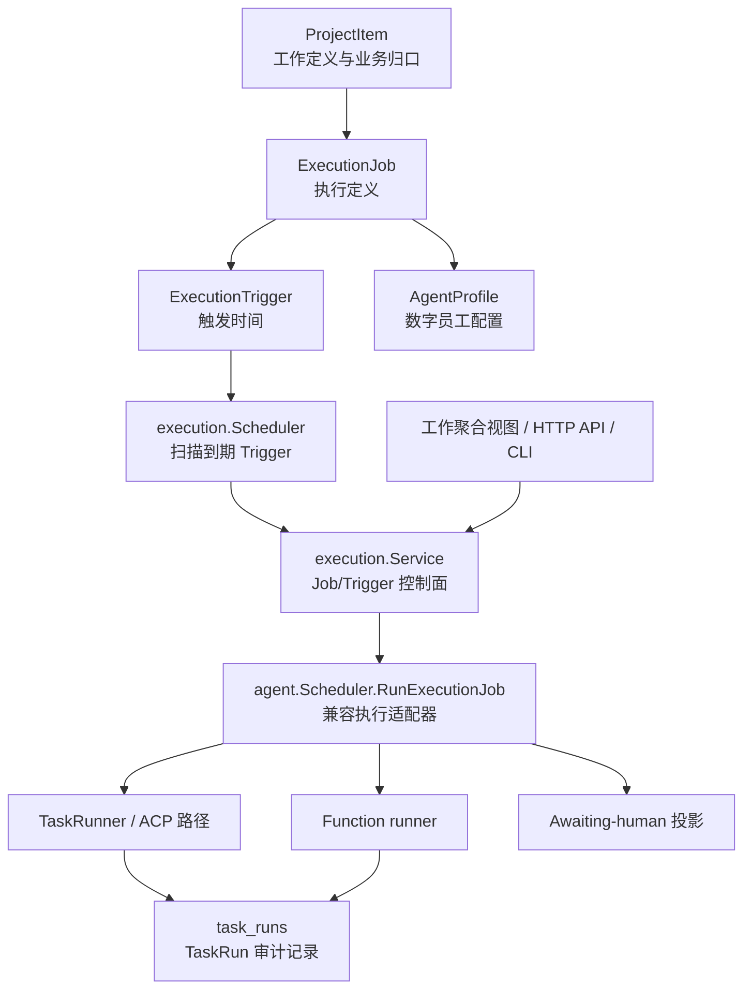

# ExecutionJob × AgentProfile 运行架构（实施基线）

> **状态：已实现基线 + 明确的后续路线图**
>
> **更新：2026-08-11**
>
> **适用范围：** `ProjectItem`、`ExecutionJob`、`ExecutionTrigger`、`TaskRun`、`AgentProfile`、CLI、HTTP API、工作聚合视图与现有 Scheduler/Executor 适配层。
> **术语权威：** [名称定义表](../product/名称定义表.md)。若本文与该表冲突，以名称定义表为准；若本文与代码冲突，以代码和测试为准，并应同时修订本文。

本文记录的是当前已经落地的系统边界，不把尚未实现的 ACP 会话重构、分布式调度、成本系统等写成现状。后续功能必须先判断其属于哪一个对象，再实现；不得重新把调度、运行事实和看板工作定义混入同一字段。

---

## 1. 一句话模型

```text
ProjectItem      = 为什么要做的工作定义
ExecutionJob     = 如何执行一个 task 型工作项
ExecutionTrigger = 何时请求执行该 Job
TaskRun          = 某次执行实际留下的审计记录
AgentProfile     = agent 执行时采用的运行时、Provider、模型和公开选项
```

首版的基数和边界如下：

```text
ProjectItem(type=task)  0..1 ── 1 ExecutionJob
ExecutionJob            0..1 ── 1 ExecutionTrigger
ExecutionJob            0..N ── TaskRun
ExecutionJob(agent)     0..1 ── 1 AgentProfile
```

- `requirement`、`bug`、`discussion` 不能创建 `ExecutionJob`。
- 没有 Trigger 的 Job 是**仅手动执行**的 Job；创建 Job 不会自动执行。
- 一个 Trigger 不创建新的 ProjectItem。循环执行产生新的 `TaskRun`，而不是复制工作项。
- `TaskRun` 是事实和证据，不是待办定义，也不是 Chat 的 `AgentTurn`。

---

## 2. 当前系统结构



### 2.1 已落地的调用链

1. 用户、CLI、`taskapi.DispatchTask` 或前端创建 `task` 型 `ProjectItem`。
2. `execution.Service.CreateJob` 校验该 Item 属于指定项目且类型可执行，创建唯一的 Job。
3. agent Job 绑定显式、项目默认、系统默认 Profile，或在兼容窗口绑定 legacy AgentType。
4. 用户调用 `run`，或 `execution.Scheduler` 扫描到到期 Trigger，均会调用 `Service.RunNow`。
5. `Service` 通过已注册的 dispatcher 调用 `agent.Scheduler.RunExecutionJob`。
6. 适配器继续复用现有 Workspace 锁、任务状态投影、`TaskRunner`、function runner 与 human 路径。
7. agent/function 路径把 Job 维度写入现有 `task_runs` 审计主干；ProjectItem 只保留兼容的工作状态投影。

### 2.2 两个 Scheduler 的兼容边界

当前进程中同时存在两个职责不同的调度循环：

| 组件 | 当前职责 | 不负责什么 |
|---|---|---|
| `execution.Scheduler` | 每五秒查询到期、`armed` 的 Trigger；调用 Job 的 `RunNow`；一次性 Trigger 置为 `exhausted`，周期 Trigger 计算下一次 | ACP、Provider、密钥、看板归口、执行进程生命周期 |
| `agent.Scheduler` | Workspace 并发锁、把 Job 投影为旧任务状态、分流 agent/function/human 执行器 | Trigger 持久化和到期决策 |

这是一段明确的兼容适配期，而不是两个并行的 Job 模型。新功能不得绕过 `execution.Service` 直接以 ProjectItem 的旧 `scheduledAt`、`recurrence` 或 `status=running` 作为新的执行控制面。

---

## 3. 对象定义与所有权

| 对象 | 权威问题 | 当前存储/实现 | 不能承载 |
|---|---|---|---|
| `ProjectItem` | 为什么存在、工作内容、需求/缺陷归口、依赖、验收、里程碑 | `project_items` / `meta` | Trigger、真实运行历史、密钥 |
| `ExecutionJob` | 一个 task 要由哪种执行器、哪个 Profile/legacy agent、在哪个目录、超时与最大尝试数执行 | `kernel_execution_jobs` / `internal/execution` | API Key、当前运行状态、Agent 正文 |
| `ExecutionTrigger` | Job 的一次性或周期性启动时间 | `kernel_execution_triggers` / `internal/execution` | 工作内容、执行输出 |
| `TaskRun` | 某次尝试何时启动、是否完成、证据、错误、Job 快照 | `task_runs` / `meta` | 待办定义、长期凭证 |
| `AgentProfile` | 可调度 agent 的运行时、Provider、模型与公开选项 | Provider 配置存储 / `internal/provider` | API Key、任意用户 argv、当前会话状态 |

### 3.1 ProjectItem

`ProjectItem` 是工作管理主实体；`type=task` 才是可执行条目。`requirement` 与 `bug` 用 `issueState=open|closed` 收口，不能被 Job/Run 的成功或失败直接替代。

项目项中的 `executor`、`assignee` 和 `TaskTarget` 仍保留，以兼容既有 Scheduler、taskapi 和旧 AgentType。对新建的执行编排，**Job 的 `executorKind` 与 Profile/legacy binding 是执行控制面的权威来源**；不要把项目项的 `assignee` 当作新的 Profile 绑定。

### 3.2 ExecutionJob

当前 Job 的持久化字段包括：

```text
id, project_id, work_item_id, business_ref
executor_kind = agent | function | human
profile_id, profile_source, legacy_agent_type, function_type
cwd, capabilities_json
status, revision, timeout_minutes, max_attempts
blocked_code, blocked_reason, created_at, updated_at
```

规则：

- 数据库以 `(project_id, work_item_id)` 唯一约束保证一个 task 型 Item 最多一个 Job。
- agent Job 不能同时设置 `profileId` 和 `legacyAgentType`。
- function Job 必须有 `functionType`；human Job 不绑定 Profile。
- 更新 Profile、legacy agent、function、cwd、capabilities、timeout 或 max attempts 时，Job revision 递增。
- `pause`、`resume`、`archive` 改变 Job 是否可以启动新的 Run；这些操作不删除历史 Run。

### 3.3 AgentProfile 与绑定解析

`AgentProfile` 是稳定的数字员工配置：`runtime_id + provider_id + model_id + options + revision`。当前 Profile 状态为 `active`、`disabled`、`archived`；只有 `active` Profile 可以创建或更新为新的 agent Job。

创建 agent Job 时的绑定优先级为：

```text
显式 profileId
→ 项目 default_profile_id
→ ProviderData.default_profile_id（系统默认）
→ 显式 legacyAgentType（兼容路径）
→ 拒绝创建
```

`deepseek-build` 的 legacy 类型会被归一为系统 Profile。已保存 Job 不会因为默认 Profile 改变而静默换人；Profile 在 Job 上的来源写入 `profile_source=explicit|project_default|system_default|legacy`。

Provider 仍拥有密钥。`ResolvedProfileSnapshot` 与 `ProfileLaunchSpec` 只可持久化无密钥快照；`Credentials`、`TransientEnv` 仅能存在于当前运行内存，且其 Go JSON 字段已显式排除。

### 3.4 ExecutionTrigger

当前每个 Job 最多一条 Trigger。已支持的契约为：

| Kind | `spec` | 行为 |
|---|---|---|
| `at` | `{"at":"RFC3339 timestamp"}` | 到期后请求一次执行，并置为 `exhausted` |
| `recurrence` | `{"everyMinutes":正整数}` | 每次成功发起后按分钟数计算下一次 |

Trigger 还保存 `timezone`、`misfirePolicy=skip|run_once`、`overlapPolicy=forbid|allow` 与 `status=armed|paused|exhausted`。当前 Service 会校验这些枚举，并禁止 agent Job 设 `overlapPolicy=allow`。

**实现限制：** 当前轮询尚未实现跨重启的 misfire 补偿、数据库 claim、时区/DST 计算或按 Job 的 occurrence 去重。`misfirePolicy` 是已持久化的契约字段，不应被解释为已完成的恢复语义；这些能力在“后续路线图”中追踪。

### 3.5 TaskRun

`task_runs` 是唯一的运行审计表，不新建平行 Run 表。为 ExecutionJob 扩展的兼容列为：

```text
job_id, trigger_id, occurrence_key, scheduled_for, job_revision,
resolved_job_snapshot_json, resolved_profile_snapshot_json,
usage_json, client_request_id
```

历史 Run 可以为空。当前 Job 调度路径已经写入 `job_id`、`job_revision`、`resolved_job_snapshot_json`，agent 路径还写入无密钥 Profile 快照。function 路径也使用同一审计主干。

**当前限制：** `trigger_id`、`scheduled_for` 和稳定的定时 occurrence key 尚未由 Trigger 调度链完整写入；当前 ExecutionJob 的运行键由适配器以 `manual:<id>` 生成。因此不应依赖这些字段做幂等重放或精确的周期归并，直到后续原子 claim/occurrence 迁移完成。

---

## 4. 状态与完成证据

状态分层不可混用：

| 层 | 状态/事实 | 含义 |
|---|---|---|
| 议题 | `ProjectItem.issueState` | requirement/bug 是否关闭 |
| 工作投影 | `ProjectItem.status` | 兼容的工作流显示；不是 Trigger 或 Run 的权威状态 |
| 编排 | `ExecutionJob.status` | `active|paused|blocked|completed|archived`，决定是否允许启动新的 Job Run |
| 时间 | `ExecutionTrigger.status` + `nextRunAt` | `armed|paused|exhausted`，决定是否会由时间自动请求执行 |
| 事实 | `TaskRun.status` | 本次 execution/verification 尝试的结果与证据 |

完成规则：

- 创建 Job、设置 Trigger、接受一次 `run` 请求，都不等于 ProjectItem 已完成。
- agent/function task 需要成功的 `TaskRun` 与既有验收/完成门禁作为完成证据。
- 失败保留 Run 和错误；用户可立即重试、暂停、修改 Trigger，或修订工作项后再执行。
- human Job 被投影为 `awaiting_human`，必须由负责人确认后才更新对应工作项。

---

## 5. 对外控制面

### 5.1 HTTP API

| 方法 | 路径 | 用途 |
|---|---|---|
| `POST` | `/api/execution-jobs` | 创建 Job |
| `GET` | `/api/execution-jobs?projectId=<id>` | 列出全部或一个项目的 Job；每项包含可选 Trigger |
| `GET` / `PUT` | `/api/execution-jobs/{id}` | 读取或更新 Job |
| `POST` | `/api/execution-jobs/{id}/run` | 立即请求执行，返回 `202 accepted` |
| `POST` | `.../{id}/pause`、`.../{id}/resume`、`.../{id}/archive` | 控制 Job 生命周期 |
| `PUT` / `DELETE` | `.../{id}/trigger` | 设置或删除唯一 Trigger |
| `GET` | `.../{id}/runs` | 读取该 Job 的 TaskRun 列表 |

当前未提供独立的 `GET /api/execution-runs/{id}` 或 Run cancel API；客户端必须使用 Job 的 runs 列表读取结果。

### 5.2 CLI

所有新的执行编排走正在运行的 daemon HTTP API。默认地址是 `http://127.0.0.1:38080`，可由 `ONEAGENTS_URL` 覆盖。

```bash
# 创建执行定义：仅 task 型 ProjectItem 可用
1agents execution create --project <project-id> --item <work-item-id> \
  --executor agent --profile <profile-id> --cwd <path> --timeout 30 --max-attempts 1

# function / human
1agents execution create --project <project-id> --item <work-item-id> \
  --executor function --function <type>
1agents execution create --project <project-id> --item <work-item-id> --executor human

# 查询、立即执行与控制
1agents execution get <job-id>
1agents execution runs <job-id>
1agents execution run <job-id>
1agents execution pause|resume|archive <job-id>

# 配置或删除 Trigger
1agents execution trigger <job-id> --kind at \
  --spec '{"at":"2026-08-12T09:00:00Z"}'
1agents execution trigger <job-id> --kind recurrence \
  --spec '{"everyMinutes":30}' --misfire skip --overlap forbid
1agents execution trigger-delete <job-id>
```

旧的 `1agents task` CLI 已下线，不能再用它创建、调度或查询执行任务。看板工作定义仍使用 `1agents project-items`。

### 5.3 前端工作聚合

工作聚合区域读取 `/api/execution-jobs`：

- 显示可执行 task 数、关联 Job 数及每个 Job 的执行器/Profile、状态和 Trigger；
- 展示每个 Job 的 `TaskRun` 结果、错误和时间；
- 失败 Job 可以“立即执行”；
- 用户可以设置一次性 Trigger，指定若干分钟后再运行，也可以修改或删除现有 Trigger。

前端是控制面和可视化，不拥有调度规则；任何新的执行入口都必须复用 HTTP/Service/CLI 语义。

---

## 6. 存储迁移与兼容

### 6.1 Schema

`execution.Repository` 在全局 `meta.db` 创建并维护：

```text
kernel_execution_jobs
kernel_execution_triggers
```

`projects.default_profile_id` 支持项目默认 Profile；`task_runs` 在启动时补齐 ExecutionJob 相关列。

`task_runs` 的迁移有特别顺序要求：必须**先补齐 `job_id` 等列，再创建依赖 `job_id` 的唯一索引**。旧数据库已经存在 `task_runs` 时，`CREATE TABLE IF NOT EXISTS` 不会添加列；若先创建索引，会导致启动时报 `no such column: job_id`。该路径由 `TestTaskRunSchemaReconcilesLegacyTableBeforeCreatingJobIndex` 覆盖。

### 6.2 兼容规则

- 历史 TaskRun 的新列允许为空，不强制推测历史 Profile。
- legacy `codex` / `claudecode` 等 AgentType 继续可通过 `legacyAgentType` 运行。
- `deepseek-build` 是 legacy 到系统 Profile 的归一化特例。
- 原有 `agent.Scheduler` 和 `TaskRunner` 被 ExecutionJob dispatcher 复用；在迁移完成前，不删除旧 ProjectItem 状态投影。
- 不允许另一套 Run 表或另一套“任务 CLI”。

---

## 7. 架构红线（防止功能漂移）

1. **先分对象再编码。** 工作内容改 `ProjectItem`；执行方式改 `ExecutionJob`；自动时间改 `ExecutionTrigger`；执行证据读写 `TaskRun`；数字员工配置改 `AgentProfile`。
2. **应用入口守边界。** 业务应用通过 `taskapi` 派发工作；前端和 CLI 通过 Execution HTTP 契约控制 Job。应用不能直接 import `agent.Scheduler`、`TaskRunner`、ACP 实现或直接写 execution 表。
3. **密钥不跨域。** API Key、Authorization Header、瞬时 credentials 不写入 Job、Run、项目项、会话、事件、API 响应或日志。
4. **不要把状态折叠。** `ProjectItem.status` 不是 Job/Trigger/Run 的替代字段；创建、调度和发起都不是完成。
5. **不要复制工作定义表示周期。** 周期行为只更新 Trigger 并产生 Run。
6. **不要恢复旧 CLI。** 任务看板用 `project-items`，执行编排用 `execution`；不得新增 `1agents task` 的兼容写路径。
7. **保持 Job 唯一性。** 一个项目中的同一 task 型 Item 最多一个 Job；新增多执行方案前必须显式演进该约束和 UI，而不是绕过索引。

---

## 8. 已知后续路线图（尚未作为当前能力）

以下设计方向可以继续推进，但在落地前不得在产品或架构文档中写成“已实现”：

| 方向 | 尚缺的能力 |
|---|---|
| Trigger 可靠性 | 数据库 claim、稳定 occurrence key、TriggerID/scheduledFor 写入、跨重启 misfire、时区/DST、retry 与 overlap 的完整语义 |
| Executor 收敛 | 明确的 Executor interface/registry、独立 ACP/function/human executor、取消 Run |
| Profile 纵向闭环 | 每次 Run 固定 revision 快照、完整 LaunchSpec 注入、ACP session fingerprint 与多 Profile 隔离 |
| 会话与成本 | ChatSession/Turn 的 Profile revision、usage/cost 收集与查询 |
| 可观测性 | 运行详情 API、Run 取消、阻塞原因 UI、last/next run 投影 |
| 扩展性 | webhook/event Trigger、无 ProjectItem 的后台 Job、多节点 lease/fencing、独立调度服务 |
| 自动任务配方台 | 已锁定规格，见 [automation-baseline](./automation-baseline.md)：agent Job 可选 `preambleFunctionType`、`core.script`、Function→ACP 注入。未落地前不得写成当前能力 |

实施任一方向时，先更新本文件的“当前系统结构”和 [名称定义表](../product/名称定义表.md) 的裁决项，再暴露新的 API、CLI 或前端控制。

---

## 9. 最低验证门槛

涉及该架构的改动至少验证：

```bash
cd backend && go test ./...
cd frontend && yarn check && yarn build
```

涉及 SQLite migration 时，必须保留或补充“旧 schema 打开后可自动补列并创建索引”的回归测试。涉及 CLI/HTTP 时，至少覆盖成功路径、无效 Job/Trigger 参数与已归档/暂停 Job 的拒绝路径。
