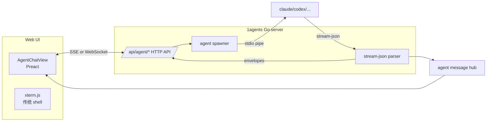
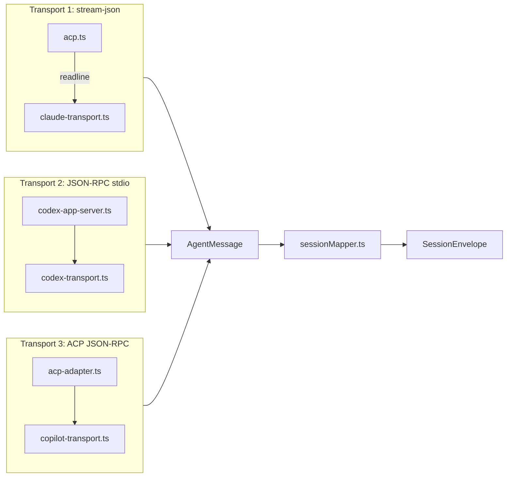

# ccpark / @agentdock/daemon 设计模式参考

> **本文件不是接入方案、不是产品 PRD**，只是从 `@agentdock/daemon` 0.0.46（npm 上 `ccpark` 的真实引擎）的 `dist/*.js` 中整理出的**可借鉴设计模式**。原项目 (`scottzx/1agents`) 已确认**不引入** ccpark 作为依赖，但其中若干思想可在 1agents 现有架构上演进。

参考来源：本地 `node_modules` 内的 `dist/*.js`（minified 但结构可读）+ `@agentdock/{wire,crypto,sdk,daemon}` 四个 npm 包源码 README。

---

## 1. 背景

`@agentdock/daemon` 的产品定位与 1agents **不重叠**：

| 维度 | 1agents | ccpark |
|---|---|---|
| 终端 | ttyd 完整 shell 共享 | 仅 fork AI agent CLI 的 stdin/stdout |
| 文件管理 | 自家 fs/handler | 无 |
| AI 接入 | cc-connect → IM 平台 | 直接 fork 7 个 agent CLI（Claude/Codex/Copilot/Gemini/Hermes/OpenClaw/OpenCode） |
| 用户控制 AI | 通过 IM 发消息 | 通过浏览器 PWA |
| 部署模型 | 自托管 | SaaS（连 `ccpark-api.yungujia.com`） |
| 加密 | 仅 TLS | 应用层 E2E |

但其中**通用的设计模式**值得保留：流式对话 UI、传输适配、E2E 加密、Token 自动刷新、白标壳等。下面按"可立刻借鉴 / 长期可演进"两类列。

---

## 2. 核心可借鉴模式

### 2.1 流式对话 UI > 终端控制

#### 现状（1agents）
- 用户在 Web UI 上看到的是 **xterm.js + ttyd** 的全屏 shell
- 跟本地 agent CLI 互动只能"在 shell 里手动键入"——打字没补全、没 markdown 渲染、没工具调用可视化、permission 弹框直接污染终端、token/费用无统计

#### ccpark 做法
- 浏览器 PWA 里用**结构化的消息块**展示 agent 输出（`text` / `tool-call` / `tool-result` / `permission-request` / `usage` / `status`）
- 实时流式追加（不是"一次刷新一整段"）
- `permission-request` 走 PWA 内置对话框，不污染终端
- `usage` / `result` 单独成块，附 cost / duration / token

#### 对 1agents 的演进建议
在 `html/src/components/` 下新增一个**与 xterm 并列**的视图：`AgentChatView`（暂定名）。架构如下：



要点：
- **不复用 ttyd**——`spawn agent CLI` 直接走 Go 端（参考 `agentSpawn.ts` 派发器模型：claude / codex / copilot / ...）
- **解析 `stream-json` 行为 `sessionMapper`**：在 Go 里实现 `turn-start` / `text` / `tool-call` / `permission-request` / `turn-end` 的归一化层
- **HTTP API 用 SSE**（Server-Sent Events）：单向流足够，比 WebSocket 简单，且 Go `net/http` 原生支持
- **前端用 Preact**（与 1agents 现有栈一致）做消息块渲染，markdown 用 `marked`（已在依赖里），`xterm` 仍保留为"传统 shell"标签

详细的 Preact 消息块组件可参考 `app.tsx` 现有的 `DrawerPanel` 模式：右抽屉 + 移动端全屏。

#### 实施切片
| 阶段 | 范围 | 工作量估算 |
|---|---|---|
| M1 | Go 端 `spawn claude --output-format stream-json`，SSE 推到前端 | 1 周 |
| M2 | 前端 `AgentChatView`：text + tool-call + permission 弹框 | 1 周 |
| M3 | 加 subagent 嵌套 (`Task` / `Agent` tool_use)、usage / cost 统计 | 1 周 |
| M4 | 接入其他 6 个 agent（codex / copilot / ...），每种一份 transport 适配 | 2 周 |

---

### 2.2 应用层 E2E 加密（master secret + per-session DEK）

#### 现状（1agents）
- HTTPS / WSS 全靠 TLS
- 任何能拿到 TLS 终止点（反向代理、公司网关、CDN）的人都能看明文消息

#### ccpark 做法（强烈建议直接抄）

```
┌─────────────────────────────────────────────────────────────┐
│  Pairing（一次性，Curve25519 NaCl Box）                      │
│  CLI                                    PWA                 │
│  generateBoxKeyPair()                   scan QR             │
│  POST /v1/pairing/request {publicKey}   审批                 │
│  pollUntilAuthorized                    POST /deliver        │
│  decryptBox(payload, secretKey)            {encryptedPayload}│
│  ↓                                                         │
│  masterSecret (256-bit) → credentials.json (mode 0600)     │
└─────────────────────────────────────────────────────────────┘
                              ↓
┌─────────────────────────────────────────────────────────────┐
│  会话加密（AES-256-GCM, Web Crypto API）                    │
│                                                             │
│  generateSessionKey(masterSecret)                          │
│    → { dek, wrappedDek }                                   │
│  createSession(metadata, wrappedDek) → server 收到 wrappedDek│
│  keyManager.setSessionDek(sessionId, dek)                   │
│  encryptEnvelope(envelope, dek)                            │
│    → { c: ciphertext, t: "encrypted" }                     │
│  ↑ server 拿不到 dek，无法解                               │
└─────────────────────────────────────────────────────────────┘
```

设计要点：
1. **master secret 永远不上 server**，只在 client 端 `credentials.json` 里（0600 权限）
2. **DEK per session** — 每次新会话重新生成，被 master secret 加密后传给 server
3. **server 只能拿 wrappedDek** — 即使 server 数据库被脱裤，没有 master secret 也解不出明文
4. **resume 时支持 DEK 恢复** — server 把 wrappedDek 还给 client，client 解开
5. **DEK 缺失时**严格 fail-closed：ccpark 行为是 `log "SECURITY: envelope dropped"` + 不入队（**不静默降级**）

#### 对 1agents 的演进建议
1agents 现在的消息是 cc-connect 经飞书/Telegram 走的，**不需要**应用层加密（IM 平台自带 TLS + 鉴权）。但如果未来想做"1agents Cloud"（自托管外的官方服务），应该直接抄这套。

落地步骤（如要做）：
- `internal/crypto/` Go 包：用 `crypto/aes` + `crypto/cipher` + `golang.org/x/crypto/curve25519` + `golang.org/x/crypto/nacl/box`
- 协议定义跟 wire 解耦——**不要引入 `@agentdock/wire`**，Zod 跟 Go 没法共用，**用 protobuf 或 OpenAPI 重新定义**
- key 存 `~/.1agents/credentials.json`（已有，可复用）
- Web Crypto API 替换为 SubtleCrypto 的 AES-GCM（前端用）

---

### 2.3 统一 Agent Transport Adapter

#### 现状（1agents）
- `modules/cc-connect/agent/` 下每个 agent 一个 go 文件（claudecode / codex / cursor / gemini / ...）
- 新增一个 agent 要改 5+ 个文件
- 跟 platform 强耦合（agent 必须配对 IM platform）

#### ccpark 做法
3 种 transport 类型 + 1 个统一中间表示：



`AgentMessage` 是一个**discriminated union**（Go 里可以做成 sealed interface + type switch）：

```go
type AgentMessage interface{ isAgentMessage() }

type TextMessage struct{ Content string; Thinking bool }
type ToolCall struct{ CallID, Name string; Input any }
type ToolResult struct{ CallID, Output string; IsError bool }
type Status struct{ S string } // working / idle / error
type Usage struct{ InputTok, OutputTok int; Model string }
type PermissionRequest struct{ RequestID, ToolName string; Input any }
type Result struct{ CostUSD float64; DurationMs int64 }
type Error struct{ Message string }
```

每个 transport 的 parser 只负责"我这种格式怎么变成 `AgentMessage`"，之后所有逻辑（turn 边界、UI 渲染、token 统计、permission 弹框）都跟 transport 无关。

#### 对 1agents 的演进建议
短期（接入第 N+1 个 agent）先把 `agent/` 目录的 go 文件统一抽成一个 `agent.Message` 接口 + `agent.Transport` interface：

```go
type Transport interface {
    Start(ctx context.Context) error
    SendMessage(text string) error
    Cancel() error
    Events() <-chan Message
}
```

长期（做 2.1 的流式 UI 时）把 ccpark 的 `sessionMapper` 概念搬过来：把 `Message` 流变成带 `turn-start` / `turn-end` 边界的 `Envelope` 流，前端按 turn 渲染。

---

### 2.4 本机 HTTP + Bearer Token 的无状态 RPC

#### ccpark 做法
- daemon 起在 `127.0.0.1:0`（随机端口）
- `Authorization: Bearer <token>` 鉴权
- `POST /rpc` body `{method, params}` 调任意方法
- 返回 `{ok, result?, error?}` 标准三态

#### 现状（1agents）
- 已有 `internal/server/` 提供 HTTP API
- 鉴权用 `access token`（存 cookie 或 header），但调用契约不统一

#### 演进建议
统一 API 响应格式：
```json
{ "ok": true, "result": ... }
{ "ok": false, "error": "max-sessions-reached" }
```

这样前端可以用同一个 `await api(method, params)` wrapper，不用每加一个端点都写 try/catch。

---

### 2.5 Token 自动刷新 + 重连

#### ccpark 做法（值得抄的核心代码片段）
```ts
// 60 行 minified
export function createOnAuthError(ctx) {
  return () => {
    const retry = async (attempt) => {
      if (await attemptTokenRefresh(ctx, true)) return;   // 立即刷一次
      if (attempt >= 5) { /* exhausted */ return; }      // 5 次退避上限
      const delay = 5000 * 2 ** attempt;                 // 指数退避
      await new Promise(r => setTimeout(r, delay));
      retry(attempt + 1);
    };
    retry(0);
  };
}
```

外加 30min 周期主动 `attemptTokenRefresh`：
```ts
setInterval(() => attemptTokenRefresh(ctx), 30 * 60 * 1000);
```

#### 现状（1agents）
- 1agents 自己发的 token 是自己鉴权用，没有"对远端 server 鉴权"的概念

#### 演进建议
**目前不适用**——1agents 不连远端 server。但如果做 2.2 的 E2E 加密 + Cloud 服务，这套刷新模式直接抄。

---

### 2.6 4 包分层 + 白标壳

#### ccpark 做法
```
@agentdock/wire   ← Zod schema + 常量
@agentdock/crypto ← AES + NaCl + Web Crypto
@agentdock/sdk    ← Socket.IO 封装
@agentdock/daemon ← 产品本体
   ↑
agentdock / ccpark / yarkai  ← 17 行白标壳
```

白标壳本质：
```js
process.env['AGENTDOCK_NPM_PACKAGE'] ??= 'ccpark';
process.env['AGENTDOCK_SERVER']       ??= 'https://ccpark-api.yungujia.com';
import { createRequire } from 'node:module';
const daemonPkg = dirname(require.resolve('@agentdock/daemon/package.json'));
await import(pathToFileURL(resolve(daemonPkg, 'dist', 'cli.js')));
```

#### 对 1agents 的演进建议
1agents 现在已经是自托管，**不需要白标**。但有相关的子模式可以参考：
- 现在的 `npm/` 目录 = 把 Go 二进制 + ttyd + cloudflared 打包成 npm 包 → **已经是这个模式**（`@scottzx/1agents`）
- 唯一可借鉴的：`brand.ts` lookup 模式可以做成 `internal/config/profile.go`：

```go
type Profile struct {
    DataDir string
    ServerURL string
    NpmPkg string
    Edition string // personal / enterprise
}

var profiles = map[string]Profile{
    "1agents": {DataDir: "~/.1agents", ServerURL: "..."},
    "1agents-enterprise": {DataDir: "~/.1agents-ent", ServerURL: "..."},
}

func GetProfile() Profile { /* lookup by env */ }
```

主要是给**将来想做"商业版/社区版"双轨**留接口。

---

## 3. 不借鉴的部分（明确列出，避免误用）

| 模式 | 不借鉴的理由 |
|---|---|
| **连远端 SaaS server** | 1agents 是自托管，引入远端 server 违背产品定位 |
| **强制 E2E 加密** | 当前用户场景都是自托管，TLS 足够。E2E 是 Cloud 化之后才需要的 |
| **PI 启动 spawn 守护** | 1agents 的 Go 主进程已经是 daemon，再套一层 Node 守护毫无意义 |
| **白标 3 套 npm 包** | 1agents 没有白标需求 |
| **EDITION 个人/企业模式** | 1agents 单版本，feature flag 用 Go build tag 即可 |
| **history 同步到 server** | 1agents 历史留在本地 `~/.claude/projects/*.jsonl` 即可 |
| **agent 缓存 60min TTL** | 没必要，CLI 版本变化不频繁 |
| **多 server 凭证 profile** | 1agents 单 server 假设 |

---

## 4. 推荐落地顺序

按"价值 / 工作量"排序（高 → 低）：

1. **2.1 流式对话 UI** — 用户能直接感受到差异，价值最高，工作量中等
2. **2.3 Transport Adapter** — 跟 2.1 一起做，1agents 加新 agent 不再痛苦
3. **2.4 统一 RPC 响应** — 小改动，1 天做完，全局受益
4. **2.6 Profile 配置层** — 现在 0 成本埋点（1 个 file + 1 个 env var），将来要用的时候现成
5. 2.2 E2E 加密、2.5 Token 刷新 — 等真有 Cloud 需求时再上

---

## 5. 参考资料

- ccpark 实际代码：`node_modules/@agentdock/daemon/dist/*.js`（0.0.46）
- 关键文件：
  - `dist/cli.js` — 入口 + 派发
  - `dist/daemonLoop.js` — 主循环
  - `dist/daemonRpcHandler.js` — RPC 方法
  - `dist/acp.js` / `dist/codex-app-server.js` / `dist/acp-adapter.js` — 3 种 transport
  - `dist/session/sessionMapper.js` — turn 边界算法
  - `dist/pairing/pairingClient.js` + `dist/pairing/authClient.js` — 配对加密
  - `dist/keyManager.js` + `dist/dekMethods.js` + `dist/envelopeSerializer.js` — DEK 链路
  - `dist/tokenRefresher.js` — 60 行教科书级实现
  - `dist/brand.js` — 3 个品牌的 lookup
- 上游包：`@agentdock/wire`（Zod schema）、`@agentdock/crypto`（Web Crypto）、`@agentdock/sdk`（Socket.IO）

---

## 6. 版本记录

| 日期 | 事件 |
|---|---|
| 2026-06-09 | 初稿。基于 0.0.46 版本的 dist 代码 |
