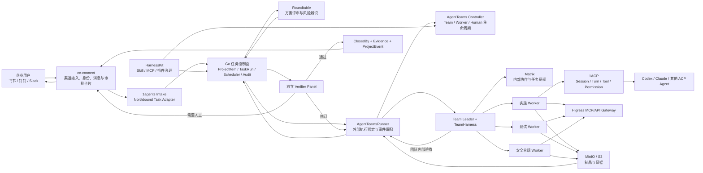
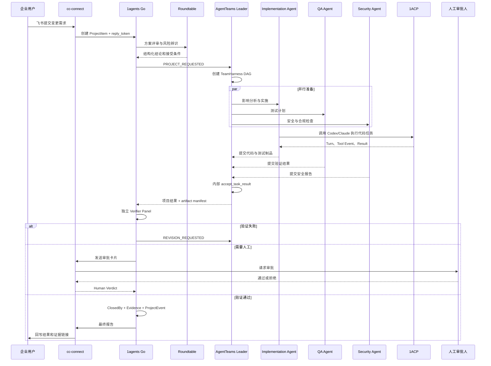

> **Historical analysis / Superseded decision**
> 本文保留 2026-07 对 AgentTeams、1ACP、cc-connect 和 Go 任务内核的完整调研过程，但其“Matrix 仅用于内部协作、cc-connect 承担主交互入口、1ACP 运行 AgentTeams Worker”等结论已被 2026-08-03 决策取代。当前权威方向见 [Chat-first AgentTeams 交互与渠道架构](../architecture/chat-first-agentteams-interaction.md) 和 [GOAI 技术方案](../GOAI/技术方案v1.md)。

## 结论先行（历史）

AgentTeams 非常适合成为 1agents 参赛方案里的“多 Agent 组织与协同执行引擎”，但不适合替换 1agents 已有的 Go 任务管理、cc-connect 或 1ACP。

最合理的组合方式是：

> **1agents Go 后端负责企业任务与治理，AgentTeams 负责团队组织和多 Agent 协同，1ACP 负责单个 Agent 的运行与 Turn 协议，cc-connect 负责企业消息渠道，HarnessKit 负责可复用 Skill/MCP/插件资产治理。**

这套组合与赛道要求高度吻合，而且比单独使用 AgentTeams 更完整：

- AgentTeams 提供显式的 Manager、Leader、Worker、Human 组织结构。
- Go 后端提供企业级任务、审批、验证、审计和最终状态闭环。
- 1ACP 提供 Codex、Claude 等单 Agent 的稳定会话与工具执行能力。
- cc-connect 提供飞书、钉钉、Slack、Telegram 等真实企业入口。
- HarnessKit 提供 Skill、MCP、插件、安装回执和经验沉淀能力。

当前还不能称为“已经完成 AgentTeams 集成”：仓库中目前只有 [.gitmodules](/Users/scott/Documents/01-开发项目/1agents/1agents_app/.gitmodules:28) 的子模块声明，根 Makefile、Go 后端和前端尚未引用 AgentTeams。准确表述应当是：

> **AgentTeams 源码依赖已经引入，架构集成尚未开始。**

我建议将参赛选题收敛为：

> **面向企业软件变更与发布的多 Agent 合规执行闭环**
> 从企业 IM 接收需求，由 AgentTeams 团队完成影响分析、方案评审、编码、测试、安全审计和交付验证；1agents 负责全程任务追踪、人工审批、证据沉淀和最终回写。

这能把 1agents 现有的几乎所有核心能力串成一个真正端到端、可运行、可验证的 Production 场景。

---

# 一、AgentTeams 是什么项目

AgentTeams 原名 Hiclaw，本质上不是“又一个聊天机器人框架”，而是一个面向长生命周期、多角色协同的 Agent 团队运行基础设施。

它在自己的文档中对边界定义得比较清楚：

- 它负责组织、编排、运行和管理多个 Agent 容器。
- 它不自己实现底层 Agent Runtime。
- 它通过 Matrix 提供团队消息协作。
- 通过 MinIO 提供文件和制品同步。
- 通过 Higress 提供 MCP/API 网关和凭证隔离。
- 通过 Controller/CRD 管理 Worker、Team、Manager、Human 的生命周期。

可参考 [AgentTeams 中文 README](/Users/scott/Documents/01-开发项目/1agents/1agents_app/modules/AgentTeams/README.zh-CN.md:15) 和 [总体架构文档](/Users/scott/Documents/01-开发项目/1agents/1agents_app/modules/AgentTeams/docs/architecture.md:9)。

可以把 AgentTeams 理解成：

```text
AgentTeams
≈ 多 Agent 组织模型
+ Agent 容器生命周期管理
+ 内部协作空间
+ 团队任务协议
+ 文件与制品共享
+ MCP/API 访问治理
```

它更接近“Agent 团队版 Kubernetes + Slack/Matrix + 协作协议”，而不是 LangChain、CrewAI 那种主要存在于一个 Python 进程里的编排库。

## 1. AgentTeams 的组织模型

AgentTeams 当前有四类核心主体。

### Manager

Manager 是组织级协调者：

- 管理团队和资源。
- 对接 Controller API。
- 创建或调整 Team、Worker、Human 等资源。
- 跨团队协调。

它原则上不直接穿透团队管理每个 Worker，而是通过 Team Leader 协调 Team。这个边界在 [Kubernetes 原生编排文档](/Users/scott/Documents/01-开发项目/1agents/1agents_app/modules/AgentTeams/docs/k8s-native-agent-orch.md:66) 中有明确说明。

### Team Leader

Leader 是团队内部唯一协调者：

- 接收项目级请求。
- 拆解工作。
- 创建 DAG 或 Loop。
- 向 Worker 委派任务。
- 检查任务状态。
- 接收 Worker 结果。
- 做团队内部验收。
- 汇总最终报告。

Team CRD 强制一个 Team 只有一个 Leader。相关结构可见 [AgentTeams CRD 类型定义](/Users/scott/Documents/01-开发项目/1agents/1agents_app/modules/AgentTeams/agentteams-controller/api/v1beta1/types.go:412)。

### Worker

Worker 是执行单元，可配置：

- Agent Runtime。
- 模型。
- 容器镜像。
- Skills。
- MCP Servers。
- 通信策略。
- 访问控制。
- 凭证绑定。
- Running、Sleeping、Stopped 等期望状态。

代码定义见 [WorkerSpec](/Users/scott/Documents/01-开发项目/1agents/1agents_app/modules/AgentTeams/agentteams-controller/api/v1beta1/types.go:166)。

### Human

Human 是有明确权限级别和访问范围的人类参与者：

- 可加入指定 Team。
- 可访问指定 Worker。
- 可被授权介入、审批或观察。
- 可以成为生产系统中的人工控制点。

对应结构见 [HumanSpec](/Users/scott/Documents/01-开发项目/1agents/1agents_app/modules/AgentTeams/agentteams-controller/api/v1beta1/types.go:567)。

这套 Manager—Leader—Worker—Human 模型，正好可以直接映射比赛要求里的“不少于三个不同职能 Agent”和“人在回路”。

---

# 二、AgentTeams 已经实现了哪些能力

## 1. Controller 和声明式资源管理

AgentTeams 有一个 Go 实现的 Controller/Operator，支持管理：

- Worker
- Team
- Human
- Manager

支持本地嵌入式运行和 Kubernetes CRD 两种思路，负责资源的声明、创建、更新、状态协调和生命周期控制。

当前 Controller REST API 主要还是资源与生命周期管理接口，路由见 [controller HTTP server](/Users/scott/Documents/01-开发项目/1agents/1agents_app/modules/AgentTeams/agentteams-controller/internal/server/http.go:64)。

需要特别注意：

> Controller 当前不是完整的“企业任务提交 API”。

它能创建 Team 和 Worker，但 TeamHarness 里的项目和任务目前主要通过运行时内部的 MCP、Matrix 和文件元数据驱动，而不是通过 Controller REST API 创建。

这将是 1agents 集成时最明显的接口缺口之一。

## 2. TeamHarness：团队协作协议和运行时基础

TeamHarness 是 AgentTeams 中最值得 1agents 复用的部分。

它是一个运行时中立的团队协作层，为不同 Agent Runtime 提供统一的：

- Prompt。
- Skill。
- MCP tools。
- 项目协议。
- 任务委派协议。
- 房间协作协议。
- 文件同步协议。
- 制品发布协议。

它不负责：

- Worker 容器生命周期。
- Controller reconcile。
- Kubernetes 状态协调。
- 密钥持久化。
- 全局调度。

边界定义见 [TeamHarness 边界与契约](/Users/scott/Documents/01-开发项目/1agents/1agents_app/modules/AgentTeams/docs/teamharness-boundary-and-contracts.md:6)。

目前 TeamHarness MCP Server 已实现的工具组包括：

- `health`
- `message`
- `roomflow`
- `filesync`
- `artifact`
- `projectflow`
- `taskflow`

工具注册入口见 [TeamHarness MCP Server](/Users/scott/Documents/01-开发项目/1agents/1agents_app/modules/AgentTeams/plugins/teamharness/mcp/server.py:28)。

## 3. 项目级 DAG 和 Loop

TeamHarness 已经具备比较完整的项目内部任务流能力。

Leader 可以：

- 创建项目。
- 快速创建单任务项目。
- 规划 DAG。
- 规划循环迭代任务。
- 解析当前可执行节点。
- 检查项目状态。
- 接受 Worker 结果。
- 汇总项目报告。

实现集中在 [TeamHarness projectflow](/Users/scott/Documents/01-开发项目/1agents/1agents_app/modules/AgentTeams/plugins/teamharness/mcp/server.py:3196)。

这意味着它已经可以表达类似：

```text
影响分析
   ├── 安全审计
   ├── 测试方案
   └── 实施方案
          ↓
       代码实现
          ↓
     集成测试与验收
```

也可以表达需要反复修正的 Loop：

```text
实施 → 测试 → 不通过 → 修正 → 再测试
```

这部分与比赛强调的任务拆解、并行协同和状态追踪高度匹配。

## 4. Worker 委派与结果提交

Taskflow 已经实现：

- Leader 向 Worker 委派任务。
- Worker ACK。
- Worker 提交结果。
- Leader 检查状态。
- Leader 取消任务。
- Leader 接受任务结果。

对应实现位于 [taskflow 逻辑](/Users/scott/Documents/01-开发项目/1agents/1agents_app/modules/AgentTeams/plugins/teamharness/mcp/server.py:3806)。

它提供的是“团队内部微任务状态机”，不是 1agents Go 后端的企业任务状态机。两者应建立映射，但不应合并为同一套表或同一个状态字段。

## 5. Matrix 内部协作

AgentTeams 使用 Matrix 作为内部协作总线：

- Team 房间。
- Leader 与 Worker 的直接消息。
- 任务房间。
- 结构化消息和普通对话。
- Human 可观察和干预。

Matrix 在这里不是面向最终企业用户的外部渠道，而是 Agent 团队内部工作空间。

这是它与 cc-connect 最容易混淆的地方：

- AgentTeams Matrix：内部 Agent 协同。
- cc-connect：外部飞书、钉钉、Slack、Telegram 等企业入口和结果回写。

两者应隔离使用。

## 6. MinIO 文件和制品同步

AgentTeams 使用 MinIO 或 S3 类存储来共享：

- 项目上下文。
- 任务输入。
- Worker 结果。
- 代码或文档制品。
- 报告。
- 元数据。

这样可以避免所有大文件和历史上下文都通过对话消息传递。

对企业 Agent 来说，这一点很重要，因为它能提供：

- 可持久化制品。
- 可校验摘要。
- 可追溯版本。
- 降低上下文 Token。
- 跨 Agent 文件同步。

不过，1agents 集成时应进一步增加 artifact manifest，例如：

```json
{
  "artifact_id": "art_xxx",
  "task_id": "agt_task_xxx",
  "path": "s3://bucket/project/result.tar.gz",
  "sha256": "...",
  "size": 123456,
  "producer": "worker-implementation",
  "created_at": "...",
  "turn_ids": ["turn_xxx"]
}
```

Go 后端保存证据引用和摘要，不需要把完整二进制制品复制进自己的数据库。

## 7. Higress 与访问治理

AgentTeams 将 MCP/API 服务通过 Higress 暴露给 Worker，支持：

- Consumer 身份。
- 凭证管理。
- API 网关。
- 服务访问控制。
- 不同 Worker 的权限隔离。
- Secret 与运行时配置分离。

这使它比普通“多个 Agent 共用一个 MCP 配置文件”的方案更接近企业生产环境。

## 8. WorkerFlow：单 Worker 内部子流程

AgentTeams 还有一个容易和 TeamHarness 混淆的 WorkerFlow。

WorkerFlow 用于单个 Worker 内部的临时执行流程，例如：

- 一个 Worker 临时再调用若干子 Agent。
- 本地并行分析。
- 将内部步骤汇总成一个 Worker 结果。

其边界明确说明：

- 它不创建 TeamHarness Worker。
- 不创建团队项目 DAG。
- 不创建团队任务房间。
- 不直接向 requester 汇报。

见 [WorkerFlow 文档](/Users/scott/Documents/01-开发项目/1agents/1agents_app/modules/AgentTeams/plugins/workerflow/prompts/team/WORKERFLOW.md:1)。

因此层级可以表达为：

```text
AgentTeams Team
└── Worker
    └── WorkerFlow
        ├── 临时子 Agent A
        ├── 临时子 Agent B
        └── 临时子 Agent C
```

AgentTeams Team 是持久的组织结构，WorkerFlow 是单个 Worker 的内部实现细节。

---

# 三、AgentTeams 当前的成熟度判断

AgentTeams 已经不是纯概念项目，核心团队协作协议有实际实现和测试。

我在本地做了针对性验证：

| 模块 | 验证结果 |
|---|---|
| 1agents Go `internal/agent` | 通过 |
| 1agents Go `internal/meta` | 通过 |
| 1agents Go `internal/roundtable` | 通过 |
| cc-connect `core` | 通过 |
| cc-connect `agent/oneacp` | 通过 |
| TeamHarness projectflow | 通过 |
| TeamHarness taskflow | 通过 |
| TeamHarness roomflow | 通过 |
| TeamHarness contracts | 通过 |
| 1ACP bridge JavaScript 语法检查 | 通过 |
| AgentTeams 全量插件集成测试 | 未全绿 |
| AgentTeams Controller 全量 Go 测试 | 未完成，首次 Kubernetes 依赖下载时间过长，主动终止，没有得到代码失败结论 |

AgentTeams 插件集成测试目前有一个具体不一致：

- LoongSuite 的 TeamHarness Agent 定义当前只声明了 `qwenpaw` 检测命令，见 [teamharness.json](/Users/scott/Documents/01-开发项目/1agents/1agents_app/modules/AgentTeams/plugins/teamharness/loongsuite/agents.d/teamharness.json:5)。
- 但测试同时期待 `qwenpaw` 和 `claude`，见 [CLI 集成测试](/Users/scott/Documents/01-开发项目/1agents/1agents_app/modules/AgentTeams/plugins/tests/cli/test_agentteams_plugin_cli.py:101)。

Claude Code adapter 目前也更接近预留接口，QwenPaw/OpenClaw 路径相对完整。

因此更准确的成熟度评价是：

> AgentTeams 的组织模型、Controller、Matrix 协作、TeamHarness 项目/任务协议已经具备可用内核；但跨 Runtime 适配、异常恢复、外部任务 API 和部分插件契约仍处于快速演进阶段。

参赛 Demo 可以使用，企业 Production 化还需要 1agents 在外面补齐：

- 外部任务入口。
- 幂等。
- 持久化绑定。
- 失败恢复。
- 独立验证。
- 人工审批。
- 审计证据。
- 安全权限。

---

# 四、1agents 当前已经有什么

根据仓库现状和你提供的 Feature Catalog，1agents 已经不只是一个远程终端或 Web Chat 项目，而是在形成一个“AI 原生工作操作系统”。

根 README 对产品方向的描述已经比较接近本次赛题，见 [1agents README](/Users/scott/Documents/01-开发项目/1agents/1agents_app/README.md:3)。

其主要能力可以分为以下几层。

## 1. 工作台与执行入口

已有：

- Web Terminal。
- 文件管理。
- Web Chat。
- 远程工作区。
- 多 Agent CLI/ACP Runtime 连接。
- 本地与远程服务统一启动。

这解决“在哪里工作”和“如何调用 Agent”。

## 2. 企业任务模型

Go 后端已经有比较丰富的 `ProjectItem` 模型，包含：

- Issue/Workflow 双状态。
- 父子任务。
- 依赖。
- 优先级。
- Assignee。
- 目标。
- 结果。
- 成本。
- 验收条件。
- 重试。
- 周期任务。
- 单验证人。
- 多验证人。
- ClosedBy。

见 [ProjectItem 定义](/Users/scott/Documents/01-开发项目/1agents/1agents_app/backend/internal/meta/types.go:497)。

它的 Executor 已经抽象成：

- `agent`
- `function`
- `human`

见 [Executor 类型](/Users/scott/Documents/01-开发项目/1agents/1agents_app/backend/internal/meta/types.go:230)。

这个抽象应该保留，不建议为了 AgentTeams 增加第四种 `team` executor。

更合适的方式是：

```text
executor = agent
agent_provider = acp | agentteams
```

也就是把 AgentTeams Team 看成一种更高级的 Agent Runtime Provider。

## 3. 任务状态机

当前状态已经包括：

- pending
- queued
- running
- completed
- failed
- cancelled
- blocked
- not_ready
- pending_review
- awaiting_human

见 [任务状态定义](/Users/scott/Documents/01-开发项目/1agents/1agents_app/backend/internal/meta/types.go:292)。

这比 TeamHarness 的团队内部任务状态更适合承担企业任务最终状态。

## 4. TaskRun 和执行证据

Go 后端已经有 TaskRun，用来记录：

- 执行尝试。
- 验证尝试。
- 状态。
- Evidence。
- Verdict。
- ClosedBy。

见 [TaskRun](/Users/scott/Documents/01-开发项目/1agents/1agents_app/backend/internal/meta/task_runs.go:10)。

Evidence 的设计方向也是正确的：存储隐私安全的 proof reference，不直接塞完整日志、Secret 或敏感内容。见 [CompletionEvidence](/Users/scott/Documents/01-开发项目/1agents/1agents_app/backend/internal/meta/types.go:345)。

这正好可以作为 AgentTeams 运行结果进入企业任务闭环的“最终证据层”。

## 5. ProjectEvent 和 AgentTurn

Go 后端已有不可变项目事件模型，可以关联：

- correlation ID。
- TaskRun。
- Session。
- Turn。
- Actor。
- Origin。
- Before/After。
- Sequence。

见 [ProjectEvent 与 AgentTurn](/Users/scott/Documents/01-开发项目/1agents/1agents_app/backend/internal/meta/turn_types.go:8)。

这使它适合作为统一审计投影，而不是要求 AgentTeams、cc-connect 和 1ACP 都把全部内部状态复制到 Go 数据库。

## 6. Scheduler

当前调度器会周期扫描待执行任务，并根据 executor 分派：

- Human → `awaiting_human`
- Function → Function Runner
- Agent → TaskRunner/1ACP

入口见 [scheduler.go](/Users/scott/Documents/01-开发项目/1agents/1agents_app/backend/internal/agent/scheduler.go:12)。

但它目前有一个重要限制：

> WorkspaceLock 是进程内内存锁，且每个 Workspace 同时只运行一个任务。

这对于本地单任务执行很安全，但与 AgentTeams 的多 Worker 并行模式会冲突。

正确改造不是简单放开锁，而是：

- Go 只在“提交 AgentTeams 远程运行”阶段持有锁。
- AgentTeams 接受任务并持久化外部 run ID 后，Go 释放本地锁。
- AgentTeams Workers 使用独立容器或独立 Git worktree。
- 最终合并回 canonical workspace 时重新串行化。
- 远程执行状态由 durable binding 和 watcher 驱动，而不是一直占住 Go goroutine 和内存锁。

## 7. 独立验证器

Go TaskRunner 已有独立 verifier 机制：

- 执行者和验证者可以分离。
- 支持多个 verifier。
- 支持 threshold。
- 支持只读 tasks MCP。
- 支持 `needsHuman`。
- 无有效 verdict 时保守拒绝。

对应逻辑见 [runner.go](/Users/scott/Documents/01-开发项目/1agents/1agents_app/backend/internal/agent/runner.go:335)。

这是 1agents 相比 AgentTeams 最重要的补充之一：

- AgentTeams Leader 的 `accept_task_result` 是团队内部语义验收。
- Go verifier 是企业任务最终完成门禁。

两层都应该保留：

```text
Worker submit
→ AgentTeams Leader 内部验收
→ Go 独立 Verifier 外部验收
→ 必要时 Human 审批
→ ProjectItem completed
```

## 8. Roundtable

代码中已经存在一个真实可运行的 Roundtable 内核，不只是规划中的功能。

当前包括：

- R1 Brief。
- R2 五个并行 Panelist。
- Referee 汇总。
- R3 交叉验证。
- 异步 RoundRun。
- 幂等。
- 每个席位独立 ACP 会话。

见 [Roundtable 类型和流程](/Users/scott/Documents/01-开发项目/1agents/1agents_app/backend/internal/roundtable/types.go:1)。

Feature Catalog 将它标为 unplanned，说明 Catalog 的状态更接近产品 Backlog/Issue 状态，不能直接等同于“仓库没有代码”。

Roundtable 和 AgentTeams 的关系应该是：

- Roundtable：限定轮次、限定角色、面向决策和评审。
- AgentTeams：长生命周期、面向执行和协同。

推荐用法：

```text
需求进入
→ Roundtable 做方案评审/风险辨识
→ 产出结构化决策
→ 创建或补充 Go ProjectItem
→ AgentTeams 执行
```

不要用 Roundtable 替代比赛要求的 AgentTeams 多 Agent 协同主链路。

---

# 五、AgentTeams 与 cc-connect 的竞合关系

## 合作关系

cc-connect 很适合做 AgentTeams 的企业渠道入口和结果出口。

cc-connect 已支持：

- 多种 Agent Adapter。
- 多种 IM 平台。
- 多 Bot。
- 多项目配置。
- 持久会话。
- 权限事件。
- 富媒体。
- 定时任务。
- Relay。

其 Agent 接口见 [cc-connect interfaces.go](/Users/scott/Documents/01-开发项目/1agents/1agents_app/modules/cc-connect/core/interfaces.go:397)。

理想链路是：

```text
飞书/钉钉/Slack
→ cc-connect
→ 1agents Intake / Northbound Task API
→ Go ProjectItem
→ AgentTeams
→ Go 验证与审批
→ cc-connect
→ 原渠道回写
```

cc-connect 还可以承担：

- Human approval card。
- 补充信息请求。
- 阻塞任务通知。
- 风险升级。
- 最终报告。
- 运行摘要。
- 制品链接分发。

## 竞争关系

cc-connect 自己也具备：

- SessionManager。
- 多 Agent 切换。
- 定时任务。
- Agent 进程管理。
- 消息路由。
- 多 Bot relay。

如果让 cc-connect 直接负责完整任务工作流，它就会与以下模块产生重叠：

- Go Scheduler。
- AgentTeams TeamHarness。
- 1ACP Session Manager。
- Matrix 内部协作。

cc-connect 中所谓的 `project`，实际上更接近“工作目录 + Agent + Platform 的配置集合”，不是 1agents 的企业 Project/Workspace。

因此应该明确边界：

| 能力 | 归属 |
|---|---|
| 外部 IM 消息接收与回复 | cc-connect |
| 外部用户和渠道会话上下文 | cc-connect |
| 企业任务创建和最终状态 | Go 后端 |
| 团队内部协作消息 | AgentTeams Matrix |
| Agent 会话与 Turn | 1ACP |
| 多 Agent 内部任务拆解 | TeamHarness |
| 最终验证和审计 | Go 后端 |

## cc-connect 的 1ACP Adapter

cc-connect 已经有 1ACP Adapter，能够：

- 启动或连接 1ACP。
- `ensure_session`。
- 转换 text/tool/permission/done 等事件。
- 保持 Agent 会话。

见 [cc-connect oneacp session](/Users/scott/Documents/01-开发项目/1agents/1agents_app/modules/cc-connect/agent/oneacp/session.go:67)。

长期建议是：

> 对需要纳入 1agents 统一审计链路的 Agent 会话，尽量走 cc-connect → 1ACP，而不是让 cc-connect 的每个原生 Adapter 各自维护另一套不可关联的会话生命周期。

原生 Adapter 可以保留用于兼容，但“可审计的正式任务运行”应尽量收敛到 1ACP。

## 必须避免 Matrix 回环

cc-connect 也支持 Matrix，AgentTeams 内部同样使用 Matrix。如果两者直接监听同一批房间，很容易发生：

- 重复消费。
- 消息回声。
- 无限转发。
- 一个用户消息触发两套 Agent。
- Session 重复创建。
- 内部任务消息泄露到外部渠道。

因此应采用以下任一策略：

- AgentTeams 使用独立 Matrix homeserver。
- 或者内部房间加严格命名空间和 denylist。
- cc-connect 不监听 AgentTeams 内部 Team/Task Room。
- 只有 Go Intake 和 AgentTeams Connector 允许跨边界传递结构化事件。

---

# 六、AgentTeams 与 Go 后端任务管理的竞合关系

这是整个集成里最关键的边界。

## 二者确实有竞争

Go 后端和 TeamHarness 都有：

- Project。
- Task。
- Status。
- Dependency。
- Retry/Replan。
- Result。
- Acceptance。

如果没有明确边界，很容易做出两套互相覆盖的任务系统：

```text
Go ProjectItem running
TeamHarness Task blocked
Go 不知道 blocked

或者：

Go ProjectItem cancelled
TeamHarness Worker 仍在执行
```

## 推荐：宏任务与微任务分层

不要将 AgentTeams 的每个 Task 都同步成 Go ProjectItem。

推荐模型：

```text
Go ProjectItem
= 企业宏任务 / 工作订单 / 需求 / 审批对象

TeamHarness ProjectMeta
= 某一次 AgentTeams 团队执行计划

TeamHarness TaskMeta
= 团队内部微任务
```

例如：

```text
Go ProjectItem:
“为支付模块增加退款审计，并完成上线前验证”

AgentTeams Project:
“payment-refund-audit-implementation”

AgentTeams 内部 Task:
1. 分析现有退款链路
2. 设计数据模型
3. 实现后端代码
4. 编写测试
5. 安全审计
6. 运行集成测试
7. 生成交付报告
```

Go 后端只需要保存 AgentTeams Project 的外部绑定和摘要，不要将所有内部 Task 变成用户可编辑的 Go 任务。

## 一项概念只能有一个权威所有者

建议采用以下权威矩阵：

| 概念 | 权威状态源 |
|---|---|
| 企业 Project/Workspace | Go `meta.db` |
| 企业 Requirement/ProjectItem | Go `meta.db` |
| 企业任务最终状态 | Go `meta.db` |
| TaskRun、Verifier、ClosedBy | Go `meta.db` |
| Team/Worker/Human 生命周期 | AgentTeams Controller/CRD |
| 团队内部 DAG/Loop | TeamHarness ProjectMeta |
| 团队内部微任务 | TeamHarness TaskMeta |
| 团队内部消息 | Matrix |
| Agent Session/Turn | 1ACP Journal |
| 外部渠道会话与回复位置 | cc-connect |
| 大型制品 | MinIO/S3 |
| 审计投影 | Go ProjectEvent |
| Skill/MCP/插件资产目录 | HarnessKit |

这里的核心原则是：

> 同步的是引用、事件和投影，不是让多个系统同时写同一份状态。

## 建议新增 execution binding

Go 后端需要一个通用的外部执行绑定，而不是把 AgentTeams 字段直接塞进 `ProjectItem`。

示意：

```text
execution_bindings
────────────────────────────────────────
id
task_run_id
provider              // acp | agentteams | function
external_run_id       // AgentTeams project_id
external_team_id
external_status
last_event_cursor
metadata
created_at
updated_at
```

需要保证：

```text
UNIQUE(provider, external_run_id)
```

ID 必须命名空间隔离：

```text
Go TaskRun ID       tr_...
AgentTeams Project  agtp_...
AgentTeams Task     agtt_...
Matrix Event        $...
1ACP Turn           turn_...
cc-connect Session  ccs_...
```

不要试图让一个 ID 在所有系统中承担所有含义。

## 不建议增加 `executor=team`

当前 `agent/function/human` 三元模型是很好的产品抽象。

AgentTeams Team 应当作为一种 Agent Provider：

```text
executor.type = agent
executor.target.provider = agentteams
executor.target.team = release-compliance-team
```

Go Agent 调度层可以演变成：

```go
type AgentRunner interface {
    Start(...)
    Cancel(...)
    Reconcile(...)
}
```

实现：

```text
ACPRunner
AgentTeamsRunner
```

这样：

- 普通单 Agent 任务继续由 ACPRunner 执行。
- 复杂协同任务由 AgentTeamsRunner 执行。
- 上层任务状态、验证和审计不需要知道具体 Runtime 内部细节。

---

# 七、AgentTeams 与 1ACP 的竞合关系

## 合作关系

1ACP 的定位是单 Agent 会话和协议桥。

它提供：

- Headless ACP Client。
- 多 Agent Adapter。
- 持久 Session。
- Named Session。
- Prompt Queue。
- Cancel。
- Agent 崩溃重连。
- Tool Event。
- Permission Request。
- Turn Journal。
- 请求幂等。

见 [1ACP README](/Users/scott/Documents/01-开发项目/1agents/1agents_app/modules/1acp/README.md:19)。

AgentTeams 本身明确不实现 Agent Runtime，因此两者天然互补：

```text
AgentTeams
负责：谁和谁组成团队、谁做什么、如何协同

1ACP
负责：某个 Worker 如何与 Codex/Claude/Grok 等 Agent 建立会话并完成一个 Turn
```

一种很自然的实现方式是：

```text
AgentTeams Worker
└── 1ACP Client
    ├── Codex
    ├── Claude Code
    ├── Cursor
    └── 其他 ACP Agent
```

参赛首版不一定要把 1ACP 嵌进所有 AgentTeams Worker。可以只让“实施/编码 Worker”通过 1ACP 调用 Codex 或 Claude，其余 Worker 使用 QwenPaw/OpenClaw + MCP。

这样集成风险最低，也能完整体现现有资产。

## 竞争关系：1ACP Flows

1ACP 还包含实验性的 Flows，支持：

- DAG。
- Action。
- Compute。
- Decision。
- Checkpoint。
- Ordering。
- Liveness。
- Session 管理。
- 持久化。
- Routing。

见 [1ACP Flows 文档](/Users/scott/Documents/01-开发项目/1agents/1agents_app/modules/1acp/docs/flows.md:6)。

这一部分与以下两者存在明显竞争：

- Go Scheduler。
- AgentTeams TeamHarness DAG/Loop。

因此参赛 MVP 中不建议让 1ACP Flows 再承担全局工作流。否则会形成三层宏观编排：

```text
Go Scheduler
  → 1ACP Flow
      → AgentTeams Project DAG
```

这种架构的失败恢复、取消、重试、状态解释都会非常困难。

推荐边界是：

- Go Scheduler：企业宏任务。
- TeamHarness：团队内部 DAG/Loop。
- 1ACP Flow：仅限某一个 Worker 内部的确定性微流程，或者包装为一个 `function` executor。
- 不让 1ACP Flow 管理跨 Worker 的企业任务。

## 一个现有的 P0 文档与代码冲突

当前代码中，1ACP Bridge 会生成并持久化 Turn ID，Go 后端将其作为可信 Turn ID 建立投影。见 [turn_bridge.go](/Users/scott/Documents/01-开发项目/1agents/1agents_app/backend/internal/agent/turn_bridge.go:70)。

但产品名词表仍写着：

- Go 生成 canonical `turn_id`。
- Go/meta.db 是唯一 durable queue owner。

见 [名称定义表](/Users/scott/Documents/01-开发项目/1agents/1agents_app/docs/product/名称定义表.md:233)。

这与当前代码和测试不一致。

在接入 AgentTeams 前必须先做一个明确决定。我建议遵循当前代码：

- 1ACP 是运行时 Session/Turn Journal 的权威源。
- Go 是企业 Task/TaskRun 的权威源。
- Go 保存 Turn 的审计投影和关联。
- AgentTeams 不再创造第四种“权威 Turn”。

然后更新名词表和生命周期文档。

---

# 八、AgentTeams 与 HarnessKit 的关系

根据你提供的 Feature Catalog，HarnessKit 已经承担：

- 扩展发现。
- Skill/MCP/插件目录。
- 安装。
- 卸载。
- 验证。
- 更新。
- 撤销。
- 冲突检测。
- Receipt。
- 来源和版本治理。

AgentTeams 自己也有插件平台，用于把 TeamHarness、WorkerFlow 等内容安装进具体 Runtime。

这两者存在局部竞争，但非常容易分层：

| 能力 | 建议归属 |
|---|---|
| 全局扩展资产目录 | HarnessKit |
| Skill/MCP 来源、版本、哈希、Receipt | HarnessKit |
| 组织级策略、审批与允许列表 | HarnessKit/Go |
| AgentTeams Runtime 中安装 TeamHarness | AgentTeams plugin controller |
| Runtime-specific 路径和 Hook | AgentTeams adapter |
| Worker 生命周期 | AgentTeams Controller |
| 企业任务调用了哪个 Skill | Go TaskRun/Evidence |

必须避免：

> HarnessKit 和 AgentTeams Plugin Controller 同时写同一个 Worker 的插件目录。

建议流程：

```text
HarnessKit
  发现和验证 TeamHarness 插件
  固化 source/version/hash/receipt
        ↓
AgentTeams Controller
  根据期望状态把插件应用到目标 Worker Runtime
        ↓
Worker Runtime
  报告安装结果
        ↓
HarnessKit/Go
  保存实际安装回执和审计记录
```

也就是：

- HarnessKit 决定“安装什么、从哪里来、是否被允许”。
- AgentTeams 决定“安装到哪个 Worker、如何适配该 Runtime”。
- Worker 报告实际结果。
- Go 后端保存企业级证据。

---

# 九、推荐的整体目标架构



## 最重要的设计原则

### 1. cc-connect 不做企业任务权威源

它只保存渠道和会话上下文。

### 2. Go 不直接写 TeamHarness 的 `meta.json`

TeamHarness 当前通过直接 JSON 文件维护项目和任务元数据，写入代码见 [server.py](/Users/scott/Documents/01-开发项目/1agents/1agents_app/modules/AgentTeams/plugins/teamharness/mcp/server.py:2780)。

这套文件写入目前没有数据库事务、CAS 或完整版本控制。若 Go 和 Leader 同时写，会发生覆盖。

因此：

- 只有 Leader/TeamHarness 写内部项目元数据。
- Go 通过结构化事件下发请求。
- Go 只读取投影和制品引用。
- 后续可推动 AgentTeams 增加 version/ETag/atomic replace。

### 3. AgentTeams 不持有企业 IM Secret

Team 只接收一个不透明的 `reply_token` 或 `correlation_id`。

最终回写必须回到：

```text
AgentTeams → Go → cc-connect → 原渠道
```

不要让 AgentTeams Worker 自己保存飞书、钉钉或 Slack 的高权限凭证。

### 4. 双层验收

AgentTeams Leader 验收“内部工作是否完成”。

Go Verifier 验收“企业接受条件是否满足”。

### 5. 大任务才进入 AgentTeams

普通问题或单步操作继续直接走 1ACP。

例如：

| 任务 | 执行方式 |
|---|---|
| 解释一个错误 | 单 Agent / 1ACP |
| 修改一个小配置 | 单 Agent / 1ACP |
| 多模块功能开发 | AgentTeams |
| 涉及编码、测试、安全审计、审批 | AgentTeams |
| 企业发布与合规验证 | AgentTeams |
| 多方方案争议 | Roundtable，然后 AgentTeams |

---

# 十、推荐参赛选题

## 选题名称

**AgentOps ChangeFlow：企业软件变更与发布的多 Agent 合规执行基础设施**

也可以更产品化一些：

> **1agents TeamOps：从企业需求到可审计交付的多 Agent 协同工作系统**

## 为什么这个场景最适合当前项目

你们现有能力天然覆盖：

- 企业 IM：cc-connect。
- 需求和任务：Go ProjectItem。
- 任务依赖和调度：Go Scheduler。
- 多 Agent 组织：AgentTeams。
- 单 Agent 执行：1ACP。
- 代码和终端：1agents Web Terminal。
- 方案评审：Roundtable。
- 验证：Go Verifier。
- 人工审批：Human executor + cc-connect。
- 证据：TaskRun、ProjectEvent、ClosedBy、MinIO。
- Skill 沉淀：HarnessKit。

这不是为了比赛临时拼一个 Demo，而是把已有系统真正闭环起来。

## 至少三个不同职能 Agent

建议设置四个 Agent，加一个 Human：

### 1. Change Manager / Team Leader

职责：

- 理解企业需求。
- 补齐验收条件。
- 将任务拆成 DAG/Loop。
- 分派 Worker。
- 跟踪阻塞。
- 检查任务提交。
- 汇总交付报告。

框架映射：

- AgentTeams Team Leader。
- TeamHarness projectflow/taskflow。
- Matrix 协作房间。

### 2. Implementation Agent

职责：

- 代码影响分析。
- 修改代码。
- 编写单元测试。
- 运行构建。
- 提交 diff、测试结果和制品。

框架映射：

- AgentTeams Worker。
- 1ACP → Codex/Claude。
- Terminal/Git/MCP。
- MinIO artifact。

### 3. QA/Verification Agent

职责：

- 从验收条件生成测试计划。
- 独立运行测试。
- 检查回归。
- 验证交付物。
- 生成结构化 verdict。

框架映射：

- AgentTeams Worker。
- 独立工作区。
- Go Verifier 的候选验证者。

### 4. Security/Compliance Agent

职责：

- Secret 泄露检查。
- 依赖和许可证检查。
- 权限边界检查。
- 高风险命令审计。
- 发布策略检查。

框架映射：

- AgentTeams Worker。
- 只读或最小权限 MCP。
- Higress Consumer 身份。
- Go Evidence。

### 5. Human Release Approver

职责：

- 审批高风险操作。
- 决定是否发布。
- 处理 Agent 无法判断的冲突。
- 签署最终完成。

框架映射：

- AgentTeams Human。
- Go `awaiting_human`。
- cc-connect 审批卡片。

## 完整业务闭环



---

# 十一、比赛要求与框架能力的对应关系

| 赛道要求 | 方案实现 |
|---|---|
| 不少于 3 个不同职能 Agent | Leader、Implementation、QA、Security |
| 角色编排 | AgentTeams Manager/Team/Leader/Worker CRD |
| 任务拆解 | TeamHarness Project DAG/Loop |
| 上下文传递 | Matrix、Task Room、reply_route、MinIO、1ACP Session |
| 协同执行 | Matrix + Leader/Worker taskflow |
| 状态追踪 | CRD Status + TeamHarness meta + Go TaskRun 投影 |
| 工具调用 | Higress MCP、1ACP Tool Events、Terminal/Git |
| 结果验证 | Leader 内部验收 + Go 独立 Verifier |
| 执行证据 | Artifact manifest、Turn 引用、TaskRun、ProjectEvent、ClosedBy |
| 安全审计 | Worker 权限、Higress Consumer、Human 审批、最小权限 ACP |
| 经验沉淀 | HarnessKit Skill/MCP/插件版本和安装 Receipt |
| 人在回路 | AgentTeams Human + Go awaiting_human + cc-connect 审批卡片 |
| 端到端企业闭环 | IM 请求 → 执行 → 验证 → 审批 → 回写 |

---

# 十二、建议的最小集成接口

当前 AgentTeams Controller 没有正式的 TeamHarness Project/Task 外部 API，因此第一阶段不要直接改 Controller 成一个庞大任务平台。

## MVP 接入方式

Go 向 Team Leader 的 Matrix Room 发送结构化事件：

```json
{
  "type": "PROJECT_REQUESTED",
  "schema_version": 1,
  "correlation_id": "corr_xxx",
  "task_run_id": "tr_xxx",
  "project_item_id": "item_xxx",
  "title": "支付退款审计功能",
  "description": "...",
  "acceptance_criteria": [
    "...",
    "..."
  ],
  "risk_level": "high",
  "reply_token": "opaque_xxx",
  "artifact_prefix": "s3://bucket/runs/tr_xxx/"
}
```

Leader 收到后调用 TeamHarness：

```text
create_project
plan_dag / plan_loop
delegate_task
check_task
accept_task_result
```

Go 侧监听结构化结果事件：

```json
{
  "type": "PROJECT_RESULT_SUBMITTED",
  "schema_version": 1,
  "correlation_id": "corr_xxx",
  "task_run_id": "tr_xxx",
  "agentteams_project_id": "agtp_xxx",
  "status": "submitted",
  "summary": "...",
  "artifact_manifest": "s3://bucket/runs/tr_xxx/manifest.json",
  "leader": "release-team-leader"
}
```

## Production 接入方式

后续再建设一个独立的 AgentTeams Task Gateway：

```text
POST /v1/team-runs
GET  /v1/team-runs/{id}
POST /v1/team-runs/{id}/cancel
POST /v1/team-runs/{id}/revision
GET  /v1/team-runs/{id}/events?cursor=...
```

这个 Gateway 可以是：

- AgentTeams sidecar。
- MCP-to-REST bridge。
- 独立 connector。
- 上游 AgentTeams 的可贡献模块。

Controller 继续只承担资源生命周期，Task Gateway 承担工作提交与事件订阅。不要把两者混成一个超大控制器。

---

# 十三、需要优先解决的架构风险

## P0：接入前必须解决

### 1. 明确 Turn 权威源

修复 Go 文档与 1ACP 当前代码的不一致。

推荐：

- 1ACP 权威拥有 Session/Turn Journal。
- Go 权威拥有企业 Task/TaskRun。
- Go 投影 Turn 元数据。

### 2. 防止三套编排器同时拥有任务

必须落实权威矩阵：

- Go：宏任务。
- TeamHarness：团队微任务。
- 1ACP：Agent Turn。
- 1ACP Flows 不承担全局宏流程。

### 3. 建立 AgentTeams 外部执行绑定

不能只把 Matrix 消息发出去就认为任务已调度。

至少要持久化：

- external run ID。
- Team。
- last event cursor。
- 状态。
- correlation ID。
- 重试次数。
- 最后心跳。
- artifact manifest。
- cancel 状态。

### 4. 改造 WorkspaceLock 语义

AgentTeams 远程执行不能一直占用当前 Go 进程内锁。

需要：

- 异步 dispatch。
- durable lease/binding。
- worker 独立 worktree。
- 最终合并串行。
- 重启后的 sweeper/reconcile。

### 5. 取消正式任务中的 blanket `approve-all`

当前 TaskRunner 建立 unattended Session 时存在 `approve-all` 路径，相关位置见 [runner.go](/Users/scott/Documents/01-开发项目/1agents/1agents_app/backend/internal/agent/runner.go:109)。

这对本地 Demo 方便，但不符合企业生产安全要求。

应改为：

- 默认最小权限。
- 读写权限分层。
- 危险工具单独授权。
- 删除、部署、发消息、访问生产数据时触发 Human gate。
- 权限决策进入 ProjectEvent/Evidence。

## P1：试点阶段解决

### 6. 隔离两套 Matrix 使用

避免 cc-connect 与 AgentTeams 监听同一内部房间。

### 7. TeamHarness 元数据单写者

当前 JSON 写入没有 CAS/事务，Leader 应作为唯一写者。Go 不直接修改内部文件。

### 8. 制品上传完成与结果提交之间建立水位

Worker 必须在提交结果前确认：

- 文件上传完成。
- SHA-256 已生成。
- manifest 已持久化。
- MinIO 可读。

否则会出现“任务已完成，但验证器还读不到制品”。

### 9. 异常恢复

TeamHarness 的正常上下文恢复已有设计，但异常循环的自动恢复、active task 扫描等仍有未完成边界。

1agents 需要补：

- heartbeat。
- stale run sweeper。
- Leader 重启恢复。
- Worker 丢失检测。
- Matrix 重复事件幂等。
- blocked 状态升级。
- 重试上限。
- 人工接管。

### 10. Runtime 选择要保守

比赛主链路优先使用 AgentTeams 当前更成熟的 QwenPaw/OpenClaw TeamHarness 路径。

编码 Worker 可以通过 1ACP 调用 Codex/Claude。

暂时不要在答辩中宣称“Claude Code 已经是完整一等 AgentTeams Runtime”，除非先修复 adapter 和 LoongSuite 契约测试。

---

# 十四、推荐实施路线

## Phase 0：架构定界，2～3 天

交付：

- 一份状态权威 ADR。
- 统一 ID 和 correlation 规则。
- 明确 Turn 权威源。
- 明确 Go/AgentTeams/1ACP/cc-connect/HarnessKit 边界。
- 明确哪些功能不做。

验收：

- 一个概念只有一个权威写入者。
- 每个跨系统动作都有幂等键。
- 任何一层重启后都能从权威源恢复。

## Phase 1：Competition POC，1～2 周

交付：

- AgentTeams 可选部署 Profile。
- `AgentTeamsConnector`。
- `AgentTeamsRunner`。
- 一个 Go ProjectItem 映射一个 TeamHarness Project。
- 至少三个 Worker。
- QwenPaw/OpenClaw Leader。
- 编码 Worker 通过 1ACP 执行。
- MinIO artifact manifest。
- Go TaskRun 状态投影。
- Verifier。
- cc-connect 最终回写。

建议不要把 AgentTeams 默认塞进根目录 `make all`：

- Matrix、MinIO、Higress、Controller 依赖较重。
- 桌面单 Agent 用户不一定需要。
- 更适合作为可选 Team Runtime Profile。

例如后续可以提供：

```text
make agentteams
make agentteams-up
make agentteams-down
make package-agentteams
```

但不要改变默认轻量构建的性质。

## Phase 2：企业试点，2～4 周

交付：

- durable `execution_bindings`。
- Outbox。
- AgentTeams event cursor。
- cancel/revision/retry。
- Human approval。
- 独立 Git worktree。
- 最小权限。
- status watcher/sweeper。
- UI 中显示 Team、DAG、Worker、Artifact、Evidence。

## Phase 3：Production

交付：

- Kubernetes/Helm。
- HA。
- AgentLoop 可观测性。
- Chaos testing。
- 组织级权限。
- Skill 评测与版本回归。
- Canary。
- 成本、时延和 Token 统计。
- 长任务恢复。
- 多租户隔离。

---

# 十五、明确不应该做的事情

为了避免项目失控，建议把以下内容明确列为 Non-goals：

- 不用 TeamHarness 替换 Go 企业任务内核。
- 不把每个 AgentTeams 微任务同步成 Go ProjectItem。
- 不用 Matrix 替换 cc-connect。
- 不让 cc-connect 成为业务任务状态权威源。
- 不让 1ACP Flows 成为全局工作流。
- 不为 AgentTeams 增加第四种 `executor=team`。
- 不让 HarnessKit 和 AgentTeams 同时修改 Worker 插件目录。
- 不让 AgentTeams Worker 保存企业 IM 的高权限 Token。
- 不把 AgentTeams 重型基础设施打进每个默认桌面安装包。
- 不在第一个端到端场景完成前扩展多个行业场景。

---

# 十六、最终定位建议

对外可以这样描述 1agents 和 AgentTeams 的关系：

> AgentTeams 为 1agents 提供多 Agent 团队的组织、协作与执行运行时；1agents 在其上提供企业任务控制面、渠道接入、独立验证、人工审批、执行证据、Skill 治理和安全审计，从而将多 Agent 团队从可演示的协作框架提升为可追踪、可验证、可恢复的企业任务系统。

一句话产品架构：

> **cc-connect 接任务，Go 管任务，AgentTeams 组团队，1ACP 跑 Agent，HarnessKit 沉淀能力，Verifier 和 Human 决定任务是否真正完成。**

这就是目前最有竞争力、也最符合你们已有代码资产的结合方向。
