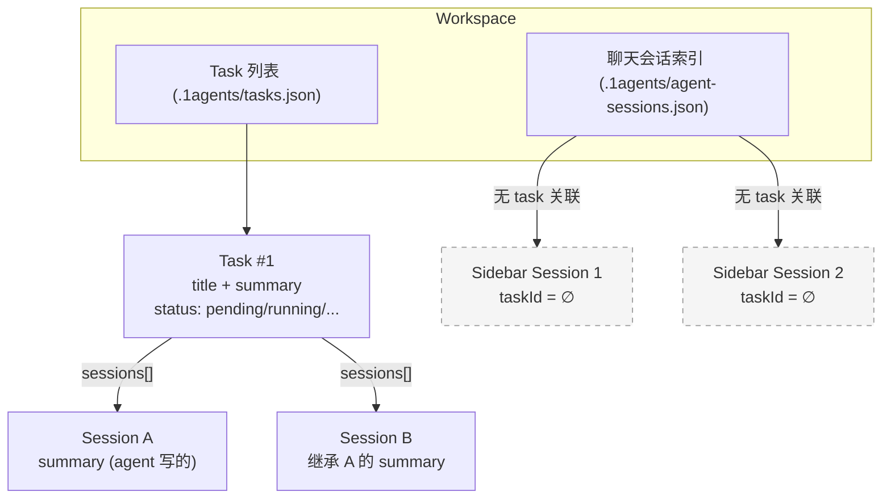
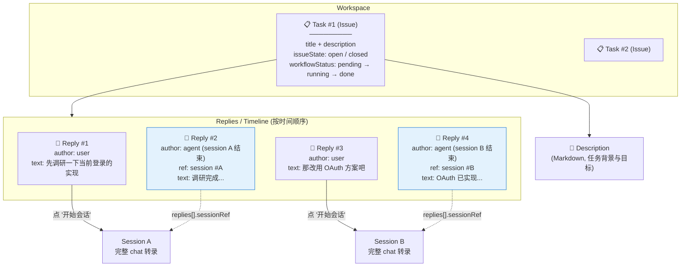

# Task as Issue: GitHub-style Topic Threading for 1agents

**Status:** Design (not yet implemented)
**Author:** scottzx + Claude
**Date:** 2026-06-10
**Scope:** `backend/internal/agent/`, `modules/1acp/bridge-server.js`, `html/src/`, Claude Code hook config

---

## 1. Motivation

1agents 当前把 "任务"（Task）和 "会话"（Session）的关系建模成 **父-子工作流**：每个 Task 拥有 `sessions[]`，后端在下一个 session 启动时把前序 session 的 summary 注入 system context。

这个模型有两个缺口：

1. **用户的声音在两次会话之间消失了。** Task 描述里没有正文字段，会话之间没有评论层。当用户跑完一个 agent session、看了 summary 之后写一句 "这个地方要改一下"，这句话只存在于他自己的脑子里 —— 下一个 session 启动时只能看到上一轮 agent 的 summary，看不到用户视角的中间反馈。
2. **侧边栏会话是孤儿。** 存在 `ChatSessionRecord` 索引里的会话与 `Task.sessions[]` 是两套独立存储；侧边栏新建的会话从来不带 `taskId`，Task 那边也看不到。

设计目标：**把 Task 升级成 Issue 话题**，引入"回复/评论"作为 Task 和 Session 之间的中间层，让用户和 agent 在同一个时间线上对话。

目标形态：

```
Issue (Task) ──► Description (背景说明)
           ──► Replies[] (时间线)
                ├── user comment (纯文字)
                ├── agent reply (回写自 session 结束)
                └── user "do X"  →  spawn / follow-up  Session
           ──► Sessions[] (执行索引, 由 replies 反向聚合)
```

---

## 2. Background: ACP ID Decoupling (Already Done)

在引入 Issue 模型之前，聊天面板的会话标识已经做过一次解耦。Issue 模型建在这个新基建之上。

`ChatSessionRecord` 现在有两个 session id 字段，互不依赖：

| 字段 | 用途 | 何时填充 | 谁用 |
|---|---|---|---|
| `cc_session_id` | cc-connect / IM 通道的会话 id | 创建时由 `ccCreateSession()` 返回 | IM 集成（飞书 / Telegram 等） |
| `acp_session_id` | ACP 通道的会话 id = agent 自己的 session UUID（Claude Code 的 JSONL 文件名） | 首次 `session_ready` 时由 bridge-server 上报 | 聊天面板的历史加载 / resume |

数据流：

**创建新会话**
1. 前端 `POST /api/agent/sessions` → 后端创建 `ChatSessionRecord`，`acp_session_id` 留空
2. 前端打开 WebSocket → Go 后端查 record，取出 `acp_session_id`（空）
3. Go 后端发 `ensure_session` 给 bridge-server（不带 `resumeSessionId`）
4. bridge-server 让 runtime 起一个新 agent 进程，agent 自己生成 UUID
5. bridge-server 回 `session_ready`，带上 `agentSessionId`（agent 报的 UUID）
6. Go 后端拦截 `session_ready`，调 `chatStore.UpdateACP(sessionId, agentSessionId)` 写回 1agents 索引

**重新打开已用过的会话**
1. 前端打开 WebSocket → Go 后端查 record，`acp_session_id` 非空
2. Go 后端发 `ensure_session`，带上 `resumeSessionId = <acp_session_id>`
3. bridge-server 把 `resumeSessionId` 透给 runtime → runtime 让 agent 恢复那个 UUID → 同一个 JSONL 文件
4. `session.handle.agentSessionId` 跟历史一样，`get_history` 能找到 `~/.claude/projects/<slug>/<acp_session_id>.jsonl`
5. items 正确返回

**加载历史**

bridge-server 的 `get_history` 现在优先用 `session.handle.agentSessionId`（runtime 的运行时记录，最权威），payload 里的 `acpSessionId` 只作为 hint：

```js
const acpSessionId = session?.handle?.agentSessionId || payload.acpSessionId;
const items = await adapter({ agentType, acpSessionId, workspacePath });
```

`loadClaudeCodeHistory` 也改了参数名 `acpSessionId`（不再是 `ccSessionId`）。

**已修改的文件（这部分已落地）**

- `backend/internal/agent/types.go` — `ChatSessionRecord` 加 `AcpSessionID string` 字段
- `backend/internal/agent/store.go` — 加 `UpdateACP(id, acpSessionID)` 方法（只在原值为空时写入，避免被旧值覆盖）
- `backend/internal/agent/handler.go` — `HandleChatWs` 查 record，把 `acpSessionID` 传给 Bridge
- `backend/internal/agent/acpx_client.go` —
  - `WsMessage` 加 `ResumeSessionID`、`AgentSessionID`、`AcpSessionID` 字段
  - `Bridge` 签名加 `chatStore *Store, acpSessionID string`
  - 发 `ensure_session` 时填 `ResumeSessionID: acpSessionID`
  - 收到 `session_ready` 且 `agentSessionId` 非空时，拦截并写回索引
- `modules/1acp/bridge-server.js` —
  - `ensure_session` handler 接受 `resumeSessionId` / `acpSessionId`，传给 `runtime.ensureSession({resumeSessionId})`
  - `session_ready` 响应里加 `agentSessionId: handle.agentSessionId`
  - `get_history` handler 改用 `session.handle.agentSessionId`（runtime 权威值）→ 透给适配器
  - `loadClaudeCodeHistory` 参数名 `acpSessionId`（不再用 `ccSessionId`）
- `html/src/components/types.ts` — `ChatSession` 加 `acpSessionId?: string`
- `html/src/services/agentService.ts` — `RawChatSession` / `normalizeChatSession` 读 `acp_session_id`
- `html/src/components/chat/hooks.ts` — `get_history` 载荷把 `ccSessionId` 换成 `acpSessionId`

验证：
- `go build ./...` ✅
- `go test ./internal/agent/...` ✅
- `node --check bridge-server.js` ✅

> 范围之外：`drawer/TaskList.tsx` 里的 `openExistingSession` / `startNewSession` 仍硬编码 `ccSessionId: ''` 等空字符串 —— 但那个是任务面板，跟 IM 路径有关；聊天面板走的是 `LeftSidebar` 的 `onSelectSession`，那里 `normalizeChatSession` 会从 API 读出真实字段，没受影响。**本次 Issue 模型落地时，需要同步更新 TaskList 里的硬编码**。

---

## 3. The Gap (Current State)



**Problems:**

- Task 没有正文/描述字段（只有 `title` + 自动生成的 `summary`）
- Task 没有评论/回复层 —— 用户在两次 session 之间说的话 = 消失
- 侧边栏的 `ChatSessionRecord` 跟 `Task.sessions[]` 互不引用
- 没有 `GET /api/agent/tasks/{id}`，任务不可深链
- 任务卡片不会话历史（点 "进入" 才看到 chat）
- 状态机是 `pending/running/...`（CI 任务风格），不是 `open/closed`（issue 风格）

---

## 4. Target State (Issue Model)



**What's new:**

- `Task.Description` (Markdown 正文) — issue 风格的任务背景说明
- `Task.IssueState` — `open` / `closed` 维度（叠加在工作流状态之上）
- `Task.Replies[]` — 按时间排序的对话流，用户和 agent 都可以写
- 每条 `agent` reply `ref` 到一个具体 `SessionMetadata`
- 上下文注入从 "只拼前序 session summary" 升级到 "拼整条 reply 时间线"
- 侧边栏会话可选带 `taskId`，UI 上以 `📋 Task: <title>` 徽章显示关联

---

## 5. Confirmed Decisions

### 5.1 Top-level decisions (4)

| # | Dimension | Choice | Notes |
|---|---|---|---|
| 1 | Status model | **Dual status** | Keep `pending/running/completed/...` workflow status, layer `open/closed` on top |
| 2 | Reply mode | **Unified reply** | Single input box; submit can be ① open new session ② follow up existing session (via dropdown) |
| 3 | Orphan handling | **Soft link / no enforcement** | Sessions can have empty `taskId`; list shows all chronologically; sessions with a task show `📋 Task: <title>` badge |
| 4 | Reply write permission | **User + Agent** | Claude Code `Stop` hook auto-appends a reply with the final assistant message |

### 5.2 Sub-decisions (4)

| # | Dimension | Choice | Notes |
|---|---|---|---|
| A | Hook extraction | **Full last assistant message, no truncation** | Take the last `assistant` message's `content` verbatim (join all text blocks if array) |
| B | System context format | **Plain text "background" block** | Description + all replies + task state concatenated as a single system message block |
| C | Unfiled / archive | **No special handling** | Sidebar = all sessions chronologically, newest first. Some have task badge, some don't. No archive prompt, no reminder. |
| D | Dual status UI | **Two badges** | Workflow status = text badge `[running]` / `[completed]` / ... Issue state = icon (🔓 open / 🔒 closed) |

---

## 6. Data Model (Final)

```go
// backend/internal/agent/types.go

type Task struct {
    ID            string            `json:"id"`
    Title         string            `json:"title"`
    Description   string            `json:"description"`           // 🆕 Markdown, issue body
    IssueState    IssueState        `json:"issueState"`            // 🆕 open | closed
    Status        TaskStatus        `json:"status"`                // workflow: pending|queued|running|completed|failed|cancelled|blocked
    ScheduleType  ScheduleType      `json:"scheduleType"`
    ScheduledAt   *time.Time        `json:"scheduledAt"`
    DependsOn     []string          `json:"dependsOn"`
    CreatedAt     time.Time         `json:"createdAt"`
    UpdatedAt     time.Time         `json:"updatedAt"`
    StartedAt     *time.Time        `json:"startedAt,omitempty"`
    CompletedAt   *time.Time        `json:"completedAt,omitempty"`
    Summary       string            `json:"summary,omitempty"`
    Replies       []Reply           `json:"replies"`               // 🆕 chronological timeline
    Sessions      []SessionMetadata `json:"sessions"`              // kept as execution index
    WorkspacePath string            `json:"-"`
}

type IssueState string
const (
    IssueOpen   IssueState = "open"
    IssueClosed IssueState = "closed"
)

type Reply struct {
    ID            string    `json:"id"`
    Author        Author    `json:"author"`                   // user | agent
    AgentType     string    `json:"agentType,omitempty"`      // author=agent 时填
    Text          string    `json:"text"`                     // 完整原文
    SessionRef    string    `json:"sessionRef,omitempty"`     // 关联到 SessionMetadata.ID
    AcpSessionID  string    `json:"acpSessionId,omitempty"`   // 原始 agent UUID
    InReplyTo     string    `json:"inReplyTo,omitempty"`      // 追问模式 = 目标 reply.id
    Mode          ReplyMode `json:"mode"`                     // new | follow_up | pure_comment
    CreatedAt     time.Time `json:"createdAt"`
}

type Author struct {
    Kind string `json:"kind"`     // "user" | "agent"
    Name string `json:"name"`     // "scott" | "claude-opus-4-8" | ...
}

type ReplyMode string
const (
    ModeNewSession  ReplyMode = "new"           // 开了新 session
    ModeFollowUp    ReplyMode = "follow_up"     // 追问已有 session
    ModePureComment ReplyMode = "pure_comment"  // 纯评论
)

type SessionMetadata struct {
    ID        string        `json:"id"`
    Kind      SessionKind   `json:"kind"`
    Name      string        `json:"name"`
    AgentType string        `json:"agentType"`
    Status    SessionStatus `json:"status"`
    Summary   string        `json:"summary,omitempty"`
    ReplyIDs  []string      `json:"replyIds,omitempty"`  // 🆕 反向索引：这次 session 关联的 replies
    CreatedAt time.Time     `json:"createdAt"`
}

// 已有（ACP 解耦后）
type ChatSessionRecord struct {
    ID           string    `json:"id"`
    WorkspaceID  string    `json:"workspaceId"`
    Name         string    `json:"name"`
    AgentType    string    `json:"agentType"`
    CcSessionID  string    `json:"ccSessionId"`    // IM 通道
    AcpSessionID string    `json:"acpSessionId"`   // ACP 通道（agent UUID）
    CcProject    string    `json:"ccProject"`
    SessionKey   string    `json:"sessionKey"`
    CreatedAt    time.Time `json:"createdAt"`
    LastEventAt  time.Time `json:"lastEventAt"`
}
```

---

## 7. API Surface

### 7.1 New endpoints

```
GET    /api/agent/tasks/{id}                      🆕 single task, includes description + replies
POST   /api/agent/tasks/{id}/replies              🆕 user reply (author=user)
POST   /api/agent/tasks/{id}/replies/agent        🆕 hook write-back (author=agent, internal token auth)
PATCH  /api/agent/tasks/{id}                      🆕 edit description / toggle issue state
GET    /api/agent/tasks?unfiled=true              🆕 (optional) list sessions without taskId — used by sidebar
```

### 7.2 The `agent` reply endpoint

`POST /api/agent/tasks/{id}/replies/agent` requires a header:

```
X-Internal-Token: <AGENT_HOOK_TOKEN>
```

Where `AGENT_HOOK_TOKEN` is a long-lived secret configured on the 1agents server (env var / config file) and shared with the Claude Code hook script.

This is separate from the user-facing auth path so external callers cannot forge agent replies.

Payload:

```json
{
  "text": "<full last assistant message content>",
  "inReplyTo": "<replyId that triggered this session>",
  "acpSessionId": "<agent UUID from session_ready>",
  "agentType": "claude-opus-4-8"
}
```

### 7.3 Removed / kept

- `GET /api/agent/tasks` (list) — **kept**, payload shape unchanged
- `POST /api/agent/tasks` (create) — **kept**, but accept new `description` field
- `DELETE /api/agent/tasks/{id}` — **kept**

---

## 8. Hook Design (Claude Code Side)

### 8.1 Configuration

In `~/.claude/settings.json` (or per-project `.claude/settings.json`):

```json
{
  "hooks": {
    "Stop": [
      {
        "hooks": [
          {
            "type": "command",
            "command": "/usr/local/bin/1agents-post-session.sh"
          }
        ]
      }
    ]
  }
}
```

### 8.2 The hook script

`/usr/local/bin/1agents-post-session.sh`:

```bash
#!/usr/bin/env bash
# 1agents post-session hook
# Triggered by Claude Code on Stop event.
# Reads AGENT_TASK_ID / AGENT_REPLY_ID / AGENT_HOOK_TOKEN / ONEGENTS_API_BASE
# from env (set by 1agents when spawning the Claude process).
# Extracts the last assistant message from the transcript
# and POSTs it back to 1agents as an agent reply.

set -euo pipefail

EVENT=$(cat)  # hook event JSON on stdin
TRANSCRIPT_PATH="$(echo "$EVENT" | jq -r '.transcript_path // empty')"
SESSION_ID="$(echo "$EVENT" | jq -r '.session_id // empty')"

TASK_ID="${AGENT_TASK_ID:-}"
REPLY_ID="${AGENT_REPLY_ID:-}"
TOKEN="${AGENT_HOOK_TOKEN:-}"
API_BASE="${ONEGENTS_API_BASE:-http://127.0.0.1:8080}"

# Bound check: only act if we have a task to write to
if [ -z "$TASK_ID" ] || [ -z "$TRANSCRIPT_PATH" ] || [ ! -f "$TRANSCRIPT_PATH" ]; then
  exit 0
fi

# Extract the LAST assistant message's content, verbatim
SUMMARY=$(jq -r '
  [.messages[]? | select(.role == "assistant" and .message.content != null)]
  | last
  | if . == null then ""
    elif (.message.content | type) == "array"
      then [ .message.content[]? | select(.type == "text") | .text ] | join("\n")
    else (.message.content // "" | tostring)
    end
' "$TRANSCRIPT_PATH")

if [ -z "$SUMMARY" ]; then
  exit 0
fi

# Build payload and POST
PAYLOAD=$(jq -n \
  --arg text "$SUMMARY" \
  --arg replyId "$REPLY_ID" \
  --arg acpSessionId "$SESSION_ID" \
  --arg agentType "${AGENT_TYPE:-claude}" \
  '{text: $text, inReplyTo: $replyId, acpSessionId: $acpSessionId, agentType: $agentType}')

curl -fsS -X POST "${API_BASE}/api/agent/tasks/${TASK_ID}/replies/agent" \
  -H "X-Internal-Token: ${TOKEN}" \
  -H "Content-Type: application/json" \
  -d "$PAYLOAD" >/dev/null
```

Make it executable and token-restricted:

```bash
chmod 700 /usr/local/bin/1agents-post-session.sh
chown root:wheel /usr/local/bin/1agents-post-session.sh
```

### 8.3 Env injection in 1agents

When `handler.go` spawns a Claude Code process for a new session under a task, it sets:

```
AGENT_TASK_ID=<task.id>
AGENT_REPLY_ID=<reply.id of the user reply that triggered this session>
AGENT_HOOK_TOKEN=<server-side secret>
AGENT_TYPE=<e.g. claude-opus-4-8>
ONEGENTS_API_BASE=<server base URL>
```

These propagate through the acpx bridge to the runtime that launches Claude Code.

---

## 9. System Context Template

Upgrade `handler.go:332-345` (currently "拼接前序 session summaries") to use this template. Inject as a single system message **before** the user's current request.

```
=== ISSUE BACKGROUND ===
Task ID: task_abc123
Title: 优化登录流程
Issue State: open
Workflow Status: running
Workspace: /Users/scott/projects/foo

Description:
当前登录流程太慢，需要：
1. 改用 OAuth
2. 加 session 复用

Replies (chronological, 4 entries):
---
[1] user @ 2026-06-09T14:20:00
    先调研一下当前的实现

[2] agent (claude-opus-4-8, session #A) @ 2026-06-09T15:01:23
    调研完成，现状：xxx, yyy, zzz. 关键发现: cookie 没设 Secure

[3] user @ 2026-06-09T15:30:00
    那改用 OAuth 方案吧

[4] agent (claude-opus-4-8, session #B) @ 2026-06-09T16:45:11
    OAuth 已实现，PR: github.com/.../pr/123
---
End of background.

=== USER'S CURRENT REQUEST ===
<user's current reply text>
```

Properties:
- Pure text, no JSON / no structured field splitting
- Clearly marked sections (`=== ISSUE BACKGROUND ===` / `=== USER'S CURRENT REQUEST ===`)
- Full replies, no truncation
- Order is chronological

---

## 10. UI Wireframes

### 10.1 Task card — current state

```
┌─────────────────────────────────────────────┐
│  优化登录流程                  [running]     │
│  ─────────────────────────────────────────  │
│  摘要: 调研了现有方案，准备实现...           │
│                                             │
│  前置依赖:  Task #4 ✓                       │
│                                             │
│  ── 执行会话列表 ────────────────────────  │
│  • session-abc   running   进入 →          │
│  • session-def   done      进入 →          │
│                                             │
│              [ + 新建服务会话 ]             │
└─────────────────────────────────────────────┘
```

### 10.2 Task card — target state

```
┌──────────────────────────────────────────────────────┐
│  📋 优化登录流程    🔓 [running]                     │
│  ──────────────────────────────────────────────────  │
│  📝 描述 (可编辑)                                      │
│  ┌────────────────────────────────────────────────┐  │
│  │ 当前登录流程太慢，需要：                       │  │
│  │ 1. 改用 OAuth                                  │  │
│  │ 2. 加 session 复用                             │  │
│  └────────────────────────────────────────────────┘  │
│                                                      │
│  ── 时间线 (Replies) ──────────────────────────────  │
│  💬 6/9 14:20  scott                                 │
│  │  先调研一下当前的实现                              │
│  │  [🤖 Session #A · claude-opus-4-8] →             │
│  │                                                  │
│  🤖 6/9 15:01  claude (reply #2)                    │
│  │  调研完成，现状：xxx, yyy, zzz                     │
│  │  关键发现: cookie 没设 Secure                      │
│  │  [查看完整转录 →]                                 │
│  │                                                  │
│  💬 6/9 15:30  scott                                 │
│  │  那改用 OAuth 方案吧                              │
│  │  [🤖 Session #B · claude-opus-4-8] →             │
│  │                                                  │
│  🤖 6/9 16:45  claude (reply #4)                    │
│  │  OAuth 已实现，PR: github.com/.../pr/123          │
│  │  [查看完整转录 →]                                 │
│                                                      │
│  ── 输入回复 ──────────────────────────────────────  │
│  [ 多行输入框 ............................. ]        │
│  ( ) 纯评论   (•) 启动新 Agent 会话                  │
│  追问目标: [ 下拉选已有 session: A · B · ... ]       │
│  [ 提交 ]                                            │
│                                                      │
│  ── 元信息 ──────────────────────────────────────  │
│  前置依赖: Task #4 ✓                                 │
│  会话: A · B (2) · 状态: running                     │
│  [ 🔒 关闭 Issue ]                                   │
└──────────────────────────────────────────────────────┘
```

### 10.3 Sidebar session item — with optional task badge

```
┌────────────────────────────────────────────┐
│  💬 调研登录方案                             │
│  claude-opus-4-8 · 📋 优化登录流程 · 2h ago  │  ← 有 task
└────────────────────────────────────────────┘

┌────────────────────────────────────────────┐
│  💬 临时想法                                │
│  claude-opus-4-8 · 5m ago                   │  ← 无 task，裸着
└────────────────────────────────────────────┘
```

---

## 11. Frontend Changes

| File | Change |
|---|---|
| `html/src/components/drawer/TaskList.tsx` | Replace execution-session list with timeline. Add description block (editable), reply input, issue-state toggle, dual badges. **Also: fix hardcoded `ccSessionId: ''` to use `acpSessionId` per Section 2 scope note** |
| `html/src/components/drawer/TaskList.tsx` (more) | "新建服务会话" replaced by single reply input with mode radio |
| `html/src/components/LeftSidebar.tsx` (or equivalent session list) | Each session item renders optional `📋 Task: <title>` badge when `taskId` is set |
| `html/src/components/types.ts` | Add `Reply`, `Author`, `ReplyMode`, `IssueState` types |
| `html/src/services/agentService.ts` | `addReply(taskId, payload)`, `patchTask(taskId, partial)`, `getTask(taskId)` |
| `html/src/components/chat/hooks.ts` | No major change — chat panel still works off `ChatSession`; reads `acpSessionId` correctly per Section 2 |
| `html/src/i18n/dict.ts` | Add keys: `task.description`, `task.timeline`, `task.reply.pure`, `task.reply.new`, `task.reply.followUp`, `task.issue.open`, `task.issue.close` |
| `html/src/style/index.scss` | Timeline component styles, dual-badge styles, reply input styles |

---

## 12. Implementation Roadmap

| Phase | Scope | Touches | Verification |
|---|---|---|---|
| **P0 Data layer** | Add `Description` / `IssueState` / `Replies` / `Reply` to `types.go`; add `AppendReply` / `UpdateDescription` / `SetIssueState` to `store.go`; add `UpdateACP` is already done | `backend/internal/agent/types.go`, `store.go` | `go build ./...` |
| **P1 API layer** | `GET /tasks/{id}`, `POST /tasks/{id}/replies` (user), `POST /tasks/{id}/replies/agent` (hook + token auth), `PATCH /tasks/{id}` (description / state) | `backend/internal/agent/handler.go` | `go test ./internal/agent/...` |
| **P2 Context injection** | Replace `handler.go:332-345` with the Section 9 template. Same injection point (system message before user's request) | `handler.go` | Manual: open a task with N replies, start new session, verify the system prompt contains the background block |
| **P3 Hook side** | Write `1agents-post-session.sh`; configure `~/.claude/settings.json` Stop hook; ensure `AGENT_TASK_ID` / `AGENT_REPLY_ID` / `AGENT_HOOK_TOKEN` are exported when spawning Claude | `1agents-post-session.sh` (new), `bridge-server.js` env pass-through, `handler.go` env setting | Manual: run a session under a task, verify the timeline gets a new agent reply after Stop |
| **P4 Task card UI** | Timeline + description + reply input + dual badges + issue state toggle. Fix hardcoded `ccSessionId` in `TaskList.tsx` | `drawer/TaskList.tsx`, `style/index.scss`, `i18n/dict.ts` | `make frontend`; visual + manual interaction |
| **P5 Sidebar UI** | Add optional `📋 Task: <title>` badge to session list items when `taskId` is set | `LeftSidebar.tsx` (or equivalent) | `make frontend`; visual check |
| **P6 E2E walkthrough** | Full flow: create task → write first user reply → choose "open new session" → Claude runs → hook writes back → write second user reply → choose "follow up session A" → Claude resumes → timeline shows full story → close issue | All of the above | Recorded in `walkthrough.md` per chat-ui precedent |

---

## 13. Open Questions (for implementation phase, not blocking)

1. **JSONL / transcript retention**: If `last assistant message` is the only thing we pull, and the user later edits their own input before sending it back, the system context can drift from the actual transcript. Acceptable trade-off given simplicity — out of scope.
2. **Hook failures**: If the hook script errors (network down, 1agents not running, etc.), the agent's run still completes successfully but the reply is lost. Consider: add a local fallback queue in the hook script (write payload to a spool file, retry on next Stop). **Defer to v2.**
3. **Concurrent sessions under one task**: The current scheduler has a per-workspace lock. Multiple concurrent sessions under one task are not possible today. Not changed by this design.
4. **Old sessions (s8/s9 era)**: Their `acpSessionID` is empty in the index. Reopening them gets a fresh UUID and an empty history (correct, since they never talked to Claude Code). To recover history, the user opens a new session. **Backfill via `~/.claude/projects/<slug>/` JSONL scan is fragile and out of scope.**
5. **Hook agent vs user name**: We set `agentType` (e.g. `claude-opus-4-8`) as the author name for now. Future: let users name their agents (e.g. "Cody").

---

## 14. Out of Scope (Explicit)

- 回填 s8/s9 等老会话的历史（脆弱，不做）
- 智能匹配 `~/.claude/projects/` 下的孤儿 JSONL 到现有 `ChatSessionRecord`（同上）
- Web UI for editing the `1agents-post-session.sh` hook config
- Multi-tenant hook token rotation
- Reply 编辑 / 删除 UI（先 append-only）
- Task 之间的依赖图可视化（已有数据，暂无 UI）

---

## 15. Success Criteria

P6 done = all of the following verifiable:

1. ✅ Create a task with title + description
2. ✅ Issue starts in `open` + `pending`
3. ✅ Write user reply (mode=new) → new session starts → runs to completion
4. ✅ Hook auto-appends an agent reply with the full last assistant message
5. ✅ Timeline shows: user / agent / user / agent in chronological order
6. ✅ Open the same task again → click "+ reply" → choose mode=follow_up + target=session A → Claude resumes session A's UUID → previous chat history is visible
7. ✅ System context block contains description + all 4 prior replies
8. ✅ Toggle issue state from 🔓 open to 🔒 closed; UI shows the icon change
9. ✅ Sidebar session list shows `📋 Task: <title>` badge for sessions linked to a task; sessions without show no badge
10. ✅ All P0–P5 tests pass; `make all` builds cleanly
