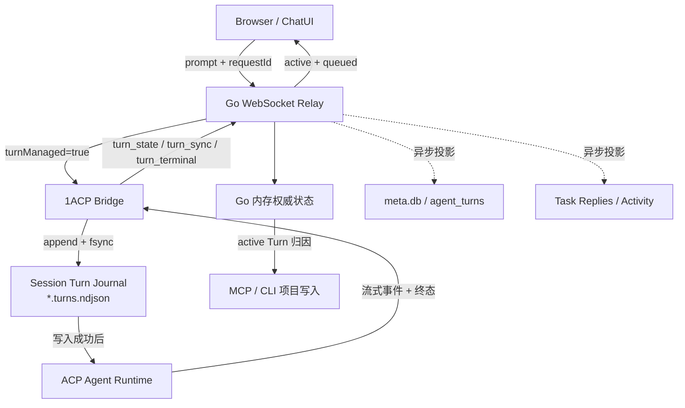

# Turn 权威 Journal 迁移与实现记录（方案 A）

<!-- markdownlint-disable MD013 -->

| 字段     | 内容                                                                                                                 |
| -------- | -------------------------------------------------------------------------------------------------------------------- |
| 状态     | **源代码已实现，待目标环境部署验证**                                                                                 |
| 方案     | **A：1ACP 本地 Journal 是 Turn 权威事实，`agent_turns` 是可重建投影**                                                |
| 日期     | 2026-07-30                                                                                                           |
| 影响范围 | 1ACP Bridge、Go WebSocket Relay、`agent_turns`、MCP 写入归因、Task Reply 时间轴、ChatUI 重连状态                     |
| 关联文档 | [Turn v1 设计](./design.md) · [Turn v1 实现走查](./walkthrough.md) · [旧 v1.1 闭环草案](./lifecycle-closure-v1.1.md) |
| 基准分支 | `main`                                                                                                               |

> 本文记录 2026-07-30 对 Turn 机制的实际修改过程、现行协议、迁移策略、部署顺序和验证结果。
> 它补充 v1 领域模型，并取代旧 v1.1 草案中“Go/SQLite 是 Turn 身份和队列唯一真源”的设计结论。

---

## 0. 文档结论

旧链路把 Turn 执行建立在 `agent_turns` 写入成功之上。一旦 Go Bridge 没有拿到
`turnStore`、Session 没有 `ProjectID`，或者 SQLite 暂时不可用，Prompt 就会绕过结构化
Turn 调度器，形成两套互相矛盾的事实：

```text
Agent Runtime 本地历史：有完整对话和工具过程
1agents meta.db：没有 agent_turns
```

方案 A 将边界改为：

```text
必须成功的硬门禁：
  Prompt → 1ACP 本地 Turn Journal fsync → 才能确认排队或开始执行

不得阻塞执行的派生链路：
  Journal → turn_sync / turn_state / turn_terminal
          → Go 内存权威状态
          → agent_turns / Task Replies / Project Activity 投影
```

因此，系统只有一个 Turn 事实源：

- **1ACP 本地 Journal** 决定 Turn 是否存在、是否运行、排队顺序和终态；
- **Go 内存状态** 保存最近一次 Journal 同步，供 UI 状态和 MCP 实时归因使用；
- **SQLite `agent_turns`** 用于查询、审计和页面投影，可以从 Journal 重建；
- **Agent Runtime SessionRecord** 保存详细对话，并作为旧会话迁移和崩溃对账输入；
- **前端** 不再用本地 `typing` 猜运行态，重连后以 `turn_sync` 为准。

---

## 1. 触发本次修改的故障

### 1.1 受影响会话

故障会话：

```text
a16f17f8d05649a792bd82c05764f0ba
```

只读检查结果：

| 存储层                       | 检查结果                                      |
| ---------------------------- | --------------------------------------------- |
| `sessions`                   | 存在会话主记录                                |
| `agent_turns`                | 0 条                                          |
| 1ACP SessionRecord           | 可解析，包含 2 条 User 消息和 2 条 Agent 消息 |
| SessionRecord `turn_results` | 空                                            |
| Codex 原生 Session JSONL     | 存在完整执行历史                              |

1ACP SessionRecord 中可用于迁移的两个稳定 User message ID：

```text
52bcda7e-d960-484b-9a58-6d836508421b
1501e1a3-6cc6-4834-9d4e-1cab947b13af
```

本次实现没有直接改写用户机器上的 Session 文件或 `meta.db`。部署新版本并重新连接该
Session 后，1ACP 会先读取本地 SessionRecord，将这两轮导入 Journal，再由 Go 异步投影到
`agent_turns`。

### 1.2 旧链路为何会漏记

旧 Go 转发逻辑同时承担三件事：

1. 在 SQLite 创建 `agent_turns`；
2. 在 Go 内存维护 active/pending 队列；
3. 把 Prompt 下发给 1ACP。

当 `turnStore == nil` 或 `ProjectID == ""` 时，`queuePrompt()` 会返回
`handled = false`，随后进入 Legacy 透传分支。Runtime 仍然执行 Prompt，但
`agent_turns` 不会创建记录。

这不是单纯的“少一条审计记录”。系统后续又把 `agent_turns` 当作运行许可和恢复依据，
所以同一个可恢复故障会放大为：

1. MCP 写操作报 `ErrTurnNotRunning`；
2. Task Reply 无法关联 initiating/final Reply；
3. `turn_sync` 缺失，刷新后 UI 停留在错误的 Loading/Typing 状态；
4. 连续 Prompt 的队列出现双写、竞态或乱序；
5. Go 重启恢复无法判断 Runtime 的真实终态。

### 1.3 根因不是“少做一次 DB 重试”

给 `turnStore.Create()` 增加重试只能缩小故障窗口，不能消除架构矛盾：

- Runtime 和 SQLite 仍然可能在两次写入之间崩溃；
- Go 和 1ACP 仍然各自维护一套队列；
- 重连时仍然不知道应该信 Runtime 还是数据库；
- SQLite 锁、磁盘抖动或 migration 问题仍会直接影响聊天可用性；
- Generic `error` 仍可能被误判为 Turn 终态。

本次修改解决的是“事实所有权”，不是增加一层补丁。

---

## 2. 现行架构

### 2.1 事实流



实线表示执行和实时状态链路，虚线表示允许延迟或失败后重建的投影。

### 2.2 四条不可破坏的约束

#### 约束一：Journal 先于执行

1ACP 必须先把 `queued` 或 `running` 事件追加到本地 Journal，并执行 `fsync`，之后才能：

- 向上游发送排队确认；
- 调用 `runtime.startTurn()`；
- 向前端发送 `turn_state`。

Journal 写入失败时必须拒绝启动 Turn。这是本方案唯一的持久化硬门禁。

#### 约束二：SQLite 不决定 Runtime 是否可以继续

`agent_turns`、Reply Linkage 和 Activity 都是投影。它们失败时：

- Go 记录明确日志；
- WebSocket reader 不退出；
- Runtime 继续运行；
- UI 继续接收 Journal 事件；
- 下次 `turn_sync` 再执行幂等修复。

#### 约束三：只有 1ACP 维护 Turn 队列

1ACP 负责：

- 判断立即运行还是进入 FIFO；
- 生成可信 `turnId`；
- 取消 active 或 queued Turn；
- 一个 Turn 终止后调度下一条；
- 进程恢复时清理未完成 Turn。

Go 的 `pendingTurns` 只保存最近同步结果，不再拥有调度权。

#### 约束四：重连先同步 Turn，再声明 Session Ready

`ensure_session` 的返回顺序固定为：

```text
turn_sync
session_ready(turnProtocolVersion = 3)
session_meta
```

前端因此会先恢复 active/queued 状态，再开放输入；不会在“Session 已就绪但 Turn 状态未知”
的窗口里错误显示可发送或持续 Typing。

---

## 3. 身份与数据模型参考

### 3.1 四类 ID

| 字段                            | 生成方                  | 用途                             | 是否可信               |
| ------------------------------- | ----------------------- | -------------------------------- | ---------------------- |
| `clientRequestId` / `requestId` | Browser                 | Prompt 提交幂等键                | 只用于幂等，不用于授权 |
| `turnId`                        | 新链路由 1ACP 生成 UUID | 业务 Turn 的稳定身份             | 是                     |
| `runtimeRequestId`              | 1ACP/Runtime            | 对应一次 `runtime.startTurn()`   | 仅用于 Runtime 对账    |
| `promptMessageId`               | Runtime SessionRecord   | 定位 User message 和该轮消息边界 | 仅用于本地历史恢复     |

新 Go 链路禁止 Browser 直接提供 `turnId`。如果请求包含 `turnId`，Go 返回
`TURN_FORWARD_FAILED` 协议错误。

为兼容旧 Go，1ACP v3 仍能接受宿主提供的 `turnId`。新 Go 不使用这条兼容路径，而是只发送：

```json
{
  "action": "prompt",
  "sessionId": "session-id",
  "requestId": "browser-idempotency-key",
  "turnManaged": true,
  "text": "用户输入"
}
```

若旧 Browser 没有生成 `requestId`，Go 会生成 `legacy-<unix-nanoseconds>`，保证新 1ACP 的
managed Turn 仍满足非空幂等键要求。当前 ChatUI 在发送前使用 `cryptoId()` 生成稳定
`requestId`。

### 3.2 Journal 文件

默认路径：

```text
~/.1agents/acpx-state/sessions/<url-encoded-session-id>.turns.ndjson
```

每一行是一个不可变 JSON 事件。Schema：

```text
acpx.turn.v1
```

核心字段：

| 字段                      | 类型                      | 说明                                        |
| ------------------------- | ------------------------- | ------------------------------------------- |
| `schema`                  | string                    | 固定为 `acpx.turn.v1`                       |
| `sequence`                | positive integer          | Session 内有效 Journal 事件序号             |
| `session_id`              | string                    | 1agents Session ID                          |
| `turn_id`                 | string                    | 1ACP 分配的稳定 Turn ID                     |
| `client_request_id`       | string                    | Browser 提交幂等键                          |
| `status`                  | enum                      | `queued/running/completed/failed/cancelled` |
| `prompt_text`             | string                    | 原始 Prompt 文本                            |
| `request_fingerprint`     | SHA-256 hex               | Prompt 和附件的幂等指纹                     |
| `agent_type`              | string, optional          | codex、claude、grok-build 等                |
| `final_answer`            | string, optional          | Runtime 返回的最终回答                      |
| `error_code/error_text`   | string, optional          | 失败原因                                    |
| `runtime_record_id`       | string, optional          | 1ACP SessionRecord ID                       |
| `runtime_request_id`      | string, optional          | Runtime Turn 请求 ID                        |
| `prompt_message_id`       | string, optional          | SessionRecord 中的 User message ID          |
| `stop_reason`             | string, optional          | `end_turn`、`runtime_error` 等              |
| `terminal_source`         | string, optional          | 终态来源                                    |
| `created_at/occurred_at`  | RFC 3339 string           | 创建和事件发生时间                          |
| `started_at/completed_at` | RFC 3339 string, optional | 生命周期时间                                |

Journal 保存 Prompt 和最终回答，但不保存私有思维链。附件原文不会复制到 Journal；
`request_fingerprint` 的计算会包含附件 `mediaType` 和 base64 数据，以便识别同一个
`requestId` 被复用于不同输入。

### 3.3 状态机

允许的状态迁移：

```text
new ─────────────► running ─────► completed | failed | cancelled
  └──────────────► queued ──────► running
                         └───────► completed | failed | cancelled
```

不允许：

- terminal 回到 running；
- terminal 改写成另一个 terminal；
- 同一个 `requestId` 对应不同输入；
- 同一个 `turnId` 改变请求指纹。

重复提交相同状态和相同字段时不追加事件，返回现有 Turn。

### 3.4 Durability 与并发边界

Journal 当前提供：

- 每 Session 的进程内 Promise 串行锁；
- append-only 写入；
- 每条事件写入后的文件 `fsync`；
- 文件尾没有换行时先补换行；
- 读取时跳过损坏 JSON 行，保留此前和此后的有效事实；
- 通过完整重放生成 `active`、`queued` 和 `turns` 快照。

当前不提供跨进程文件锁。设计前提是同一个 Session Journal 同一时间只由一个 1ACP Bridge
进程写入。如果未来允许多个 1ACP 进程共享相同 `stateDir`，必须先增加 OS 文件锁或单写者
租约。

---

## 4. WebSocket 协议 v3

### 4.1 版本门禁

1ACP 在 `session_ready` 中声明：

```json
{
  "event": "session_ready",
  "sessionId": "session-id",
  "turnProtocolVersion": 3
}
```

新 Go 在发送 Prompt 前要求 `turnProtocolVersion >= 3`。旧 1ACP 或尚未重启的 Bridge 会收到：

```text
1ACP Turn protocol v3 is required; restart the updated 1ACP bridge before sending prompts
```

这个门禁防止新 Go 悄悄回退到没有 Journal 的 Legacy 路径。

### 4.2 `turn_state`

1ACP 在 Turn 被创建、排队、开始或取消时发送：

```json
{
  "event": "turn_state",
  "sessionId": "session-id",
  "turnId": "turn-uuid",
  "requestId": "browser-request-id",
  "status": "queued",
  "queuePosition": 1,
  "acceptedNew": true
}
```

`acceptedNew=true` 只表示这是本次新接受的 Turn。Go 用它确保 Task 的用户 Reply 只写一次。

### 4.3 `turn_sync`

每次 `ensure_session` 或恢复时，1ACP 发送：

```json
{
  "event": "turn_sync",
  "sessionId": "session-id",
  "sequence": 12,
  "active": {},
  "queued": [],
  "turns": []
}
```

字段语义：

- `active`：当前 running Turn，可空；
- `queued`：当前 FIFO 队列；
- `turns`：完整 Journal 投影，供 Go 修复 SQLite；
- `sequence`：Journal 已应用的最后有效事件序号。

Go 收到后立即更新内存 active/queued，然后启动后台 SQLite 投影。转发给 Browser 前会移除
完整 `turns`，避免每次重连都向 UI 复制不断增长的终态历史。Browser 只消费
`active/queued`，详细历史仍通过 `get_history` 获取。

### 4.4 Runtime 事件

Managed Turn 的实时事件都携带：

```json
{
  "sessionId": "session-id",
  "turnId": "turn-uuid",
  "sequence": 5
}
```

`sequence` 是当前 WebSocket Runtime 事件序号，与 Journal 的 `journalSequence` 不同。
前端用它拒绝不属于当前 active Turn 的迟到事件。

普通 Runtime `error` 发送为：

```json
{
  "event": "error",
  "scope": "turn",
  "terminal": false
}
```

它不结束 Turn。只有明确的 `turn_terminal` 才能结束 Managed Turn。

### 4.5 `turn_terminal`

1ACP 先将 terminal 事件写入 Journal，再发送：

```json
{
  "event": "turn_terminal",
  "sessionId": "session-id",
  "turnId": "turn-uuid",
  "status": "completed",
  "journalSequence": 9,
  "finalAnswer": "最终回答",
  "terminalSource": "live_runtime"
}
```

Go 收到后先清理内存 active Turn，再异步完成：

1. `agent_turns` 终态投影；
2. initiating/final Reply 链接；
3. Task timeline 最终回答；
4. 相关 TaskRun/Activity 后续处理。

即使 SQLite 投影失败，内存和 Browser 也会立即离开 Typing 状态。

---

## 5. 代码修改过程

### 5.1 第一阶段：增加 1ACP Turn Journal

新增：

- [`turn-journal.ts`](../../../modules/1acp/src/runtime/public/turn-journal.ts)
- [`turn-journal.test.ts`](../../../modules/1acp/test/turn-journal.test.ts)

修改：

- [`runtime.ts`](../../../modules/1acp/src/runtime.ts)

实现内容：

1. 定义 `AcpTurnJournalTurn`、Mutation、Snapshot 和状态类型；
2. 使用 NDJSON append-only 事件格式；
3. 增加 Session 内串行写锁；
4. 增加 Prompt 指纹和 requestId 幂等冲突检查；
5. 每条写入调用文件 `sync()`；
6. 支持损坏尾行后的有效事件重放；
7. 从 Runtime 公共入口导出 `createTurnJournal()` 和相关类型。

### 5.2 第二阶段：把队列和终态移入 1ACP Bridge

修改：

- [`modules/1acp/bridge-server.js`](../../../modules/1acp/bridge-server.js)
- [`npm/packages/acp-bridge/bridge-server.mjs`](../../../npm/packages/acp-bridge/bridge-server.mjs)

实现内容：

1. 创建单例 `turnJournal`，复用 1ACP 的默认 `stateDir`；
2. managed Prompt 必须带 `requestId`；
3. 新 Turn 由 1ACP `randomUUID()` 生成可信 `turnId`；
4. 根据 `activeTurn/promptQueue` 记录 `running` 或 `queued`；
5. Journal 写入成功后才发送 `turn_state`；
6. Turn 结束后先写 terminal，再发送 `turn_terminal`；
7. active 结束后在同一个 Session dispatch lock 中启动下一条；
8. queued cancel 先写 `cancelled`，再通知客户端；
9. 所有 managed Runtime 事件附加 `turnId` 和事件序号；
10. `ensure_session` 先执行 Journal/Runtime 对账和 `turn_sync`；
11. 两份 Bridge 源文件保持协议同步。

### 5.3 第三阶段：把 Go 改为 Relay 和投影器

修改：

- [`acpx_client.go`](../../../backend/internal/agent/acpx_client.go)
- [`turn_bridge.go`](../../../backend/internal/agent/turn_bridge.go)
- [`turn_types.go`](../../../backend/internal/meta/turn_types.go)
- [`turns.go`](../../../backend/internal/meta/turns.go)

删除：

- `backend/internal/agent/turn_recovery.go`
- `backend/internal/agent/turn_recovery_test.go`

实现内容：

1. Go 不再在 Prompt 入口创建 `agent_turns`；
2. Go 不再调用 `NextQueued()` 调度下一轮；
3. Go 拒绝 Browser 提供的 `turnId`；
4. Go 向 1ACP 发送 `turnManaged=true` 和 Browser `requestId`；
5. 新 Go 要求 1ACP 协议 v3；
6. 收到 `turn_sync` 时先更新内存，再异步投影完整 Journal；
7. 收到 `turn_state` 时更新 active/pending 和新 Turn Reply；
8. 收到 `turn_terminal` 时立即清理 active，再后台落 SQLite/Reply；
9. DB 中存在、但 Journal 快照中不存在的 stale running/queued 投影分别标记为
   `failed/cancelled`；
10. Go 连接断开不再自行伪造 `runtime_lost` 终态；
11. 删除旧 Go `RecoverInterrupted()`，恢复事实统一由 1ACP 生成。

### 5.4 第四阶段：解除 MCP 对 SQLite 投影时序的依赖

修改：

- [`mutation_attribution.go`](../../../backend/internal/agent/mutation_attribution.go)
- [`project_events.go`](../../../backend/internal/meta/project_events.go)

现行归因顺序：

```text
有 live Bridge 且已收到 turn_sync
  ├─ active running 存在 → 使用 1ACP 内存权威 Turn
  └─ active 不存在      → 返回 ErrTurnNotRunning，不信 stale DB

没有 live Bridge / headless 路径
  └─ 回退查询 agent_turns.RunningBySession()
```

当 live Journal 已确认 running、但 SQLite 投影尚未创建时：

- `MutationContext.AuthoritativeTurn=true`；
- 内部生成的 `ProjectEvent.AllowUnprojectedTurn=true`；
- ProjectEvent 可以在同一事务中提交；
- 该字段使用 `json:"-"`，外部 HTTP/MCP 不能自行声明；
- Project、Session、Session token 和 Turn 的归属检查仍然保留。

因此，放宽的是“Turn 必须已经出现在投影表”的时序要求，不是项目权限边界。

### 5.5 第五阶段：前端消费权威同步

修改：

- [`wireProtocol.ts`](../../../frontend/packages/core/protocol/wireProtocol.ts)

现有 Chat Bridge 消费：

- `turn_state`：绑定 optimistic user bubble 与 1ACP `turnId`；
- `turn_sync`：覆盖 active/queued、`typing` 和 `turnStarted`；
- `turn_terminal`：结束当前 Turn 并刷新历史；
- Runtime event `turnId/sequence`：过滤迟到或跨轮事件。

Wire 类型增加：

- `journalSequence`；
- `acceptedNew`；
- `turnProtocolVersion`；
- `turns` 完整投影；
- `agentSessionId/acpSessionId`。

### 5.6 第六阶段：让 Timeline 投影可重复执行

Task timeline 的用户和 Agent Reply 都以：

```text
taskId + turnId + author.kind
```

做幂等检查。重连、terminal 重发或全量 `turn_sync` 不会重复插入同一 Turn 的 Reply。

---

## 6. 本地历史迁移和崩溃恢复

### 6.1 对账顺序

`reconcileTurnJournal()` 使用以下优先级：

1. **已有 Journal**：保留所有已持久化 Turn 事实；
2. **SessionRecord `acpx.turn_results`**：补齐 Runtime 已记录的 running/terminal；
3. **Legacy SessionRecord messages**：当 `turn_results` 缺失时，用稳定 User message ID 和其后
   最后一条 Agent 文本导入 completed Turn；
4. **恢复策略**：Runtime 无 active Turn 时，将 Journal 中遗留 running 标为 failed，
   queued 标为 cancelled。

当前版本不会直接扫描每一种 Agent 的原生历史文件来创建 Journal。Codex 原生 JSONL 仍是
底层详细历史来源，但自动 Turn 迁移要求对应的 1ACP SessionRecord 可读。受影响会话满足
这个条件。

### 6.2 Legacy completed Turn 导入条件

只有同时满足以下条件才会导入：

- message 是 User message；
- `User.id` 是非空稳定字符串；
- Journal 尚未包含该 `turnId/clientRequestId/promptMessageId`；
- 下一个 User message 之前至少有一条非空 Agent 文本。

导入结果：

```text
status          = completed
stopReason      = legacy_history
terminalSource  = legacy_runtime_history
turnId          = User.id
```

这条规则不会为缺少最终回答、缺少稳定 ID 或消息边界不清晰的历史伪造“成功”。

### 6.3 1ACP 重启策略

当新 1ACP 进程恢复一个 Session，且 Runtime 当前没有 active Turn：

| Journal 状态 | 恢复终态    | 错误码              | 原因                       |
| ------------ | ----------- | ------------------- | -------------------------- |
| `running`    | `failed`    | `runtime_restarted` | 无法证明工具调用能安全重放 |
| `queued`     | `cancelled` | `runtime_restarted` | 尚未执行，不自动重新下发   |

系统明确选择“可解释地中止”，不选择自动重放。原因是 MCP/CLI 工具可能不是幂等操作。

### 6.4 SQLite stale 投影修复

全量 `turn_sync` 到达 Go 后：

- DB running Turn 不在 Journal 中：标记 `failed`；
- DB queued Turn 不在 Journal 中：标记 `cancelled`；
- Journal 中存在但 DB 缺失：按 `queued → running → terminal` 合法状态路径重建；
- 已经 terminal 的 DB 记录不被旧事件回退；
- 重复同步保持幂等。

---

## 7. 关键故障下的系统行为

| 故障                            | Runtime/用户体验                       | Journal         | SQLite 投影              |
| ------------------------------- | -------------------------------------- | --------------- | ------------------------ |
| `agent_turns` 表暂时锁定        | 继续执行和流式输出                     | 正常            | 后台失败，后续 sync 修复 |
| Task Reply 写入失败             | 对话继续                               | 正常            | Reply linkage 延迟       |
| Journal 写入失败                | Prompt 不启动                          | 无不完整确认    | 不创建                   |
| Browser 刷新                    | 重连后由 `turn_sync` 恢复 Typing/Queue | 读取            | 异步对账                 |
| Go 重启                         | 重新连接 1ACP 后同步                   | 权威事实保留    | 重建                     |
| 1ACP 重启                       | 未完成 Turn 明确 failed/cancelled      | 写恢复终态      | Go 收到后投影            |
| WebSocket 丢失                  | Runtime 可以继续，事件暂不推送         | terminal 仍落盘 | 重连后补齐               |
| Journal 尾行损坏                | 读取此前有效事实，新写入前补换行       | 跳过坏行        | 根据有效快照修复         |
| 重复 requestId + 相同输入       | 返回原 Turn                            | 不重复追加      | 幂等                     |
| 重复 requestId + 不同输入       | 返回 `IDEMPOTENCY_CONFLICT`            | 不改写          | 不改写                   |
| stale DB running + Journal idle | MCP 返回 `ErrTurnNotRunning`           | idle 为准       | 后台清理 stale row       |

---

## 8. 部署与验证 How-to

### 8.1 部署前提

- 1ACP Bridge 和 Go Backend 必须来自同一批协议 v3 源代码；
- `modules/1acp/bridge-server.js` 与
  `npm/packages/acp-bridge/bridge-server.mjs` 必须同步；
- 不要先部署新 Go、继续运行旧 1ACP；
- 不要在首次部署前删除 `~/.1agents/acpx-state/sessions/*.json`，这些文件是旧会话迁移输入。

### 8.2 部署顺序

1. 构建并替换 1ACP Runtime/Bridge。
2. 重启 1ACP Bridge，确认 `session_ready.turnProtocolVersion == 3`。
3. 构建并替换 Go Backend。
4. 重启 Backend。
5. 打开或重连一个 Session，确认先收到 `turn_sync`，再收到 `session_ready`。
6. 发送一条新 Prompt，确认 Journal 在开始执行前已出现 `running` 事件。
7. 刷新页面，确认 active/queued 状态能够恢复。
8. 对受影响会话执行一次重连，确认 completed 历史被投影到 `agent_turns`。

新 1ACP 兼容旧 Go，因此这个顺序可以滚动发布。新 Go 不兼容旧 1ACP，这是有意的安全门禁。

### 8.3 回滚顺序

如果需要回滚：

1. 先回滚 Go Backend；
2. 确认旧 Go 能连接仍在运行的新 1ACP；
3. 再回滚 1ACP Bridge。

不要只回滚 1ACP 而保留新 Go。新 Go 会拒绝协议版本低于 3 的 Prompt。

已生成的 `*.turns.ndjson` 是追加式本地事实。回滚不需要删除它们；旧版本会忽略这些文件。

### 8.4 构建和专项测试

1ACP Journal：

```bash
cd modules/1acp
pnpm run typecheck
pnpm run build
pnpm run build:test
node --test dist-test/test/turn-journal.test.js
```

Go 投影、协议和归因：

```bash
cd backend
go test ./internal/agent ./internal/meta
go test -race ./internal/agent
```

Bridge 语法和同步：

```bash
node --check modules/1acp/bridge-server.js
node --check npm/packages/acp-bridge/bridge-server.mjs
diff -u \
  <(sed 's#\"./src/runtime.js\"#\"@1agents/acpx/runtime\"#' modules/1acp/bridge-server.js) \
  npm/packages/acp-bridge/bridge-server.mjs
```

前端 Wire 类型：

```bash
cd frontend
yarn eslint packages/core/protocol/wireProtocol.ts
```

### 8.5 运行态检查

检查 Journal：

```bash
SESSION_ID="<session-id>"
JOURNAL="$HOME/.1agents/acpx-state/sessions/${SESSION_ID}.turns.ndjson"
jq -c . "$JOURNAL"
```

检查当前状态：

```bash
jq -s '
  group_by(.turn_id)
  | map(last)
  | map({turn_id, client_request_id, status, sequence, terminal_source})
' "$JOURNAL"
```

检查 SQLite 投影：

```bash
sqlite3 "$HOME/.1agents/meta.db" "
SELECT id, client_request_id, status, terminal_source, last_event_seq
FROM agent_turns
WHERE session_id = '<session-id>'
ORDER BY created_at, id;
"
```

比较 Journal 和 DB 时，以 Journal 最后一条有效事件为准。DB 短暂落后允许存在；持续落后需要
检查 Backend 日志中的：

```text
Non-blocking Turn projection failed
Non-blocking Turn sync projection failed
Non-blocking terminal projection failed
```

### 8.6 受影响会话验收

重连：

```text
a16f17f8d05649a792bd82c05764f0ba
```

预期：

1. 创建
   `~/.1agents/acpx-state/sessions/a16f17f8d05649a792bd82c05764f0ba.turns.ndjson`；
2. Journal 至少出现两个 `completed` Turn；
3. `terminal_source` 为 `legacy_runtime_history`；
4. `turn_id` 分别对应两个稳定 User message ID；
5. `agent_turns` 至少出现对应的两个 completed 投影；
6. 前端重连后 `turn_sync.active` 为空，`typing=false`；
7. 再发送一条新 Prompt 时，新 Turn 使用 1ACP 生成的 UUID，不复用 Browser `requestId`。

---

## 9. 2026-07-30 验证记录

专项验证结果：

| 检查                                       | 结果 |
| ------------------------------------------ | ---- |
| `go test ./internal/agent ./internal/meta` | 通过 |
| `go test -race ./internal/agent`           | 通过 |
| 1ACP typecheck/build                       | 通过 |
| Journal replay 测试                        | 通过 |
| Journal requestId 幂等测试                 | 通过 |
| terminal-only 恢复测试                     | 通过 |
| 损坏尾行恢复测试                           | 通过 |
| 两份 Bridge `node --check`                 | 通过 |
| Root/Submodule `git diff --check`          | 通过 |
| `wireProtocol.ts` ESLint                   | 通过 |

全仓检查中的非本次阻塞项：

| 检查                    | 现象                                                       | 与本次修改关系         |
| ----------------------- | ---------------------------------------------------------- | ---------------------- |
| Backend `go test ./...` | `internal/harnesskit/proxy_test.go` 的凭据暴露断言失败     | 不在 Turn 修改文件中   |
| Frontend `yarn check`   | `ContentViewHost.tsx` 有 3 个 unused 和 2 个 prettier 问题 | 不在 Turn 修改文件中   |
| 1ACP 全量 `pnpm test`   | 执行到 Codex executable 用例后长时间无新输出，人工终止     | Journal 专项测试已通过 |

这些结果只记录本次实现时的基线。发布门仍应在合并前重新运行全仓测试，并单独处理现存失败。

---

## 10. 取舍与后续观测

### 10.1 方案 A 的代价

1. **本地文件成为运行级基础设施。** `stateDir` 的磁盘空间、权限和备份需要纳入运维。
2. **出现最终一致窗口。** Journal 已成功、SQLite 尚未投影时，查询页面可能短暂落后。
3. **Journal 含 Prompt 和最终回答。** 文件依赖本机用户权限和 umask；部署环境需要限制目录访问。
4. **单写者假设。** 当前锁只在单个 Node 进程内有效。
5. **Legacy 回填是保守推断。** 只能恢复本地记录中可以证明边界和最终回答的 Turn。

### 10.2 为什么仍选择方案 A

这些代价是可观测、可修复的。相比之下，让聊天执行、UI 状态、MCP 鉴权和 SQLite 写入绑定在
同一个同步事务里，会让任何投影故障直接变成用户不可用。

方案 A 把系统分成两个清晰层级：

- Journal 负责“这轮真实发生了什么”；
- Database 负责“产品如何查询和展示这些事实”。

前者失败就不执行，后者失败就重建。这是本次稳定性改造的核心。

### 10.3 建议增加的运行指标

以下指标尚未在本次代码中实现，建议作为后续运维任务：

- `turn_journal_append_latency_ms`；
- `turn_journal_append_failures_total`；
- `turn_projection_lag_seconds`；
- `turn_projection_failures_total`；
- `turn_sync_reconciled_total`；
- `turn_runtime_restarted_total`；
- Journal 文件大小和单 Session 事件数；
- Journal terminal 数量与 `agent_turns` terminal 数量差异。

告警应优先关注：

1. Journal 写入失败；
2. 同一 Session 长时间存在 projection lag；
3. `runtime_restarted` 短时间异常增长；
4. `IDEMPOTENCY_CONFLICT` 增长；
5. stale DB Turn 被 `projection_reconciled` 批量清理。

---

## 11. 文件变更索引

| 文件                                              | 作用                                       |
| ------------------------------------------------- | ------------------------------------------ |
| `modules/1acp/src/runtime/public/turn-journal.ts` | Journal 数据模型、落盘、重放、幂等和状态机 |
| `modules/1acp/src/runtime.ts`                     | 导出 Journal 公共 API                      |
| `modules/1acp/bridge-server.js`                   | 1ACP 队列、执行、终态、同步和恢复          |
| `modules/1acp/test/turn-journal.test.ts`          | Journal 专项测试                           |
| `npm/packages/acp-bridge/bridge-server.mjs`       | npm Bridge 同步源                          |
| `backend/internal/agent/acpx_client.go`           | WS raw relay、协议 v3 接入、Reply 投影     |
| `backend/internal/agent/turn_bridge.go`           | Journal 事件转内存状态和 SQLite 投影       |
| `backend/internal/agent/mutation_attribution.go`  | MCP 使用 live Journal Turn 归因            |
| `backend/internal/meta/project_events.go`         | 可信 live Turn 允许先于投影提交 Event      |
| `backend/internal/meta/turn_types.go`             | 增加内部权威归因标记                       |
| `backend/internal/meta/turns.go`                  | 明确队列查询只是投影视图                   |
| `frontend/packages/core/protocol/wireProtocol.ts` | 协议 v3 类型                               |
| `backend/internal/agent/turn_recovery.go`         | 已删除，恢复权迁移到 1ACP                  |
| `backend/internal/agent/*turn*test.go`            | 投影、协议、归因和幂等回归测试             |
