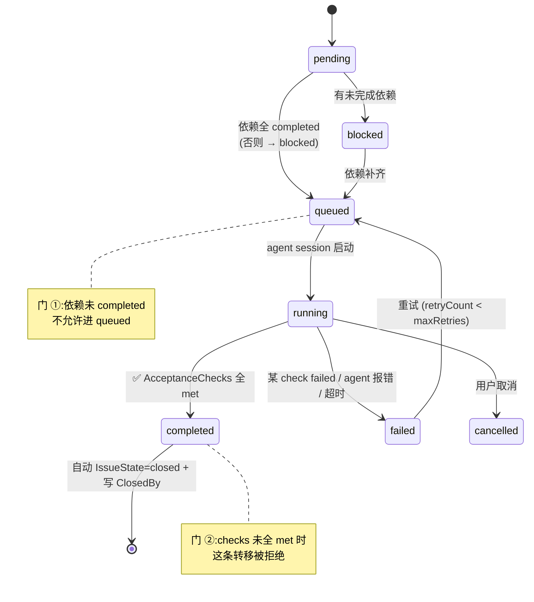

# Verifiable Completion: CI-gate + Audit Trail for the Issue Model

**Status:** Proposed — Draft v1（待评审，未落地）
**Author:** scottzx + Claude
**Date:** 2026-06-13
**Scope:** `backend/internal/meta/`, `backend/internal/agent/`, `html/src/components/drawer/TaskList/`
**Builds on:** [issue-model/design.md](../issue-model/design.md)（"Task as Issue"）、[project-model/design.md](../project-model/design.md)（SQLite 存储层）

---

## 1. Motivation

[issue-model](../issue-model/design.md) 把 Task 升级成了 GitHub Issue：双状态（`issueState` open/closed × `status` 工作流）、回复时间线、agent 回写、上下文注入。**它落地的是 GitHub 的"Issue 那一半"——意图与讨论。**

缺的是另一半 —— **PR / CI 那一半：让"完成"被可验证的事实证明。** 现状有两个缺口：

1. **完成 = agent 自我声明。** `status` 从 `running` 翻到 `completed` 没有任何事实门槛。`AcceptanceCriteria` 是一段注入给 agent 让它"自检"的纯文本（见 [types.go](../../../backend/internal/meta/types.go) 注释 `// injected; agent self-checks before completing`）——但 agent 说"我自检过了"和它真的跑过 `yarn build` 是两回事。这正是 LLM 最典型的失败模式：**听起来做完了，其实没有。**

2. **状态转移没有因果。** `status` 字段被调度器/runner 直接覆盖，谁改的、为什么改、凭什么改，全丢了。任务跑完一看是 `completed`，但"它怎么走到这一步的"无法回溯 —— 而 agent 是无状态的，下一轮接手时这段因果就是它唯一能依赖的记忆。

**设计目标:把"完成"从声明变成证明。** 一个 Task 只有在它的验收项被**真实跑过的命令**或**显式人工确认**满足时，才允许进 `completed` 并自动关闭 issue；每一次状态转移都在时间线上留下带证据的审计条目。

### 1.1 为什么 AI 驱动开发**更**需要这个，而不是更不需要

GitHub 的 CI/review 纪律是为人类异步协作设计的，对人是"协作税"。但在 agent 写代码的场景下，这套纪律的成本/收益是**反转**的：

| | 人类协作 | Agent 协作 |
|---|---|---|
| 验证门 | 防队友粗心 | agent 会自信地报告"已完成"——验证门是唯一能拦住"假完成"的东西 |
| 审计线 | 方便 review | agent 无状态，审计线是它跨会话的**记忆外置** |
| 事实驱动关闭 | 少点手工 | agent 本来就能产出事实（exitCode、diff），自动化成本极低、收益极高 |

**一句话:GitHub 要人肉补的 CI 环节，恰好是 agent 能自动产出的。这是 1agents 能比 GitHub 做得更自动的地方。**

---

## 2. Design Principles

1. **不信 agent 的话，只信退出码。** `kind:command` 的验收项由**后端独立执行**并记录退出码，而非采信 agent 自报。agent 可以在会话里跑命令，但翻转 task 状态的那次执行由后端发起。
2. **复用现有时间线,不新建并行结构。** 审计事件作为 `Author.Kind="system"` 的特殊 Reply 进入既有 `Replies[]`，与 GitHub「X closed this as completed via abc123」混排同一条时间线一致 —— 不引入独立的 `transitions[]` 数组。
3. **分层落地,可只取第一层。** 整套分三层（§7 Roadmap）：Tier 1 验证门是承重墙，Tier 2 审计事件便宜且高价值，Tier 3 验证 agent 是可选未来。三层解耦，可以只做 Tier 1 就上线。
4. **向后兼容。** 没有 `AcceptanceChecks` 的老 task 行为完全不变（空验收项 = 沿用今天的手动/agent 自报完成）。

---

## 3. Concept Mapping (GitHub → 1agents)

| GitHub | 1agents 对应物 | 现状 |
|---|---|---|
| Issue | `Task` + `IssueState` | ✅ issue-model 已落地 |
| Issue 正文 / DoD | `AcceptanceCriteria`（裸文本） | ⚠️ 不可校验 → 本设计升级为 `AcceptanceChecks[]` |
| PR（一次具体变更） | 一个 `session`（由 reply `mode=new` 派生） | ✅ 已落地 |
| PR 的 commits | 该 session 里 agent 的实际编辑 | ✅ 已落地 |
| **CI checks** | `AcceptanceCheck{kind:command}` + 后端执行 | ❌ **本设计新增** |
| **`fixes #N`** | `Task.ClosedBy`（哪次 session/reply 闭环的） | ❌ **本设计新增** |
| **merge → 自动关 issue** | checks 全 met → `completed` → `IssueState=closed` 自动 | ❌ **本设计新增** |
| **审计日志** | `Author.Kind="system"` 的时间线事件 | ❌ **本设计新增** |
| 评论时间线 | `Replies[]` | ✅ 已落地 |
| PR review | 验证 agent 二次走查（Tier 3，可选） | ❌ 本设计可选项 |

---

## 4. Data Model

存储层在 [`backend/internal/meta/types.go`](../../../backend/internal/meta/types.go)（SQLite，project-model）。前端 `html/src/components/drawer/TaskList/types.ts` 镜像同一 JSON 形状。

### 4.1 新增类型

```go
// backend/internal/meta/types.go

// CheckKind 区分验收项如何被满足。
type CheckKind string

const (
    // CheckCommand: 由后端在工作区内执行 Command，exit 0 即 met（CI gate）。
    CheckCommand CheckKind = "command"
    // CheckManual: 由用户或 agent 显式勾选，证据为一句话/一个 session 引用。
    CheckManual CheckKind = "manual"
)

type CheckState string

const (
    CheckUnmet   CheckState = "unmet"
    CheckMet     CheckState = "met"
    CheckFailed  CheckState = "failed"
)

// AcceptanceCheck 是 AcceptanceCriteria 的结构化、可校验版本。
// 一个 task 的所有 check 都 met 是 running→completed 的硬前置（§5）。
type AcceptanceCheck struct {
    ID       string     `json:"id"`
    Text     string     `json:"text"`              // "tsc 通过" / "tasks 页冒烟无空白"
    Kind     CheckKind  `json:"kind"`              // command | manual
    Command  string     `json:"command,omitempty"` // kind=command 时的 shell 命令，如 "yarn check"
    State    CheckState `json:"state"`             // unmet（初始）| met | failed
    Evidence *Evidence  `json:"evidence,omitempty"`// 最近一次判定的证据
}

// Evidence 是一次验收判定的事实记录。command 类必须有 ExitCode。
type Evidence struct {
    Kind       string    `json:"kind"`                 // command | diff | session | manual
    Command    string    `json:"command,omitempty"`
    ExitCode   *int      `json:"exitCode,omitempty"`   // command 类：0=met，非0=failed
    OutputTail string    `json:"outputTail,omitempty"` // 截断的尾部输出（≤8KB）
    SessionRef string    `json:"sessionRef,omitempty"` // 由哪次 session 触发/产生
    Actor      Author    `json:"actor"`                // system（后端跑的）| user | agent
    At         time.Time `json:"at"`
}

// ClosedBy 是 `fixes #N` 的落地记录:哪次执行让这个 task 闭环。
type ClosedBy struct {
    SessionRef string    `json:"sessionRef,omitempty"`
    ReplyID    string    `json:"replyId,omitempty"`
    At         time.Time `json:"at"`
}
```

### 4.2 Task 上的新字段

```go
type Task struct {
    // ... 现有字段不变 ...
    AcceptanceCriteria string `json:"acceptanceCriteria,omitempty"` // 保留:仍注入给 agent 自检

    // ── verification-gate（本设计新增）──
    AcceptanceChecks []AcceptanceCheck `json:"acceptanceChecks,omitempty"` // 可校验验收项;空=沿用旧行为
    ClosedBy         *ClosedBy         `json:"closedBy,omitempty"`         // 闭环来源
}
```

> 取舍:为什么保留 `AcceptanceCriteria` 而不是直接替换。它有独立用途——注入给 agent 当工作目标（"你要做到 X/Y/Z"）。`AcceptanceChecks` 是机器校验的门。二者互补:criteria 告诉 agent 往哪做，checks 验证它真做到了。落地时 criteria 可作为生成 checks 的草稿来源（§7 P4 的"从 criteria 一键拆 checks"）。

### 4.3 时间线审计事件（复用 Reply,不新建数组）

扩展现有 `Reply` 与 `Author`，让状态转移以 `system` 身份进入同一条时间线（设计原则 2）。

```go
// Author.Kind 现在允许第三种:"system"
type Author struct {
    Kind string `json:"kind"` // "user" | "agent" | "system"  ← 新增 system
    Name string `json:"name"` // "scott" | "claude-opus-4-8" | "1agents"
}

// Reply 新增可选的结构化事件载荷。普通对话 reply 该字段为空;
// system 事件 reply 的 Text 是人读摘要，Event 是机读结构。
type Reply struct {
    // ... 现有字段不变 ...
    Event *TimelineEvent `json:"event,omitempty"` // 🆕 非空 = 这是一条系统审计事件
}

type TimelineEvent struct {
    Type    string `json:"type"`              // status_change | check_passed | check_failed | closed | reopened
    From    string `json:"from,omitempty"`    // status_change 的来源状态
    To      string `json:"to,omitempty"`      // status_change 的目标状态
    CheckID string `json:"checkId,omitempty"` // check_passed/failed 指向的验收项
    Reason  string `json:"reason,omitempty"`  // "yarn build exit 1" / "依赖 task_4 已完成"
}
```

时间线上的呈现（GitHub 风格混排）：

```
💬 scott            先把背景层删掉
🤖 claude (sess #A) 已删除 background 层，body 渲染门改 isShell
⚙️ 1agents          ✓ check「tsc 通过」— yarn check exit 0
⚙️ 1agents          ✗ check「build 成功」— yarn build exit 1
🤖 claude (sess #A) 修了 webpack 端口冲突
⚙️ 1agents          ✓ check「build 成功」— yarn build exit 0
⚙️ 1agents          🔒 closed as completed · via session #A
```

---

## 5. State Machine

把今天"可任意覆盖"的 `status` 收口成合法转移图，并在两个关口加事实门。



### 5.1 门 ①:依赖闸（已有 `DependsOn` 字段，今天没当门用）

`pending → queued` 要求 `DependsOn` 全部 `completed`，否则只能进 `blocked`。某依赖被 reopen 时，依赖它的 task 从 `queued`/`running` 退回 `blocked` 并在时间线记 `status_change`。

### 5.2 门 ②:验收闸（本设计核心）

`running → completed` 要求 `len(AcceptanceChecks)==0 || 所有 check.State==met`：

- **空 checks** → 沿用今天的行为（agent 自报完成），向后兼容。
- **有 checks 但未全 met** → 转移被**拒绝**，task 停在 `running`（或视失败原因进 `failed`）。后端不会因为 agent 发了 `done` 就翻状态。
- **全 met** → 翻 `completed`，自动 `IssueState=closed`，写 `ClosedBy`，时间线追加 `closed` 事件。

### 5.3 谁执行 command check（关键决策）

**后端执行，不是 agent 自报。** 复用 issue-model §8 已有的挂载点:`acpx_client.go` 在收到 `done` 事件时已经会回写 agent reply。在同一处，对该 task 的每个 `kind:command` check：

1. 后端在 `Task.WorkspacePath` 下 spawn 命令（同 agent 的工作目录与权限）；
2. 捕获 exit code + 尾部输出（≤8KB）→ 写 `Evidence{Actor: system}`；
3. `exit 0 → State=met`，否则 `failed`；时间线追加 `check_passed`/`check_failed` 事件；
4. 全部 met → 执行 §5.2 的自动完成。

`kind:manual` 的 check 由用户在详情卡勾选，或由 agent 在会话里通过一个轻量信号标记（证据为该 session 引用 + agent 一句话）。manual check 的"信任级别"显式低于 command —— UI 上区分图标。

> **决策记录（待评审确认）:** command check 由后端跑，是整套设计的灵魂。备选方案"采信 agent 自报的 exitCode"被否——那等于没有门，agent 完全可能 hallucate 一个 exit 0。代价是后端要有在工作区执行 shell 的能力（见 §8 安全）。

---

## 6. API Surface

在 issue-model §7 基础上增量：

```
PATCH  /api/agent/tasks/{id}                     扩展:接受 acceptanceChecks 的增删改
POST   /api/agent/tasks/{id}/checks/{cid}/verify 🆕 手动触发一次 command check 执行(也用于重跑)
POST   /api/agent/tasks/{id}/checks/{cid}/mark   🆕 manual check 勾选/取消(body: {state, note})
```

- `running → completed` 不暴露为可直接 PATCH 的转移——它只能由 §5 的门内部触发（防止前端绕过验证门手动标完成）。
- `IssueState` 的手动 `open↔closed` 切换保留（issue-model 决策），但"因完成而关闭"由后端自动写并标记 `ClosedBy`，二者在时间线上可区分（手动关 = user 事件，自动关 = system 事件）。

---

## 7. Implementation Roadmap（分三层,可只做 Tier 1）

### Tier 1 — 验证门（承重墙,建议先单独上线）

| Phase | Scope | Touches | Verification |
|---|---|---|---|
| **P0 数据层** | `AcceptanceCheck` / `Evidence` / `ClosedBy` 类型;`Task.AcceptanceChecks` / `ClosedBy` 字段;store 的 `SetCheckState` / `SetClosedBy` | `meta/types.go`, `meta/tasks.go` | `go build ./...`、`go test ./internal/meta/...` |
| **P1 后端执行器** | `done` 事件处对每个 command check 在 `WorkspacePath` 下执行、写 Evidence;exit 0→met | `agent/acpx_client.go`, `agent/runner.go` | 单测:mock 一个 `exit 0` 和 `exit 1` 命令，断言 check 状态 |
| **P2 完成闸** | `running→completed` 加"checks 全 met"硬校验;全 met 时自动 `IssueState=closed` + 写 `ClosedBy` | `agent/scheduler.go` / runner 完成路径 | 单测:未全 met 时拒绝转移;全 met 时自动关 |
| **P3 前端验收 UI** | 详情卡把 `AcceptanceCriteria` 文本框升级为 check 清单:每项显示 kind 图标、state、Evidence 的 exitCode;手动重跑按钮 | `drawer/TaskList/`（`types.ts` + 详情组件）、`index.scss`、`i18n` | `make frontend`;手动勾选/重跑交互 |

**Tier 1 success:** 建一个带 `yarn check` / `yarn build` 两个 command check 的 task → 让 agent 跑 → 后端独立执行命令 → 一个故意失败 → task 停在 running 不自动完成 → 修好重跑 → 两个都 met → task 自动 completed + closed + 写 ClosedBy。

### Tier 2 — 审计时间线（便宜,高价值）

| Phase | Scope | Touches | Verification |
|---|---|---|---|
| **P4 系统事件** | `Author.Kind="system"`;`Reply.Event` / `TimelineEvent`;每次状态转移 / check 判定 append 一条 system reply | `meta/types.go`, 状态转移各处 | 单测:转移后时间线含对应 event |
| **P5 时间线混排 UI** | 详情卡时间线把 system 事件与对话 reply 按时间混排(⚙️ 图标、from→to、exitCode 悬浮看 OutputTail) | `drawer/TaskList/`、`index.scss` | 视觉 + 手动 |

### Tier 3 — AI 原生 review（可选,未来）

| Phase | Scope | Touches | Verification |
|---|---|---|---|
| **P6 验证 agent** | `running→completed` 前可选派第二个 agent 拿 checks + diff 做对抗式走查,结果作为一个 `kind:manual` 的特殊 check(agent 签字);未过则回 `running` 并在时间线留意见 | scheduler、复用 `/code-review` 思路 | 手动:跑一个有明显遗漏的 task，验证 review agent 拦下 |

> Tier 3 是 GitHub PR review 的 AI 原生版——把"human reviewer 队列"换成"验证 agent 二次走查"。**不做** human approval 队列 / reviewers 名单 / changes-requested 多轮往返（solo+AI 下是纯负担）。

---

## 8. 安全与边界

- **command check = 后端在工作区执行任意 shell。** 威胁模型:能创建/编辑 task 的人 = 能让后端在工作区跑命令。但这与现状对等——能建 task 的人本就能让 agent 在同一工作区跑任意命令。**前提:task 创建已是受信操作。** 若未来开放多用户/外部建 task，command check 需要白名单或沙箱（标记为 Open Question）。
- **输出截断:** Evidence 只存尾部 ≤8KB，避免 SQLite 行膨胀;完整输出留在 session transcript。
- **执行超时:** command check 复用 `Task.TimeoutMinutes`(已有字段),超时即 `failed`。
- **不阻塞 turn:** check 执行在 `done` 之后异步进行;执行期间 task 显示一个过渡态（沿用 `running`，UI 标"验证中"），不新增状态枚举。

---

## 9. Open Questions（实现期决定,不阻塞评审）

1. **manual check 的 agent 自勾信号:** agent 如何在会话里标记一个 manual check 完成?选项:① 约定一段输出标记被后端解析;② 一个轻量工具调用。倾向 ② 但需对照 bridge 事件流。
2. **多 command check 的执行顺序/并行:** 串行简单、可预测;并行快但输出交错。倾向串行(验收命令通常很快)。
3. **check 失败后的自动重试:** 是否复用 `MaxRetries`?倾向:command check 失败**不**自动重试整个 task(那是 agent 错误的语义),只把 task 留在 running 等下一轮 agent 修。
4. **从 `AcceptanceCriteria` 自动拆 checks:** P3 是否提供"把验收文本一键拆成 check 清单"(agent 辅助)?可选增强,不阻塞。
5. **外部多用户场景的 command 沙箱**（见 §8）。

---

## 10. Out of Scope（明确不做）

- human approval 队列 / reviewers 名单 / 多轮 changes-requested（§7 Tier 3 注）
- command 沙箱化（当前威胁模型下不需要，见 §8）
- check 之间的依赖(check A 过了才跑 check B)——验收项视为扁平集合
- 历史 task 的 checks 回填——老 task 空 checks 即沿用旧行为，不迁移
- Evidence 的完整输出持久化——只存尾部，完整看 transcript

---

## 11. 与现有设计的关系（一句话）

issue-model 给了 Task 一个 **Issue 的身体**(意图 + 时间线)；本设计给它接上 **PR/CI 的神经**(完成被事实证明 + 转移留下因果)。而 1agents 的 agent 恰好能自动产出这些事实(exitCode、diff、二次走查)——这是它能把 GitHub 需要人肉配的 CI/review 环节做成自动的根本原因。
