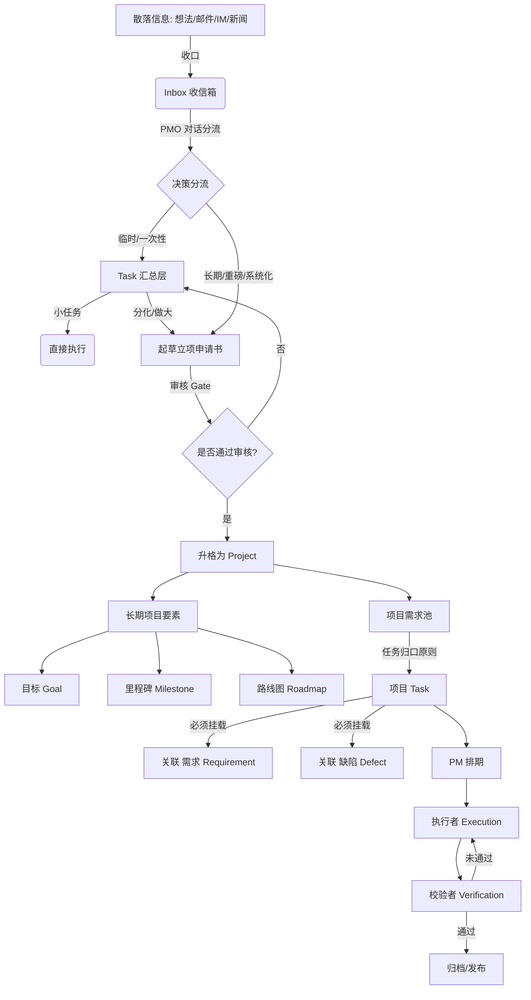
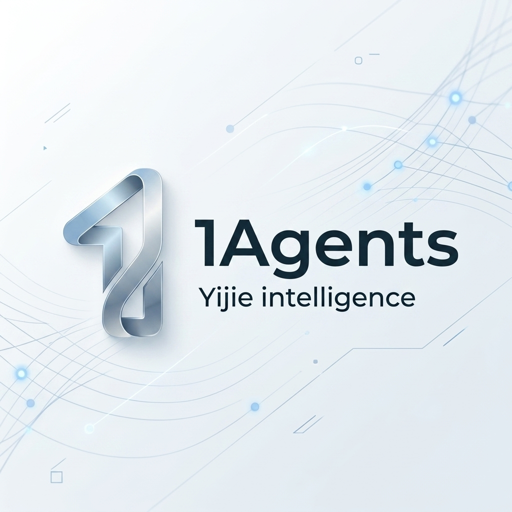
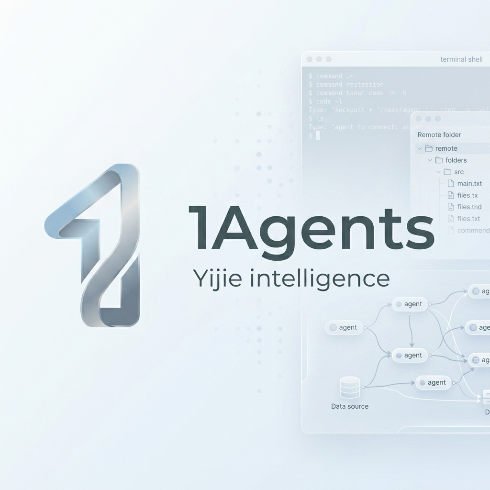
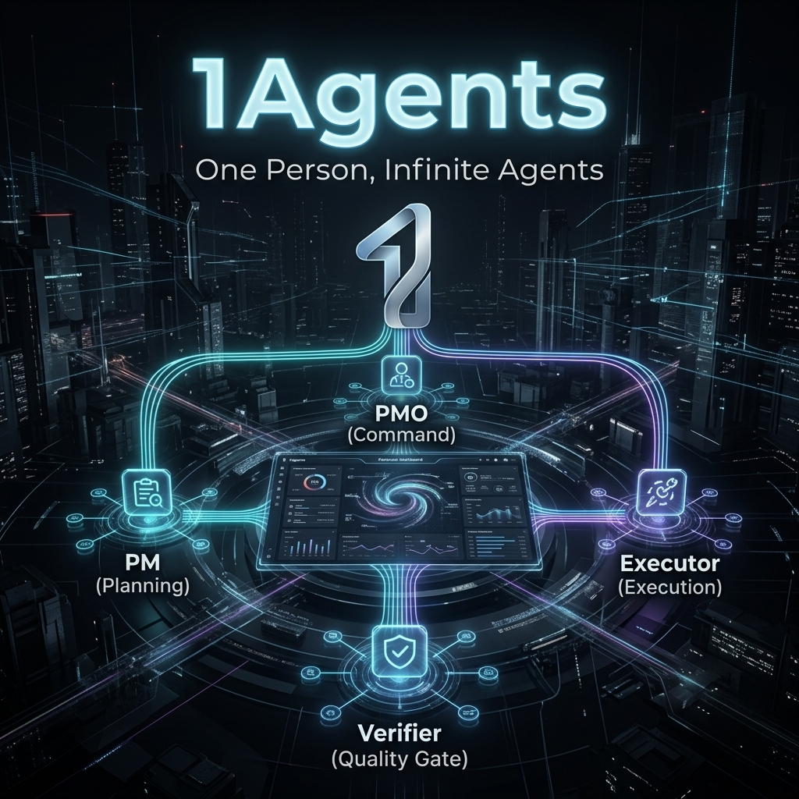

# 1Agents 营销素材与项目定位白皮书

本项目致力于解决当下知识工作者、独立开发者、超级个体所面临的“一个人要扛起一个组织”的难题。**1Agents** 不是简单的聊天机器人，而是一款 **一人成军的 AI 原生办公软件**。

---

## 🎯 核心定位与受众

### 1. 我们在做什么？
**1Agents 本质是一款「一人成军的 AI 原生办公软件」—— 你是唯一的老板，底下是一支按项目管理方式运转的 AI 团队，让一个人活成一支军队。**
它摒弃了“问一句答一句”的传统助理模式，采用 **A2A (Agent-to-Agent)** 的组织架构。各个智能体各司其职，通过项目管理模式，有条不紊地推进你的所有想法与任务。

### 2. 面向谁？
- **第一阶段**：面向**项目发起者（你）** —— 拥有大量并行的项目与庞杂的信息流，需要一个系统帮自己整理思路并自主执行。
- **长远阶段**：面向**独立开发者 (Indie Hackers)、单干创始人 (Solopreneurs)、自由职业者与知识工作者** —— 让“一人成军”成为可能，靠一支 AI 军团把活儿管起来。

### 3. 技术与概念融合
1Agents 深度契合当前 AI Agent 领域的两个最前沿热词：
- **环路工程 (Loop Engineering)**：传统的“提示词工程”侧重于单次 Prompt 调优，而 1Agents 则是典型的环路工程设计。我们为 AI 智能体设计了能自动测试、获取环境状态、多角色互动并自行反思纠偏的“系统环路”（如 Executor 修改代码与 Verifier 质量验收的闭环），让 AI 军团能够自主迭代任务直到达到目标。
- **主动式智能体 (Proactive Agents)**：传统的 Chat 助手是“被动响应型”，而 1Agents 基于事件监测与收信箱（Inbox）漏斗机制，让智能体在后台自主归拢信息、主动分析并起草立项建议书。项目启动后，智能体将按照排期主动执行并流转，无需人类保姆式的单步唤醒。

---

## 🛠 核心机制与升级链路

### 双核信息漏斗与全链路内容留痕
我们坚守**“信息漏斗”**原则与**“时时留痕”**设计：信息先收口，再分流。在项目内部，我们打破了任务、对话与产出的割裂状态，首创了**“Project ➔ Task ➔ Discussions（帖子讨论） ➔ AI Assets（代码/绘图）”一轴贯穿的链路**：

1. **信息分流分叉**：
   - **临时/一次性任务** ───→ 直接落入 **Task 汇总层**（轻量化，无须挂载需求）。
   - **长期/大体量创意** ───→ 助手起草 **立项申请书** ───→ 审核 Gate ───→ 升格为 **Project（长期项目）**。
2. **时时留痕与任务归口 (Traceability & Attribution)**：
   - 项目内的任何任务（Task）**必须**关联一个“需求 (Requirement)”或“缺陷 (Defect)”，不允许裸 Task 存在。
   - 每一个任务的执行过程、中间的帖子讨论/意见反馈，以及最终 AI 自动生成的代码、绘制的设计图像（如 AI 绘画），都强关联在同一条链路上。这实现了全流程的“时时留痕”，让项目的每一次迭代、AI 的每一次产出均可追溯、可审计。

---

## 🎭 团队角色设定

| 角色 | 职能定位 | 拟人化类比 |
| :--- | :--- | :--- |
| **PMO (Project Management Office)** | 跨项目总管，对话总入口。收拢散落信息，进行漏斗分流，辅助立项。 | 参谋长 / 总裁办主任 |
| **PM (Project Manager)** | 单个项目负责人。从项目需求池中提取需求，进行任务拆解与排期。 | 项目经理 / 策划案操盘手 |
| **Executor (执行者)** | 专注在分配给自己的具体 Task 上，编写代码、撰写文案或整理资料。 | 研发人员 / 干活的主力 |
| **Verifier (校验者)** | 只负责验收质量，对照标准给出“通过”或“打回并指出问题”。 | 质检官 / QA / 监理 |

---

## 🎨 视觉资产展示

我们基于平台 Logo（银蓝色 3D 丝带“1”）为您生成了以下高规格的营销视觉素材：

### 1. 组织横幅 (Organization Banner)
> 适用于组织主页、产品头部大图，简洁而富有科技感。

### 2. 详情页横幅 (Detail Page Banner) - 1200×340 推荐尺寸
> 适用于产品详情页或说明文档，右侧融入了轻量级终端、文件目录与 Agent 互联拓扑。

### 3. 社交媒体海报 (Social Media Poster)
> 适用于 GitHub Readme、X (Twitter)、小红书或朋友圈。展示了 PMO, PM, Executor, Verifier 相互协同的深色科技质感。

---

## 📢 社交媒体营销文案推送

### 💡 选项一：X / Twitter 风格 (极客、干货、Indie Hacker)
> **一人成军 · One Person, Infinite Agents.** 🤖💼
>
> 作为一个独立开发者，你是不是也每天在各种想法、待办、Bug 邮件和琐碎 IM 信息中疲于奔命？
> 
> 传统的 AI 只是“一问一答”的聊天框，而 **#1Agents** 帮你把一家“一人公司”建起来：
> - **PMO** 守住 Inbox，分流杂事与长期项目。
> - **PM** 拆解需求、把控项目排期。
> - **Executor** 埋头干活，**Verifier** 严苛把关质检。
> - **任务归口机制**：项目任务必须源自“需求”或“缺陷”，绝无裸任务！
> 
> 让你的 AI 替你开会、排期、执行、质检，而你，只做唯一的 Boss。 
> 👉 关注我们，开启 A2A 自动运转新时代！ #AI #IndieHacker #Solopreneur

---

### 📷 选项二：小红书 / 微信朋友圈 风格 (痛点直击、共鸣、效率升级)
> **【强烈推荐】一个人如何活成一支军队？一人成军的 AI 原生办公软件 1Agents 来了！** 🚀
> 
> 作为一个手里有三四个项目并行的“斜杠青年”/“自由职业者”，每天最崩溃的就是：
> ❌ 随手记的想法散落在各处，根本没空整理。
> ❌ 刚想做点事，又被临时的各种琐事打断。
> ❌ 传统的项目管理工具（如 Jira / Trello）太重，一个人用根本不现实。
> 
> 于是我设计了 **1Agents** —— 一个不需要聊天框、而是靠 AI 团队自己流转的个人组织！
> 
> ✨ **它的神仙机制：**
> 1. **信息漏斗 Inbox**：不管是什么想法、邮件，通通往里丢。
> 2. **AI 立项申请书**：觉得这个想法靠谱？AI 助理自动帮你生成立项申请、画出 Roadmap 和里程碑，你只需要点“批准”。
> 3. **极简 Task 汇总**：临时琐事走 Task，项目大事走 Project。
> 4. **项目归口底线**：项目里的每个任务都必须关联具体需求/Bug，杜绝凭空瞎忙，每一步都清晰可追溯！
> 
> PMO 统筹分流，PM 拆任务，Executor 写代码，Verifier 质检。AI 团队自己流转，我只需要喝着咖啡当 Boss 审批。
>
> 想了解更多关于一人成军的搭建方式？快来滴滴我吧！ 👇
> #一人成军 #个人成长 #独立开发 #AI工具 #生产力工具 #创业者 #高效工作法

---

## 🔗 关联项目

**1Hive**（曾用名 iClaw虾窝）—— 保障 AI Agent 7×24 长时间在线运行的配套硬件方案：[https://00claw.com/](https://00claw.com/)。
